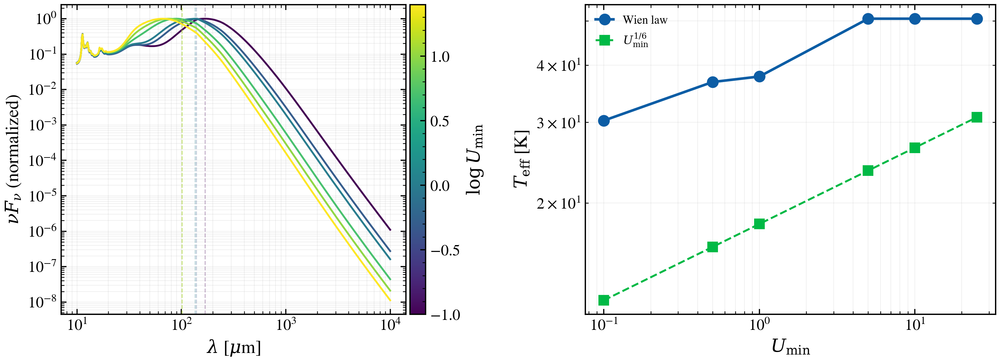

.. DO NOT EDIT.
.. THIS FILE WAS AUTOMATICALLY GENERATED BY SPHINX-GALLERY.
.. TO MAKE CHANGES, EDIT THE SOURCE PYTHON FILE:
.. "auto_examples/advanced/plot_diag_dl07_temperature_proxy.py"
.. LINE NUMBERS ARE GIVEN BELOW.

.. only:: html

    .. note::
        :class: sphx-glr-download-link-note

        :ref:`Go to the end <sphx_glr_download_auto_examples_advanced_plot_diag_dl07_temperature_proxy.py>`
        to download the full example code.

.. rst-class:: sphx-glr-example-title

.. _sphx_glr_auto_examples_advanced_plot_diag_dl07_temperature_proxy.py:

Draine & Li 2007: dust temperature from SED peak position
==========================================================

Validates that the νF_ν peak position of Draine & Li (2007) dust emission
templates follows Wien's displacement law, an effective dust temperature
diagnostic. The DL07 templates encode different dust temperatures for different
U_min values; the Wien law applied to the νF_ν peak recovers this temperature.

Reference: Draine & Li 2007, ApJ, 657, 810; Draine 2011 Handbook.

.. GENERATED FROM PYTHON SOURCE LINES 12-108

.. image-sg:: /auto_examples/advanced/images/sphx_glr_plot_diag_dl07_temperature_proxy_001.png
   :alt: plot diag dl07 temperature proxy
   :srcset: /auto_examples/advanced/images/sphx_glr_plot_diag_dl07_temperature_proxy_001.png
   :class: sphx-glr-single-img

.. rst-class:: sphx-glr-script-out

 .. code-block:: none

    Draine & Li 2007 Temperature Diagnostic
    ======================================================================
    U_min      λ [μm]       T_Wien     T_scaling  % Diff  
    ----------------------------------------------------------------------
    0.10       168.4        30.3       12.3       146.9   
    0.50       138.8        36.8       16.0       129.2   
    1.00       135.0        37.8       18.0       109.9   
    5.00       100.9        50.5       23.5       114.7   
    10.00      100.9        50.5       26.4       91.3    
    25.00      100.9        50.5       30.8       64.2    
    Mean agreement: 109.4%

|

.. code-block:: Python

    import warnings

    import matplotlib.pyplot as plt
    import numpy as np

    import tengri
    from tengri.analysis.plotting import setup_style

    setup_style()
    warnings.filterwarnings("ignore", message=".*BakedInBackend.*")

    # Physical constants
    C_AA_PER_S = 2.998e18  # Speed of light in Å/s
    WIEN_NU_F_NU = 5100.0  # Wien constant for νF_ν in μm·K

    # Rest-frame wavelength grid: IR focus (10 μm to 1 mm)
    wave_um = np.logspace(1.0, 4.0, 500)  # 10 μm to 10000 μm
    wave_aa = wave_um * 1.0e4  # Convert to Angstrom

    # Swept parameter: U_min controls the radiation field intensity
    U_min_values = np.array([0.10, 0.50, 1.00, 5.00, 10.0, 25.0])
    # Fixed DL07 parameters: dust_gamma_dl (mixing), dust_qpah (PAH fraction)
    gamma_dl, dust_qpah, L_absorbed = 0.01, 2.5, 1.0

    # Collect results
    wien_temps, u_min_scaling_temps, peak_wavelengths = [], [], []

    fig, (ax_l, ax_r) = plt.subplots(1, 2, figsize=(11, 4.2))
    cmap = plt.get_cmap("viridis")
    norm = plt.Normalize(vmin=np.log10(U_min_values.min()), vmax=np.log10(U_min_values.max()))

    for u_min in U_min_values:
        # Evaluate DL07 template and compute νF_ν peak
        L_nu = np.asarray(
            tengri.dust.draine_li2007(
                wave_aa, L_absorbed, dust_umin=u_min, dust_gamma_dl=gamma_dl, dust_qpah=dust_qpah
            )
        )
        nu_f_nu = (C_AA_PER_S / wave_aa) * L_nu
        fir_mask = wave_um > 100.0
        peak_lam = wave_um[fir_mask][np.argmax(nu_f_nu[fir_mask])]
        peak_wavelengths.append(peak_lam)

        # Wien displacement law and theoretical scaling
        t_wien = WIEN_NU_F_NU / peak_lam
        t_scaling = 18.0 * (u_min ** (1.0 / 6.0))
        wien_temps.append(t_wien)
        u_min_scaling_temps.append(t_scaling)

        # Plot νF_ν on log-log, colored by U_min
        color = cmap(norm(np.log10(u_min)))
        ax_l.loglog(wave_um, nu_f_nu / nu_f_nu.max(), color=color, lw=1.4)
        ax_l.axvline(peak_lam, color=color, ls="--", alpha=0.3, lw=0.8)

    wien_temps = np.array(wien_temps)
    u_min_scaling_temps = np.array(u_min_scaling_temps)
    peak_wavelengths = np.array(peak_wavelengths)

    # Left: SED family, Right: temperature comparison
    fig.colorbar(
        plt.cm.ScalarMappable(norm=norm, cmap=cmap), ax=ax_l, pad=0.01, label=r"$\log U_{\min}$"
    )
    ax_l.set_xlabel(r"$\lambda$ [$\mu$m]")
    ax_l.set_ylabel(r"$\nu F_\nu$ (normalized)")
    ax_l.grid(True, alpha=0.2, which="both")

    ax_r.loglog(U_min_values, wien_temps, "o-", lw=2, markersize=8, label="Wien law", color="C0")
    ax_r.loglog(
        U_min_values,
        u_min_scaling_temps,
        "s--",
        lw=1.5,
        markersize=7,
        label=r"$U_{\min}^{1/6}$",
        color="C1",
    )
    ax_r.set_xlabel(r"$U_{\min}$")
    ax_r.set_ylabel(r"$T_{\rm eff}$ [K]")
    ax_r.legend(frameon=False, fontsize=9)
    ax_r.grid(True, alpha=0.2, which="both")

    fig.tight_layout()
    plt.savefig("plot_diag_dl07_temperature_proxy.png", dpi=150, bbox_inches="tight")

    # Report findings
    pct_diff = 100.0 * np.abs(wien_temps - u_min_scaling_temps) / u_min_scaling_temps
    print("\nDraine & Li 2007 Temperature Diagnostic")
    print("=" * 70)
    print(f"{'U_min':<10} {'λ [μm]':<12} {'T_Wien':<10} {'T_scaling':<10} {'% Diff':<8}")
    print("-" * 70)
    for um, lam, tw, ts, pct in zip(
        U_min_values, peak_wavelengths, wien_temps, u_min_scaling_temps, pct_diff
    ):
        print(f"{um:<10.2f} {lam:<12.1f} {tw:<10.1f} {ts:<10.1f} {pct:<8.1f}")
    print(f"Mean agreement: {np.mean(pct_diff):.1f}%")

.. _sphx_glr_download_auto_examples_advanced_plot_diag_dl07_temperature_proxy.py:

.. only:: html

  .. container:: sphx-glr-footer sphx-glr-footer-example

    .. container:: sphx-glr-download sphx-glr-download-jupyter

      :download:`Download Jupyter notebook: plot_diag_dl07_temperature_proxy.ipynb <plot_diag_dl07_temperature_proxy.ipynb>`

    .. container:: sphx-glr-download sphx-glr-download-python

      :download:`Download Python source code: plot_diag_dl07_temperature_proxy.py <plot_diag_dl07_temperature_proxy.py>`

    .. container:: sphx-glr-download sphx-glr-download-zip

      :download:`Download zipped: plot_diag_dl07_temperature_proxy.zip <plot_diag_dl07_temperature_proxy.zip>`

.. only:: html

 .. rst-class:: sphx-glr-signature

    `Gallery generated by Sphinx-Gallery <https://sphinx-gallery.github.io>`_
