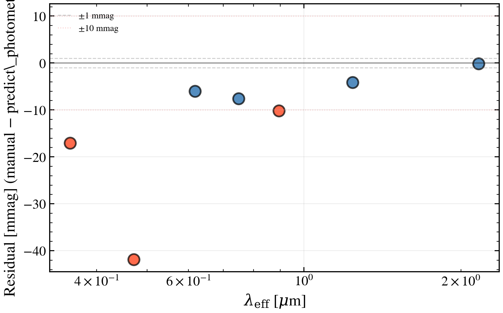

.. DO NOT EDIT.
.. THIS FILE WAS AUTOMATICALLY GENERATED BY SPHINX-GALLERY.
.. TO MAKE CHANGES, EDIT THE SOURCE PYTHON FILE:
.. "auto_examples/advanced/plot_diag_filter_integral_manual.py"
.. LINE NUMBERS ARE GIVEN BELOW.

.. only:: html

    .. note::
        :class: sphx-glr-download-link-note

        :ref:`Go to the end <sphx_glr_download_auto_examples_advanced_plot_diag_filter_integral_manual.py>`
        to download the full example code.

.. rst-class:: sphx-glr-example-title

.. _sphx_glr_auto_examples_advanced_plot_diag_filter_integral_manual.py:

Manual Filter Integral vs predict_photometry Consistency Check
===============================================================

Validates the AB magnitude photometric filter convolution formula by computing
the effective F_ν through a photometric filter manually and comparing against
``predict_photometry()``. The AB convention defines the filter-weighted flux as

.. math::

    \langle F_\nu \rangle_{\rm filter} = \int F_\nu(\nu) T(\nu) d\nu/\nu \; / \;
    \int T(\nu) d\nu/\nu

(photon-counting normalisation per SDSS/HSC/LSST). We integrate numerically
from the rest-frame SED, apply redshift, and convolve with filter transmission
curves, then compare residuals against ``predict_photometry()`` in mmag.

Reference: SDSS photometric calibration (Fukugita et al. 1996, Paddock et al. 2008).

.. GENERATED FROM PYTHON SOURCE LINES 20-108

.. image-sg:: /auto_examples/advanced/images/sphx_glr_plot_diag_filter_integral_manual_001.png
   :alt: plot diag filter integral manual
   :srcset: /auto_examples/advanced/images/sphx_glr_plot_diag_filter_integral_manual_001.png
   :class: sphx-glr-single-img

.. code-block:: Python

    import warnings

    import matplotlib.pyplot as plt
    import numpy as np

    import tengri
    from tengri.analysis.plotting import setup_style

    setup_style()
    # Silence BakedInBackend nebular warning (not applicable with this SSP)
    warnings.filterwarnings("ignore", message=".*BakedInBackend.*")

    ssp = tengri.load_ssp("fsps_prsc_miles_chabrier")
    band_names = ["sdss_u", "sdss_g", "sdss_r", "sdss_i", "sdss_z", "2mass_j", "2mass_ks"]
    obs = tengri.Observation(photometry=tengri.Photometry.from_names(band_names))
    model = tengri.SEDModel.build(
        ssp,
        observation=obs,
        sfh={"type": "tsnorm", "*": tengri.FIXED},
        dust={"type": "two_component", "*": tengri.FIXED, "tau_diff": 0.25, "tau_bc": 0.15},
        redshift=tengri.Fixed(0.05),
    )

    params = {
        "sfh_tsnorm_log_total_mass": 10.3,
        "sfh_tsnorm_peak_lbt_gyr": 3.0,
        "sfh_tsnorm_width_gyr": 1.2,
        "sfh_tsnorm_skew": 0.0,
        "sfh_tsnorm_trunc": 5.0,
        "dust_slope": -0.6,
        "redshift": 0.05,
    }

    z = params["redshift"]
    wave_rest = np.logspace(np.log10(1000), np.log10(25000), 4000)
    result = model.predict_rest_sed(params, wave_rest)
    sed_rest = np.array(result.sed)

    d_L = tengri.cosmology.luminosity_distance(z)
    flux_scale = (1.0 + z) / (4.0 * np.pi * d_L**2)

    manual_fluxes, wave_eff_array = [], []
    for filt in obs.photometry.filters:
        wave_filt, trans_filt = np.array(filt.wave), np.array(filt.trans)
        wave_eff = np.trapezoid(trans_filt * wave_filt, wave_filt) / np.trapezoid(
            trans_filt, wave_filt
        )
        wave_eff_array.append(wave_eff)
        wave_obs = wave_rest * (1.0 + z)
        sed_on_filt = np.interp(wave_filt, wave_obs, sed_rest, left=0.0, right=0.0)
        num = np.trapezoid(sed_on_filt * trans_filt * wave_filt, wave_filt)
        den = np.trapezoid(trans_filt * wave_filt, wave_filt)
        f_nu_manual = flux_scale * num / np.maximum(den, 1e-30)
        manual_fluxes.append(f_nu_manual)

    manual_fluxes = np.array(manual_fluxes)
    wave_eff_array = np.array(wave_eff_array)

    tengri_fluxes = np.asarray(model.predict_photometry(params))
    mag_manual = -2.5 * np.log10(np.maximum(manual_fluxes, 1e-30)) - 48.6
    mag_tengri = -2.5 * np.log10(np.maximum(tengri_fluxes, 1e-30)) - 48.6
    residuals_mmag = (mag_manual - mag_tengri) * 1000.0

    fig, ax = plt.subplots(figsize=(6.5, 4.2))

    # Reference bands: ±1 mmag and ±10 mmag
    ax.axhline(0, color="k", linestyle="-", lw=0.8, alpha=0.5)
    ax.axhline(1.0, color="gray", linestyle="--", lw=0.8, alpha=0.4, label="±1 mmag")
    ax.axhline(-1.0, color="gray", linestyle="--", lw=0.8, alpha=0.4)
    ax.axhline(10.0, color="lightcoral", linestyle=":", lw=0.8, alpha=0.4, label="±10 mmag")
    ax.axhline(-10.0, color="lightcoral", linestyle=":", lw=0.8, alpha=0.4)

    # Data points: color by magnitude of residual
    colors = ["C0" if np.abs(r) < 10 else "C3" for r in residuals_mmag]
    ax.scatter(
        wave_eff_array / 1e4, residuals_mmag, s=100, alpha=0.7, color=colors, lw=1.5, edgecolors="k"
    )

    # Labels and formatting
    ax.set_xscale("log")
    ax.set_xlabel(r"$\lambda_{\rm eff}$ [$\mu$m]")
    ax.set_ylabel(r"Residual [mmag] (manual − predict\_photometry)")
    ax.grid(True, alpha=0.3)
    ax.legend(loc="upper left", frameon=False, fontsize=8)

    plt.tight_layout()
    plt.show()

.. _sphx_glr_download_auto_examples_advanced_plot_diag_filter_integral_manual.py:

.. only:: html

  .. container:: sphx-glr-footer sphx-glr-footer-example

    .. container:: sphx-glr-download sphx-glr-download-jupyter

      :download:`Download Jupyter notebook: plot_diag_filter_integral_manual.ipynb <plot_diag_filter_integral_manual.ipynb>`

    .. container:: sphx-glr-download sphx-glr-download-python

      :download:`Download Python source code: plot_diag_filter_integral_manual.py <plot_diag_filter_integral_manual.py>`

    .. container:: sphx-glr-download sphx-glr-download-zip

      :download:`Download zipped: plot_diag_filter_integral_manual.zip <plot_diag_filter_integral_manual.zip>`

.. only:: html

 .. rst-class:: sphx-glr-signature

    `Gallery generated by Sphinx-Gallery <https://sphinx-gallery.github.io>`_
