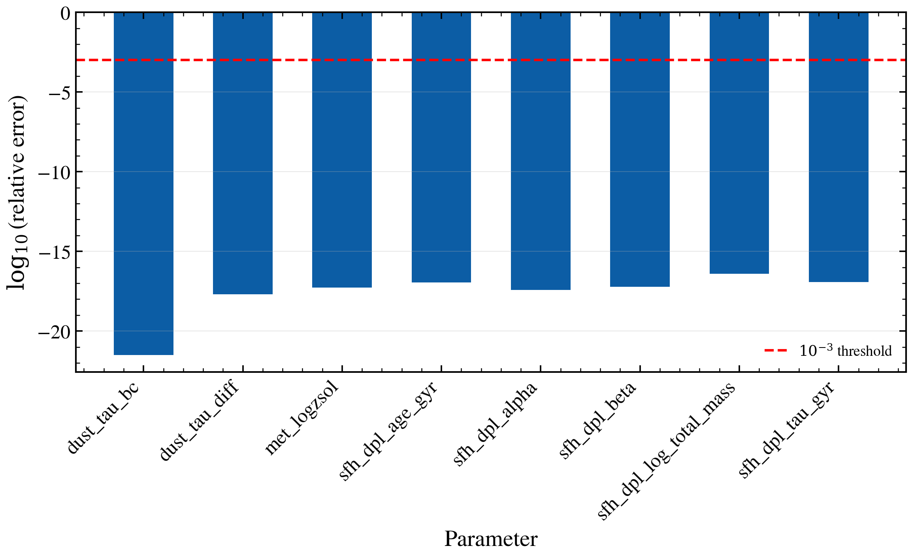

.. DO NOT EDIT.
.. THIS FILE WAS AUTOMATICALLY GENERATED BY SPHINX-GALLERY.
.. TO MAKE CHANGES, EDIT THE SOURCE PYTHON FILE:
.. "auto_examples/advanced/plot_diag_gradient_finite_difference.py"
.. LINE NUMBERS ARE GIVEN BELOW.

.. only:: html

    .. note::
        :class: sphx-glr-download-link-note

        :ref:`Go to the end <sphx_glr_download_auto_examples_advanced_plot_diag_gradient_finite_difference.py>`
        to download the full example code.

.. rst-class:: sphx-glr-example-title

.. _sphx_glr_auto_examples_advanced_plot_diag_gradient_finite_difference.py:

Autodiff gradients vs. finite-difference derivatives: diagnostic verification
==============================================================================

tengri is a differentiable JAX package. Every model gradient ∂L/∂θ computed via
`jax.grad()` should numerically match a central finite-difference approximation.
This diagnostic builds a star-forming model with several free parameters,
defines a chi-squared loss, and compares autodiff vs FD gradients for each
parameter. A mismatch (>1e-3) indicates a non-differentiable operation.

.. GENERATED FROM PYTHON SOURCE LINES 11-122

.. image-sg:: /auto_examples/advanced/images/sphx_glr_plot_diag_gradient_finite_difference_001.png
   :alt: plot diag gradient finite difference
   :srcset: /auto_examples/advanced/images/sphx_glr_plot_diag_gradient_finite_difference_001.png
   :class: sphx-glr-single-img

.. rst-class:: sphx-glr-script-out

 .. code-block:: none

    Autodiff vs Finite-Difference Gradient Diagnostic
    ======================================================================
    Parameter                 Autodiff        Finite-Diff     Rel. Error     
    ----------------------------------------------------------------------
    dust_tau_bc               -4.9630e-27     -4.9630e-27     3.2331e-22     OK
    dust_tau_diff             -3.7649e-24     -3.7649e-24     2.0954e-18     OK
    met_logzsol               -5.7350e-25     -5.7350e-25     5.5159e-18     OK
    sfh_dpl_age_gyr           -1.4672e-24     -1.4672e-24     1.1504e-17     OK
    sfh_dpl_alpha             -3.3165e-25     -3.3165e-25     3.7321e-18     OK
    sfh_dpl_beta              7.8207e-26      7.8213e-26      6.1484e-18     OK
    sfh_dpl_log_total_mass    9.9177e-24      9.9178e-24      4.0549e-17     OK
    sfh_dpl_tau_gyr           1.9383e-24      1.9383e-24      1.2006e-17     OK
    ----------------------------------------------------------------------
    Worst: sfh_dpl_log_total_mass, rel_error = 4.0549e-17
    All gradients match within 1e-3 tolerance.

|

.. code-block:: Python

    import warnings

    import jax
    import jax.numpy as jnp
    import matplotlib.pyplot as plt
    import numpy as np

    import tengri
    from tengri.analysis.plotting import setup_style

    setup_style()
    warnings.filterwarnings("ignore", message=".*BakedInBackend.*")
    jax.config.update("jax_enable_x64", True)

    # Build model with multiple free parameters (DPL SFH, two-component dust, Cue nebular)
    ssp = tengri.load_ssp("fsps_prsc_miles_chabrier")
    obs = tengri.Observation(
        photometry=tengri.Photometry.from_names(["sdss_u", "sdss_g", "sdss_r", "sdss_i"]),
    )
    model = tengri.SEDModel.build(
        ssp_data=ssp,
        observation=obs,
        sfh={"type": "dpl", "*": tengri.FREE},
        dust={
            "type": "two_component",
            "law_bc": "calzetti",
            "law_diff": "calzetti",
            "*": tengri.FREE,
            "emission": {"type": "dale2014", "*": tengri.FIXED},
        },
        neb={"type": "cue", "*": tengri.FREE},
        redshift=tengri.FREE,
    )

    # Generate synthetic observed photometry
    key = jax.random.PRNGKey(42)
    p_true = dict(model.spec.sample(key))
    photometry_true = model.predict_photometry(p_true)
    noise = jnp.ones_like(photometry_true) * 0.05 * photometry_true
    photometry_obs = photometry_true + jax.random.normal(key, photometry_true.shape) * noise

    # Use off-target parameters to create non-vanishing gradients
    p_ref = dict(model.spec.sample(jax.random.PRNGKey(99)))
    p_ref["sfh_dpl_log_total_mass"] += 2.0
    p_ref["dust_tau_bc"] = jnp.clip(p_ref["dust_tau_bc"] + 1.5, 0, 2.0)
    p_ref["met_logzsol"] = jnp.clip(p_ref["met_logzsol"] - 1.0, -2.0, 0.2)

    # Objective: reduced chi-squared
    def objective(params_dict):
        model_phot = model.predict_photometry(params_dict)
        residual = (model_phot - photometry_obs) / (noise + 1e-12)
        return jnp.sum(residual**2) / len(residual)

    # Compute autodiff gradients
    grad_autodiff = jax.grad(objective)(p_ref)
    free_param_names = sorted(model.spec.free_params)

    # Central finite-difference: eps ~ 1e-3 for float64 (avoids round-off)
    eps = 1e-3
    grad_fd_dict = {}
    for param_name in free_param_names:
        p_plus = {**p_ref, param_name: p_ref[param_name] + eps}
        p_minus = {**p_ref, param_name: p_ref[param_name] - eps}
        grad_fd = (objective(p_plus) - objective(p_minus)) / (2.0 * eps)
        grad_fd_dict[param_name] = float(grad_fd)

    # Compute relative errors
    rel_errors = {}
    worst_param, worst_error = None, 0.0
    for param_name in free_param_names:
        g_auto, g_fd = float(grad_autodiff[param_name]), grad_fd_dict[param_name]
        rel_err = abs(g_auto - g_fd) / (abs(g_fd) + 1e-12)
        rel_errors[param_name] = rel_err
        if rel_err > worst_error:
            worst_error, worst_param = rel_err, param_name

    # Plot
    fig, ax = plt.subplots(figsize=(8, 5))
    log_rel_errors = np.array([np.log10(rel_errors[p]) for p in free_param_names])
    colors = ["C1" if lre > np.log10(1e-3) else "C0" for lre in log_rel_errors]
    ax.bar(range(len(free_param_names)), log_rel_errors, color=colors, width=0.6)
    ax.axhline(np.log10(1e-3), color="red", ls="--", lw=1.5, label=r"$10^{-3}$ threshold")
    ax.set_xticks(range(len(free_param_names)))
    ax.set_xticklabels(free_param_names, rotation=45, ha="right")
    ax.set_ylabel(r"$\log_{10}$(relative error)")
    ax.set_xlabel("Parameter")
    ax.legend(frameon=False, fontsize=9)
    ax.grid(True, alpha=0.3, axis="y")
    fig.tight_layout()
    plt.savefig("plot_diag_gradient_finite_difference.png", dpi=150, bbox_inches="tight")

    # Report
    print("Autodiff vs Finite-Difference Gradient Diagnostic")
    print("=" * 70)
    print(f"{'Parameter':<25} {'Autodiff':<15} {'Finite-Diff':<15} {'Rel. Error':<15}")
    print("-" * 70)
    for param_name in free_param_names:
        g_auto = float(grad_autodiff[param_name])
        g_fd = grad_fd_dict[param_name]
        rel_err = rel_errors[param_name]
        status = "OK" if rel_err < 1e-3 else "⚠ FAIL"
        print(f"{param_name:<25} {g_auto:<15.4e} {g_fd:<15.4e} {rel_err:<14.4e} {status}")
    print("-" * 70)
    print(f"Worst: {worst_param}, rel_error = {worst_error:.4e}")
    if worst_error > 1e-3:
        print("WARNING: Gradient error exceeds 1e-3 (possible non-differentiable op).")
    else:
        print("All gradients match within 1e-3 tolerance.")

.. rst-class:: sphx-glr-timing

   **Total running time of the script:** (0 minutes 2.073 seconds)

.. _sphx_glr_download_auto_examples_advanced_plot_diag_gradient_finite_difference.py:

.. only:: html

  .. container:: sphx-glr-footer sphx-glr-footer-example

    .. container:: sphx-glr-download sphx-glr-download-jupyter

      :download:`Download Jupyter notebook: plot_diag_gradient_finite_difference.ipynb <plot_diag_gradient_finite_difference.ipynb>`

    .. container:: sphx-glr-download sphx-glr-download-python

      :download:`Download Python source code: plot_diag_gradient_finite_difference.py <plot_diag_gradient_finite_difference.py>`

    .. container:: sphx-glr-download sphx-glr-download-zip

      :download:`Download zipped: plot_diag_gradient_finite_difference.zip <plot_diag_gradient_finite_difference.zip>`

.. only:: html

 .. rst-class:: sphx-glr-signature

    `Gallery generated by Sphinx-Gallery <https://sphinx-gallery.github.io>`_
