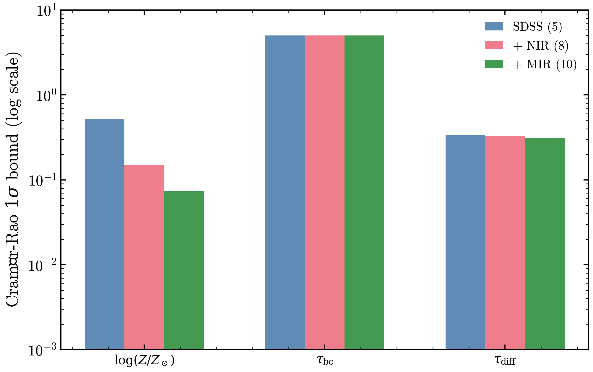

.. DO NOT EDIT.
.. THIS FILE WAS AUTOMATICALLY GENERATED BY SPHINX-GALLERY.
.. TO MAKE CHANGES, EDIT THE SOURCE PYTHON FILE:
.. "auto_examples/advanced/plot_fisher_degeneracy.py"
.. LINE NUMBERS ARE GIVEN BELOW.

.. only:: html

    .. note::
        :class: sphx-glr-download-link-note

        :ref:`Go to the end <sphx_glr_download_auto_examples_advanced_plot_fisher_degeneracy.py>`
        to download the full example code.

.. rst-class:: sphx-glr-example-title

.. _sphx_glr_auto_examples_advanced_plot_fisher_degeneracy.py:

Age-Dust-Metallicity Degeneracy: Fisher Analysis
=================================================

The Cramér-Rao bound from the Fisher Information Matrix shows that SDSS
5-band photometry alone cannot separately constrain age, dust, and
metallicity. Adding NIR or MIR bands breaks the degeneracy by factors of
2–5×, quantifying the information gain from multiwavelength coverage.

.. sphx-glr-precomputed-img:

.. GENERATED FROM PYTHON SOURCE LINES 17-143

.. code-block:: Python

    from pathlib import Path

    import jax
    import jax.numpy as jnp
    import matplotlib.pyplot as plt
    import numpy as np

    from tengri import (
        Fixed,
        Observation,
        Parameters,
        Photometry,
        SEDModel,
        Uniform,
        load_ssp,
        setup_style,
    )
    from tengri.analysis.diagnostics.fisher import compute_fisher_matrix, fisher_parameter_errors

    setup_style()

    ssp = load_ssp()

    _FILTER_DIR = next(
        (
            str(d)
            for d in [
                Path("data/filters"),
                Path("../data/filters"),
                Path("../../data/filters"),
                Path("../../../data/filters"),
            ]
            if d.exists()
        ),
        "data/filters",
    )

    spec = Parameters(
        sfh_tsnorm_log_peak_sfr=Uniform(-1.0, 2.5),
        sfh_tsnorm_peak_lbt_gyr=Uniform(0.5, 12.0),
        sfh_tsnorm_width_gyr=Uniform(0.3, 5.0),
        sfh_tsnorm_skew=Uniform(-3.0, 3.0),
        sfh_tsnorm_trunc=Uniform(1.0, 10.0),
        met_logzsol=Uniform(-2.0, 0.2),
        dust_tau_bc=Uniform(0.0, 2.0),
        dust_tau_diff=Uniform(0.0, 1.5),
        dust_slope=Fixed(-0.7),
        redshift=Fixed(0.1),
        mean_sfh_type="tsnorm",
    )

    key = jax.random.PRNGKey(42)
    true_params = {
        **spec.sample(key),
        "met_logzsol": jnp.array(-0.3),
        "dust_tau_bc": jnp.array(0.8),
        "dust_tau_diff": jnp.array(0.4),
    }

    FILTER_SETS = {
        "SDSS (5)": ["sdss_u", "sdss_g", "sdss_r", "sdss_i", "sdss_z"],
        "+ NIR (8)": [
            "sdss_u",
            "sdss_g",
            "sdss_r",
            "sdss_i",
            "sdss_z",
            "2mass_j",
            "2mass_h",
            "2mass_ks",
        ],
        "+ MIR (10)": [
            "sdss_u",
            "sdss_g",
            "sdss_r",
            "sdss_i",
            "sdss_z",
            "2mass_j",
            "2mass_h",
            "2mass_ks",
            "wise_w1",
            "wise_w2",
        ],
    }

    fisher_params = ["met_logzsol", "dust_tau_bc", "dust_tau_diff"]
    PARAM_LABELS = [r"$\log(Z/Z_\odot)$", r"$\tau_{\rm bc}$", r"$\tau_{\rm diff}$"]
    COLORS_BAR = ["#4477AA", "#EE6677", "#228833"]
    sigmas = {}
    for fname, filters in FILTER_SETS.items():
        try:
            obs = Observation(photometry=Photometry.from_names(filters, cache_dir=_FILTER_DIR))
            mdl = SEDModel(spec, ssp, observation=obs)
            phot = jnp.abs(mdl.predict_photometry(true_params))
            noise = phot / 20.0
            fim, _ = compute_fisher_matrix(
                mdl, true_params, noise, data_type="photometry", param_names=fisher_params
            )
            errs = np.array(fisher_parameter_errors(fim))
            # Unconstrained directions → clip to prior scale for visibility.
            errs = np.where(np.isfinite(errs) & (errs > 0), errs, 5.0)
            sigmas[fname] = np.minimum(errs, 5.0)
        except Exception as e:
            print(f"[{fname}] skipped: {e}")

    if not sigmas:
        raise RuntimeError("Fisher computation failed — check filter availability")

    x = np.arange(len(fisher_params))
    width = 0.22
    fig, ax = plt.subplots(figsize=(7, 4.5))
    for i, (fname, sigma_arr) in enumerate(sigmas.items()):
        ax.bar(x + (i - 1) * width, sigma_arr, width, label=fname, color=COLORS_BAR[i], alpha=0.85)

    ax.set_yscale("log")
    ax.set_ylim(1e-3, 1e1)
    ax.set_xticks(x)
    ax.set_xticklabels(PARAM_LABELS, fontsize=10)
    ax.set_ylabel(r"Cramér-Rao $1\sigma$ bound (log scale)")
    ax.set_title("Age-Dust-Metallicity Degeneracy: Filter Coverage Matters")
    ax.legend(fontsize=10, frameon=False)
    fig.tight_layout()
    plt.savefig("plot_fisher_degeneracy.png", dpi=150, bbox_inches="tight")
    plt.show()

.. _sphx_glr_download_auto_examples_advanced_plot_fisher_degeneracy.py:

.. only:: html

  .. container:: sphx-glr-footer sphx-glr-footer-example

    .. container:: sphx-glr-download sphx-glr-download-jupyter

      :download:`Download Jupyter notebook: plot_fisher_degeneracy.ipynb <plot_fisher_degeneracy.ipynb>`

    .. container:: sphx-glr-download sphx-glr-download-python

      :download:`Download Python source code: plot_fisher_degeneracy.py <plot_fisher_degeneracy.py>`

    .. container:: sphx-glr-download sphx-glr-download-zip

      :download:`Download zipped: plot_fisher_degeneracy.zip <plot_fisher_degeneracy.zip>`

.. only:: html

 .. rst-class:: sphx-glr-signature

    `Gallery generated by Sphinx-Gallery <https://sphinx-gallery.github.io>`_
