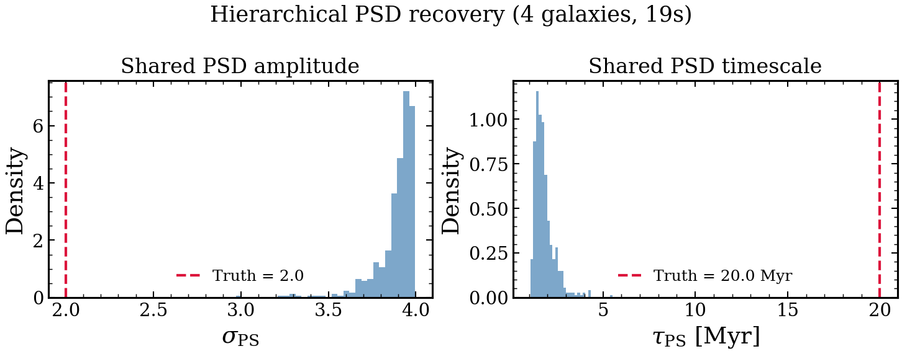

.. DO NOT EDIT.
.. THIS FILE WAS AUTOMATICALLY GENERATED BY SPHINX-GALLERY.
.. TO MAKE CHANGES, EDIT THE SOURCE PYTHON FILE:
.. "auto_examples/advanced/plot_hierarchical.py"
.. LINE NUMBERS ARE GIVEN BELOW.

.. only:: html

    .. note::
        :class: sphx-glr-download-link-note

        :ref:`Go to the end <sphx_glr_download_auto_examples_advanced_plot_hierarchical.py>`
        to download the full example code.

.. rst-class:: sphx-glr-example-title

.. _sphx_glr_auto_examples_advanced_plot_hierarchical.py:

Hierarchical PSD Inference
===========================

Sets up a small population of mock galaxies sharing the same burstiness
PSD parameters (sigma, tau), runs PopulationFitter briefly, and
displays the shared PSD posterior vs truth.

.. sphx-glr-precomputed-img:

.. GENERATED FROM PYTHON SOURCE LINES 16-156

.. code-block:: Python

    import time
    from pathlib import Path

    import jax
    import matplotlib.pyplot as plt
    import numpy as np

    jax.config.update("jax_enable_x64", True)

    from tengri import (
        Fixed,
        Observation,
        Parameters,
        Photometry,
        PopulationFitter,
        SEDModel,
        Uniform,
        load_ssp_data,
        setup_style,
    )

    setup_style()

    # --- Data ---
    def _find_ssp():
        """Locate SSP data from project root or docs/ (sphinx-gallery) cwd."""
        name = "ssp_prsc_miles_chabrier_wNE_logGasU-3.0_logGasZ0.0.h5"
        for p in [
            Path("data") / name,
            Path("../data") / name,
            Path("../../data") / name,
            Path("../../../data") / name,
        ]:
            if p.exists():
                return str(p)
        return None

    SSP_PATH = _find_ssp()

    if SSP_PATH is None:
        raise FileNotFoundError("SSP data not found — skipping example")

    ssp = load_ssp_data(SSP_PATH)
    obs = Observation(
        photometry=Photometry.from_names(["sdss_u", "sdss_g", "sdss_r", "sdss_i", "sdss_z"])
    )

    # --- True shared PSD ---
    TRUE_SIGMA = 2.0
    TRUE_TAU = 20.0
    N_GAL = 4

    def model_factory(psd_sigma=1.0, psd_tau_myr=50.0):
        """Create a SEDModel with fixed PSD — called by PopulationFitter."""
        spec = Parameters(
            sfh_tsnorm_log_peak_sfr=Uniform(-1.0, 2.5),
            sfh_tsnorm_peak_lbt_gyr=Uniform(0.5, 12.0),
            sfh_tsnorm_width_gyr=Uniform(0.3, 5.0),
            sfh_tsnorm_skew=Uniform(-3.0, 3.0),
            sfh_tsnorm_trunc=Uniform(1.0, 10.0),
            sfh_field_psd_sigma=Fixed(psd_sigma),
            sfh_field_psd_tau_myr=Fixed(psd_tau_myr),
            met_logzsol=Uniform(-2.0, 0.2),
            dust_tau_bc=Uniform(0.0, 2.0),
            dust_tau_diff=Uniform(0.0, 1.5),
            dust_slope=Fixed(-0.7),
            redshift=Fixed(0.1),
            mean_sfh_type=["tsnorm", "field"],
            n_grid=128,
        )
        return SEDModel(spec, ssp, observation=obs)

    # --- Generate mock galaxies ---
    key = jax.random.PRNGKey(42)
    model_gen = model_factory(psd_sigma=TRUE_SIGMA, psd_tau_myr=TRUE_TAU)
    galaxies = []
    for i in range(N_GAL):
        k = jax.random.fold_in(key, i)
        params = model_gen.spec.sample(k)
        mock = model_gen.mock(params, snr=20.0, key=jax.random.fold_in(k, 1))
        galaxies.append({"flux_obs": mock.flux_obs, "noise": mock.noise})
    print(f"Generated {N_GAL} mock galaxies with sigma={TRUE_SIGMA}, tau={TRUE_TAU} Myr")

    # --- Hierarchical fit (quick) ---
    hfitter = PopulationFitter(
        model_factory,
        galaxies,
        psd_sigma_prior=(0.1, 4.0),
        psd_tau_prior=(1.0, 300.0),
    )

    t0 = time.perf_counter()
    result = hfitter.run(
        "vi_linear",
        n_iterations=20,
        n_samples=4,
        n_posterior_samples=500,
        verbose=False,
        key=jax.random.PRNGKey(0),
    )
    elapsed = time.perf_counter() - t0
    print(f"Hierarchical fit: {elapsed:.1f}s")

    # --- Figure: shared PSD posterior ---
    # shared_samples keys depend on the spec — print to be safe and pick the
    # psd amplitude/timescale entries by substring match.
    keys = list(result.shared_samples.keys())
    sig_key = next(k for k in keys if "psd" in k and ("sigma" in k or "_u" in k or "amp" in k))
    tau_key = next(k for k in keys if "psd" in k and ("tau" in k))
    sig_samples = np.array(result.shared_samples[sig_key])
    tau_samples = np.array(result.shared_samples[tau_key])

    fig, (ax1, ax2) = plt.subplots(1, 2, figsize=(10, 4))

    ax1.hist(sig_samples, bins=30, density=True, alpha=0.7, color="steelblue")
    ax1.axvline(TRUE_SIGMA, color="crimson", ls="--", lw=2, label=f"Truth = {TRUE_SIGMA}")
    ax1.set_xlabel(r"$\sigma_{\rm PS}$")
    ax1.set_ylabel("Density")
    ax1.set_title("Shared PSD amplitude")
    ax1.legend()

    ax2.hist(tau_samples, bins=30, density=True, alpha=0.7, color="steelblue")
    ax2.axvline(TRUE_TAU, color="crimson", ls="--", lw=2, label=f"Truth = {TRUE_TAU} Myr")
    ax2.set_xlabel(r"$\tau_{\rm PS}$ [Myr]")
    ax2.set_ylabel("Density")
    ax2.set_title("Shared PSD timescale")
    ax2.legend()

    fig.suptitle(f"Hierarchical PSD recovery ({N_GAL} galaxies, {elapsed:.0f}s)")
    fig.tight_layout()

    outdir = Path(__file__).resolve().parent.parent / "figures" if "__file__" in dir() else Path(".")
    outdir.mkdir(parents=True, exist_ok=True)
    plt.savefig("plot_hierarchical.png", dpi=150, bbox_inches="tight")
    plt.show()

.. _sphx_glr_download_auto_examples_advanced_plot_hierarchical.py:

.. only:: html

  .. container:: sphx-glr-footer sphx-glr-footer-example

    .. container:: sphx-glr-download sphx-glr-download-jupyter

      :download:`Download Jupyter notebook: plot_hierarchical.ipynb <plot_hierarchical.ipynb>`

    .. container:: sphx-glr-download sphx-glr-download-python

      :download:`Download Python source code: plot_hierarchical.py <plot_hierarchical.py>`

    .. container:: sphx-glr-download sphx-glr-download-zip

      :download:`Download zipped: plot_hierarchical.zip <plot_hierarchical.zip>`

.. only:: html

 .. rst-class:: sphx-glr-signature

    `Gallery generated by Sphinx-Gallery <https://sphinx-gallery.github.io>`_
