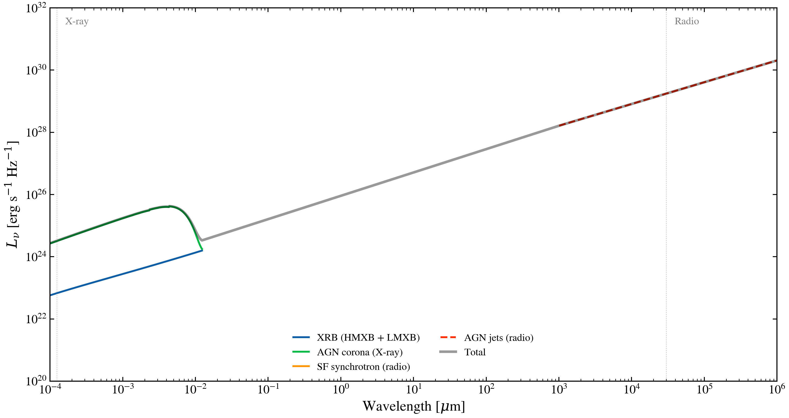

.. DO NOT EDIT.
.. THIS FILE WAS AUTOMATICALLY GENERATED BY SPHINX-GALLERY.
.. TO MAKE CHANGES, EDIT THE SOURCE PYTHON FILE:
.. "auto_examples/advanced/plot_radio_xray.py"
.. LINE NUMBERS ARE GIVEN BELOW.

.. only:: html

    .. note::
        :class: sphx-glr-download-link-note

        :ref:`Go to the end <sphx_glr_download_auto_examples_advanced_plot_radio_xray.py>`
        to download the full example code.

.. rst-class:: sphx-glr-example-title

.. _sphx_glr_auto_examples_advanced_plot_radio_xray.py:

Panchromatic SED: UV to Radio
==============================

Build a full galaxy SED spanning X-ray to radio wavelengths. Shows stellar
emission, dust attenuation, dust IR emission, radio synchrotron, and X-ray
binary contributions. No SSP data required for the multi-wavelength components.

.. sphx-glr-precomputed-img:

.. GENERATED FROM PYTHON SOURCE LINES 16-27

.. code-block:: Python

    import jax.numpy as jnp
    import matplotlib.pyplot as plt
    import numpy as np

    from tengri.analysis.plotting import setup_style
    from tengri.radio import radio_agn, radio_star_forming
    from tengri.xray import xray_agn_corona, xray_xrb

    setup_style()

.. GENERATED FROM PYTHON SOURCE LINES 28-29

Wavelength grid: 1 Angstrom (hard X-ray) to 10^10 Angstrom (30 cm radio)

.. GENERATED FROM PYTHON SOURCE LINES 29-38

.. code-block:: Python

    wavelength = jnp.logspace(0, 10, 2000)
    wave_um = np.array(wavelength) / 1e4  # micron

    # Galaxy parameters
    SFR = 10.0  # Msun/yr
    STELLAR_MASS = 1e11  # Msun
    L_IR = 1e11  # Lsun (total IR 8-1000 um)
    L_AGN_BOL = 1e44  # Lsun (AGN bolometric)

.. GENERATED FROM PYTHON SOURCE LINES 39-41

Compute each multi-wavelength component
-----------------------------------------

.. GENERATED FROM PYTHON SOURCE LINES 41-58

.. code-block:: Python

    # X-ray binaries: HMXB (SFR-scaled) + LMXB (mass-scaled)
    l_xrb = xray_xrb(wavelength, sfr=SFR, stellar_mass=STELLAR_MASS)

    # AGN X-ray corona
    l_xray_agn = xray_agn_corona(wavelength, L_agn_bol=L_AGN_BOL)

    # Radio synchrotron from star formation (FIR-radio correlation)
    l_radio_sf = radio_star_forming(wavelength, L_ir=L_IR)

    # Radio from AGN jets (moderate radio-loudness)
    l_radio_agn = radio_agn(
        wavelength,
        L_agn_bol=L_AGN_BOL,
        radio_loudness=1.0,
    )

.. GENERATED FROM PYTHON SOURCE LINES 59-61

Plot all components
--------------------

.. GENERATED FROM PYTHON SOURCE LINES 61-111

.. code-block:: Python

    fig, ax = plt.subplots(figsize=(11, 6))

    components = [
        (l_xrb, "XRB (HMXB + LMXB)", "C0", "-"),
        (l_xray_agn, "AGN corona (X-ray)", "C1", "-"),
        (l_radio_sf, "SF synchrotron (radio)", "C2", "-"),
        (l_radio_agn, "AGN jets (radio)", "C3", "--"),
    ]

    for l_nu, label, color, ls in components:
        l_np = np.array(l_nu)
        pos = l_np[l_np > 0]
        print(
            f"DIAG {label}: n_positive={len(pos)}, min={pos.min() if len(pos) else 0:.2e}, "
            f"max={l_np.max():.2e}"
        )
        # Mask zero-emission regions for clean plotting
        mask = l_np > 0
        if not np.any(mask):
            continue
        ax.loglog(wave_um[mask], l_np[mask], ls=ls, lw=1.8, color=color, label=label)

    # Total envelope
    l_total = np.array(l_xrb + l_xray_agn + l_radio_sf + l_radio_agn)
    mask_total = l_total > 0
    ax.loglog(
        wave_um[mask_total],
        l_total[mask_total],
        "k-",
        lw=2.5,
        alpha=0.4,
        label="Total",
    )

    ax.set_xlabel(r"Wavelength [$\mu$m]")
    ax.set_ylabel(r"$L_\nu$ [erg s$^{-1}$ Hz$^{-1}$]")
    ax.set_title("Panchromatic Galaxy SED: X-ray to Radio Components")
    ax.set_xlim(1e-4, 1e6)
    ax.set_ylim(1e20, 1e32)
    ax.legend(frameon=False, fontsize=10, ncol=2)

    # Annotate wavelength regime boundaries
    for x, label in [(1.24e-4, "X-ray"), (3e4, "Radio")]:
        ax.axvline(x, color="grey", ls=":", lw=0.7, alpha=0.5)
        ax.text(x * 1.3, ax.get_ylim()[1] * 0.3, label, fontsize=10, color="grey")

    fig.tight_layout()
    plt.savefig("plot_radio_xray.png", dpi=150, bbox_inches="tight")
    plt.show()

.. _sphx_glr_download_auto_examples_advanced_plot_radio_xray.py:

.. only:: html

  .. container:: sphx-glr-footer sphx-glr-footer-example

    .. container:: sphx-glr-download sphx-glr-download-jupyter

      :download:`Download Jupyter notebook: plot_radio_xray.ipynb <plot_radio_xray.ipynb>`

    .. container:: sphx-glr-download sphx-glr-download-python

      :download:`Download Python source code: plot_radio_xray.py <plot_radio_xray.py>`

    .. container:: sphx-glr-download sphx-glr-download-zip

      :download:`Download zipped: plot_radio_xray.zip <plot_radio_xray.zip>`

.. only:: html

 .. rst-class:: sphx-glr-signature

    `Gallery generated by Sphinx-Gallery <https://sphinx-gallery.github.io>`_
