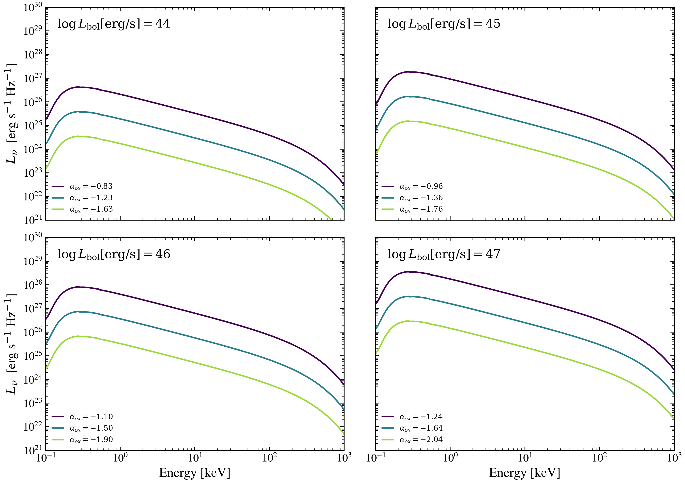

.. DO NOT EDIT.
.. THIS FILE WAS AUTOMATICALLY GENERATED BY SPHINX-GALLERY.
.. TO MAKE CHANGES, EDIT THE SOURCE PYTHON FILE:
.. "auto_examples/agn/plot_agn_alpha_ox_lbol_2d.py"
.. LINE NUMBERS ARE GIVEN BELOW.

.. only:: html

    .. note::
        :class: sphx-glr-download-link-note

        :ref:`Go to the end <sphx_glr_download_auto_examples_agn_plot_agn_alpha_ox_lbol_2d.py>`
        to download the full example code.

.. rst-class:: sphx-glr-example-title

.. _sphx_glr_auto_examples_agn_plot_agn_alpha_ox_lbol_2d.py:

X-ray corona shape across the alpha_OX vs log L_bol plane
==========================================================

The X-ray corona response of an AGN depends jointly on bolometric
luminosity (which sets the X-ray normalisation through the
Lusso & Risaliti L_X-L_UV correlation) and on the UV-to-X-ray slope
alpha_OX (which sets the relative balance of UV and X-ray emission).
Four panels at log L_bol = 44, 45, 46, 47 erg/s overlay three
alpha_OX values each, showing that the absolute X-ray luminosity
scales with L_bol while the X-ray-to-UV ratio is set independently
by alpha_OX.

Reference: Lusso & Risaliti 2016, ApJ, 819, 154 (alpha_OX-L_UV
correlation); Wilkins et al. 2020, MNRAS, 493, 5548.

.. GENERATED FROM PYTHON SOURCE LINES 17-79

.. image-sg:: /auto_examples/agn/images/sphx_glr_plot_agn_alpha_ox_lbol_2d_001.png
   :alt: plot agn alpha ox lbol 2d
   :srcset: /auto_examples/agn/images/sphx_glr_plot_agn_alpha_ox_lbol_2d_001.png
   :class: sphx-glr-single-img

.. code-block:: Python

    import os

    os.environ["TF_CPP_MIN_LOG_LEVEL"] = "2"  # suppress XLA/PjRt C++ INFO+WARNING logs

    import warnings

    import jax.numpy as jnp
    import matplotlib.pyplot as plt
    import numpy as np

    from tengri.analysis.plotting import setup_style
    from tengri.xray import alpha_ox_from_l2500, xray_agn_corona

    setup_style()
    warnings.filterwarnings("ignore", message=".*BakedInBackend.*")

    wavelength = jnp.logspace(np.log10(0.0124), np.log10(124.0), 512)
    energy_keV = 12.398 / np.array(wavelength)

    # Hopkins+2007 BC=5.15 at 2500 A
    _BC_NU = 5.15 * 1.199e15

    LOG_LBOL_VALUES = (44, 45, 46, 47)
    DELTA_VALUES = (0.4, 0.0, -0.4)  # offsets from the Just+2007 empirical alpha_OX
    COLORS = plt.cm.viridis(np.linspace(0.0, 0.85, len(DELTA_VALUES)))

    fig, axes = plt.subplots(2, 2, figsize=(10.5, 7.5), sharex=True, sharey=True)
    for ax, log_lbol in zip(axes.flat, LOG_LBOL_VALUES):
        L_2500 = 10.0**log_lbol / _BC_NU
        alpha_ox_base = float(alpha_ox_from_l2500(L_2500))
        for delta, color in zip(DELTA_VALUES, COLORS):
            sed = xray_agn_corona(
                wavelength,
                l_2500_30deg_erg_hz=L_2500,
                gamma=1.8,
                E_cut=300.0,
                delta_alpha_ox=float(delta),
            )
            sed_safe = np.where(np.asarray(sed) > 0, np.asarray(sed), np.nan)
            alpha_eff = alpha_ox_base + delta
            label = rf"$\alpha_{{ox}} = {alpha_eff:+.2f}$"
            ax.loglog(energy_keV, sed_safe, lw=1.6, color=color, label=label)
        ax.text(
            0.04,
            0.95,
            rf"$\log L_{{\rm bol}} [\mathrm{{erg/s}}] = {log_lbol}$",
            transform=ax.transAxes,
            va="top",
        )
        ax.set_xlim(0.1, 1000.0)
        ax.set_ylim(1.0e21, 1.0e30)
        ax.legend(frameon=False, fontsize=8, loc="lower left")
        ax.label_outer()

    for ax in axes[-1, :]:
        ax.set_xlabel("Energy [keV]")
    for ax in axes[:, 0]:
        ax.set_ylabel(r"$L_\nu$  [erg s$^{-1}$ Hz$^{-1}$]")

    fig.tight_layout()
    plt.savefig("plot_agn_alpha_ox_lbol_2d.png", dpi=150, bbox_inches="tight")

.. rst-class:: sphx-glr-timing

   **Total running time of the script:** (0 minutes 2.128 seconds)

.. _sphx_glr_download_auto_examples_agn_plot_agn_alpha_ox_lbol_2d.py:

.. only:: html

  .. container:: sphx-glr-footer sphx-glr-footer-example

    .. container:: sphx-glr-download sphx-glr-download-jupyter

      :download:`Download Jupyter notebook: plot_agn_alpha_ox_lbol_2d.ipynb <plot_agn_alpha_ox_lbol_2d.ipynb>`

    .. container:: sphx-glr-download sphx-glr-download-python

      :download:`Download Python source code: plot_agn_alpha_ox_lbol_2d.py <plot_agn_alpha_ox_lbol_2d.py>`

    .. container:: sphx-glr-download sphx-glr-download-zip

      :download:`Download zipped: plot_agn_alpha_ox_lbol_2d.zip <plot_agn_alpha_ox_lbol_2d.zip>`

.. only:: html

 .. rst-class:: sphx-glr-signature

    `Gallery generated by Sphinx-Gallery <https://sphinx-gallery.github.io>`_
