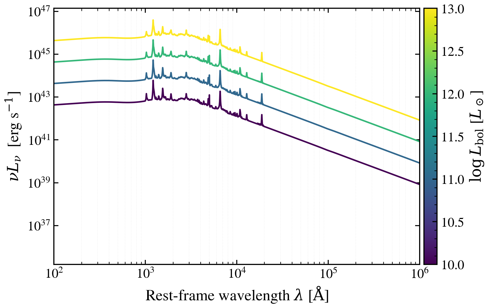

.. DO NOT EDIT.
.. THIS FILE WAS AUTOMATICALLY GENERATED BY SPHINX-GALLERY.
.. TO MAKE CHANGES, EDIT THE SOURCE PYTHON FILE:
.. "auto_examples/agn/plot_agn_qsogen_emline_sweep.py"
.. LINE NUMBERS ARE GIVEN BELOW.

.. only:: html

    .. note::
        :class: sphx-glr-download-link-note

        :ref:`Go to the end <sphx_glr_download_auto_examples_agn_plot_agn_qsogen_emline_sweep.py>`
        to download the full example code.

.. rst-class:: sphx-glr-example-title

.. _sphx_glr_auto_examples_agn_plot_agn_qsogen_emline_sweep.py:

QSOgen Emission Line Scaling: Rest-UV to Optical SED
=====================================================

How does emission-line strength shape the AGN SED in the UV and optical?
Sweeps agn_emline_scale from 0.0 to 2.0 on QSOgen at fixed log_lbol=45,
showing how line forests and broad lines strengthen the continuum between
1000–5000 Å and the Balmer continuum near H-alpha.

.. sphx-glr-precomputed-img:

.. GENERATED FROM PYTHON SOURCE LINES 17-62

.. code-block:: Python

    import jax.numpy as jnp
    import matplotlib.pyplot as plt
    import numpy as np

    from tengri.analysis.plotting import setup_style
    from tengri.components.agn import qsogen

    setup_style()

    # Wavelength grid: UV to optical (rest-frame)
    wavelength = jnp.logspace(np.log10(1000), np.log10(10000), 512)
    wave_um = np.array(wavelength) / 1e4

    # Emission-line scale factors to sweep
    emline_scale_values = [0.0, 0.5, 1.0, 1.5, 2.0]

    # Create figure with single panel
    fig, ax = plt.subplots(figsize=(8, 5))

    # Generate colors from colormap
    colors = plt.cm.viridis(np.linspace(0.0, 0.85, len(emline_scale_values)))

    # Fixed AGN luminosity
    log_lbol = 45.0

    # Sweep emission-line strength
    for emline_scale, color in zip(emline_scale_values, colors):
        sed = np.array(qsogen(wavelength, agn_log_lbol=log_lbol, agn_emline_scale=emline_scale))
        sed_safe = np.where(sed > 0, sed, np.nan)
        label = rf"Emission-line scale = {emline_scale}"
        ax.loglog(wave_um, sed_safe, lw=2.0, color=color, label=label)

    ax.set_xlabel(r"Wavelength [$\mu$m]")
    ax.set_ylabel(r"$L_\nu$ [erg s$^{-1}$ Hz$^{-1}$]")
    ax.set_title(f"QSOgen: Emission-line scaling at log L_bol/L_sun = {log_lbol}", fontsize=12)
    ax.legend(fontsize=10, frameon=False, loc="lower left")
    # Broader axis limits for context
    ax.set_xlim(0.1, 2.0)
    ax.set_ylim(1e61, 1e66)
    ax.grid(False)

    fig.tight_layout()
    plt.savefig("plot_agn_qsogen_emline_sweep.png", dpi=150, bbox_inches="tight")
    plt.show()

.. _sphx_glr_download_auto_examples_agn_plot_agn_qsogen_emline_sweep.py:

.. only:: html

  .. container:: sphx-glr-footer sphx-glr-footer-example

    .. container:: sphx-glr-download sphx-glr-download-jupyter

      :download:`Download Jupyter notebook: plot_agn_qsogen_emline_sweep.ipynb <plot_agn_qsogen_emline_sweep.ipynb>`

    .. container:: sphx-glr-download sphx-glr-download-python

      :download:`Download Python source code: plot_agn_qsogen_emline_sweep.py <plot_agn_qsogen_emline_sweep.py>`

    .. container:: sphx-glr-download sphx-glr-download-zip

      :download:`Download zipped: plot_agn_qsogen_emline_sweep.zip <plot_agn_qsogen_emline_sweep.zip>`

.. only:: html

 .. rst-class:: sphx-glr-signature

    `Gallery generated by Sphinx-Gallery <https://sphinx-gallery.github.io>`_
