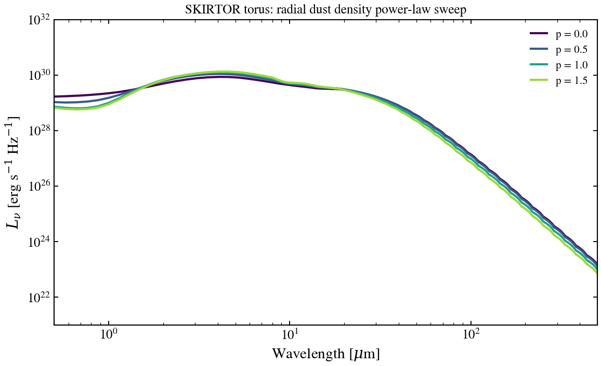

.. DO NOT EDIT.
.. THIS FILE WAS AUTOMATICALLY GENERATED BY SPHINX-GALLERY.
.. TO MAKE CHANGES, EDIT THE SOURCE PYTHON FILE:
.. "auto_examples/agn/plot_agn_skirtor_p_sweep.py"
.. LINE NUMBERS ARE GIVEN BELOW.

.. only:: html

    .. note::
        :class: sphx-glr-download-link-note

        :ref:`Go to the end <sphx_glr_download_auto_examples_agn_plot_agn_skirtor_p_sweep.py>`
        to download the full example code.

.. rst-class:: sphx-glr-example-title

.. _sphx_glr_auto_examples_agn_plot_agn_skirtor_p_sweep.py:

SKIRTOR Torus: Radial Dust Power-Law Sweep
===========================================

How does the radial dust density profile (power index p) reshape the torus
IR SED? Sweeps agn_p_skirtor from 0.0 to 1.5 at fixed inclination=0.5,
tau_97=7, showing the transition from flat to steep density profiles and
their effect on the mid-to-far-IR peak and far-IR slope.

.. sphx-glr-precomputed-img:

.. GENERATED FROM PYTHON SOURCE LINES 17-100

.. code-block:: Python

    from pathlib import Path

    import jax.numpy as jnp
    import matplotlib.pyplot as plt
    import numpy as np

    # Locate SKIRTOR grid file
    _grid_path = None
    for p in [
        Path("data/skirtor_templates_v3.h5"),
        Path("../data/skirtor_templates_v3.h5"),
        Path("../../data/skirtor_templates_v3.h5"),
        Path("../../../data/skirtor_templates_v3.h5"),
        Path("data/skirtor_templates_v2.h5"),
        Path("../data/skirtor_templates_v2.h5"),
        Path("../../data/skirtor_templates_v2.h5"),
        Path("../../../data/skirtor_templates_v2.h5"),
    ]:
        if p.exists():
            _grid_path = str(p)
            break

    if _grid_path is None:
        raise SystemExit(
            "Skipping: SKIRTOR grid not found. Run: python scripts/download_skirtor_templates.py"
        )

    from tengri.analysis.plotting import setup_style
    from tengri.components.agn import create_skirtor_from_grid

    setup_style()

    # Load the SKIRTOR interpolator
    skirtor_fn = create_skirtor_from_grid(_grid_path)

    # Wavelength grid: mid-IR to far-IR torus region
    wavelength = jnp.logspace(np.log10(5e3), np.log10(5e6), 512)
    wave_um = np.array(wavelength) / 1e4

    # Radial power-law index values to sweep
    p_values = [0.0, 0.5, 1.0, 1.5]

    # Create figure with single panel
    fig, ax = plt.subplots(figsize=(8, 5))

    # Generate colors from colormap
    colors = plt.cm.viridis(np.linspace(0.0, 0.85, len(p_values)))

    # Fixed parameters
    agn_log_lbol = 11.0
    agn_tau_skirtor = 7.0
    agn_q_skirtor = 1.0
    agn_oa_skirtor = 40.0
    cos_inc = 0.5  # 60 degrees inclination

    # Sweep radial power index
    for p_val, color in zip(p_values, colors):
        try:
            sed = skirtor_fn(
                wavelength,
                agn_log_lbol=agn_log_lbol,
                agn_tau_skirtor=agn_tau_skirtor,
                agn_p_skirtor=float(p_val),
                agn_q_skirtor=agn_q_skirtor,
                agn_oa_skirtor=agn_oa_skirtor,
                agn_cos_inc=cos_inc,
            )
            ax.loglog(wave_um, np.array(sed), lw=2.0, color=color, label=rf"p = {p_val}")
        except Exception:
            continue

    ax.set_xlabel(r"Wavelength [$\mu$m]")
    ax.set_ylabel(r"$L_\nu$ [erg s$^{-1}$ Hz$^{-1}$]")
    ax.set_title("SKIRTOR torus: radial dust density power-law sweep", fontsize=12)
    ax.legend(fontsize=10, frameon=False, loc="best")
    ax.set_xlim(0.5, 500)
    ax.set_ylim(1e21, 1e32)
    ax.grid(False)

    fig.tight_layout()
    plt.savefig("plot_agn_skirtor_p_sweep.png", dpi=150, bbox_inches="tight")
    plt.show()

.. _sphx_glr_download_auto_examples_agn_plot_agn_skirtor_p_sweep.py:

.. only:: html

  .. container:: sphx-glr-footer sphx-glr-footer-example

    .. container:: sphx-glr-download sphx-glr-download-jupyter

      :download:`Download Jupyter notebook: plot_agn_skirtor_p_sweep.ipynb <plot_agn_skirtor_p_sweep.ipynb>`

    .. container:: sphx-glr-download sphx-glr-download-python

      :download:`Download Python source code: plot_agn_skirtor_p_sweep.py <plot_agn_skirtor_p_sweep.py>`

    .. container:: sphx-glr-download sphx-glr-download-zip

      :download:`Download zipped: plot_agn_skirtor_p_sweep.zip <plot_agn_skirtor_p_sweep.zip>`

.. only:: html

 .. rst-class:: sphx-glr-signature

    `Gallery generated by Sphinx-Gallery <https://sphinx-gallery.github.io>`_
