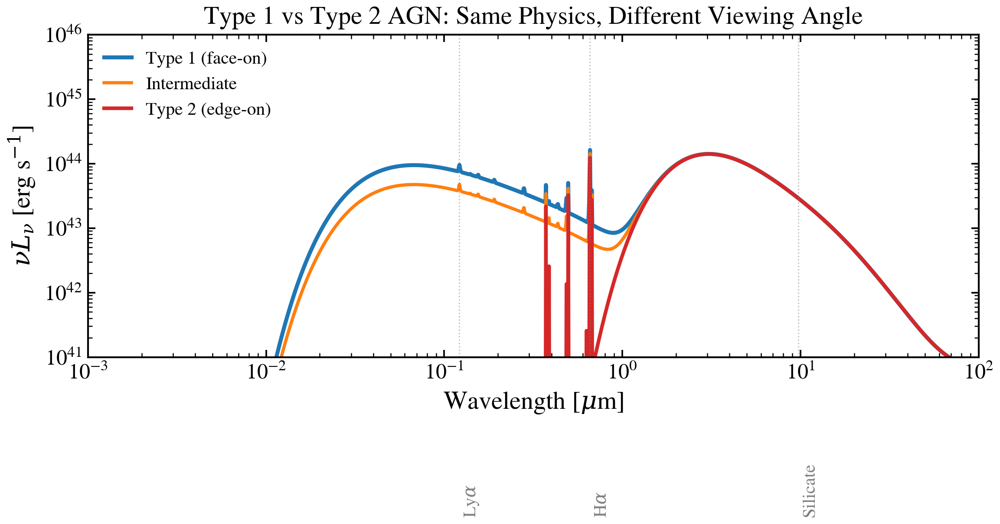

.. DO NOT EDIT.
.. THIS FILE WAS AUTOMATICALLY GENERATED BY SPHINX-GALLERY.
.. TO MAKE CHANGES, EDIT THE SOURCE PYTHON FILE:
.. "auto_examples/agn/plot_agn_type12.py"
.. LINE NUMBERS ARE GIVEN BELOW.

.. only:: html

    .. note::
        :class: sphx-glr-download-link-note

        :ref:`Go to the end <sphx_glr_download_auto_examples_agn_plot_agn_type12.py>`
        to download the full example code.

.. rst-class:: sphx-glr-example-title

.. _sphx_glr_auto_examples_agn_plot_agn_type12.py:

Type 1 vs Type 2 AGN: Geometric Unification
============================================

The unified model of AGN activity: the same physical system appears as
Type 1 (broad-line, blue disc continuum visible) or Type 2 (narrow-line only,
torus blocks the accretion disc) depending purely on viewing angle.

.. sphx-glr-precomputed-img:

.. GENERATED FROM PYTHON SOURCE LINES 16-78

.. code-block:: Python

    import jax
    import jax.numpy as jnp
    import matplotlib.pyplot as plt
    import numpy as np

    jax.config.update("jax_enable_x64", True)

    from tengri import setup_style
    from tengri.agn import unified_nlr_blr

    setup_style()

    # --- Wavelength grid: 1e-3 -- 100 um ---
    wave_aa = np.logspace(np.log10(100.0), np.log10(1e7), 2000)
    wave_um = wave_aa * 1e-4

    # --- Three inclination angles ---
    configs = [
        {"cos_inc": 0.95, "label": "Type 1 (face-on)", "color": "#1f77b4", "lw": 2.2},
        {"cos_inc": 0.50, "label": "Intermediate", "color": "#ff7f0e", "lw": 1.8},
        {"cos_inc": 0.10, "label": "Type 2 (edge-on)", "color": "#d62728", "lw": 2.0},
    ]

    fig, ax = plt.subplots(figsize=(8, 5))

    wave_jnp = jnp.array(wave_aa)
    for cfg in configs:
        lnu = unified_nlr_blr(
            wave_jnp,
            agn_log_lbol=11.0,
            agn_cos_inc=cfg["cos_inc"],
            agn_theta_torus=30.0,
            agn_log_mbh=8.0,
            agn_frac=1.0,
        )
        nulnu = np.array(lnu) * 3e18 / wave_aa  # νLν
        mask = nulnu > 0
        ax.loglog(wave_um[mask], nulnu[mask], color=cfg["color"], lw=cfg["lw"], label=cfg["label"])

    # Mark key wavelengths
    for wl, lbl in [(0.1216, r"Ly$\alpha$"), (0.6563, r"H$\alpha$"), (9.7, "Silicate")]:
        ax.axvline(wl, color="grey", ls=":", lw=0.7, alpha=0.5)
        ax.text(
            wl * 1.05,
            ax.get_ylim()[0] if ax.get_ylim()[0] > 0 else 1e35,
            lbl,
            fontsize=10,
            color="grey",
            va="bottom",
            rotation=90,
        )

    ax.set_xlim(1e-3, 100)
    ax.set_ylim(1e41, 1e46)
    ax.set_xlabel(r"Wavelength [$\mu$m]")
    ax.set_ylabel(r"$\nu L_\nu$ [erg s$^{-1}$]")
    ax.set_title("Type 1 vs Type 2 AGN: Same Physics, Different Viewing Angle")
    ax.legend(fontsize=10, frameon=False)
    fig.tight_layout()
    plt.savefig("plot_agn_type12.png", dpi=150, bbox_inches="tight")
    plt.show()

.. _sphx_glr_download_auto_examples_agn_plot_agn_type12.py:

.. only:: html

  .. container:: sphx-glr-footer sphx-glr-footer-example

    .. container:: sphx-glr-download sphx-glr-download-jupyter

      :download:`Download Jupyter notebook: plot_agn_type12.ipynb <plot_agn_type12.ipynb>`

    .. container:: sphx-glr-download sphx-glr-download-python

      :download:`Download Python source code: plot_agn_type12.py <plot_agn_type12.py>`

    .. container:: sphx-glr-download sphx-glr-download-zip

      :download:`Download zipped: plot_agn_type12.zip <plot_agn_type12.zip>`

.. only:: html

 .. rst-class:: sphx-glr-signature

    `Gallery generated by Sphinx-Gallery <https://sphinx-gallery.github.io>`_
