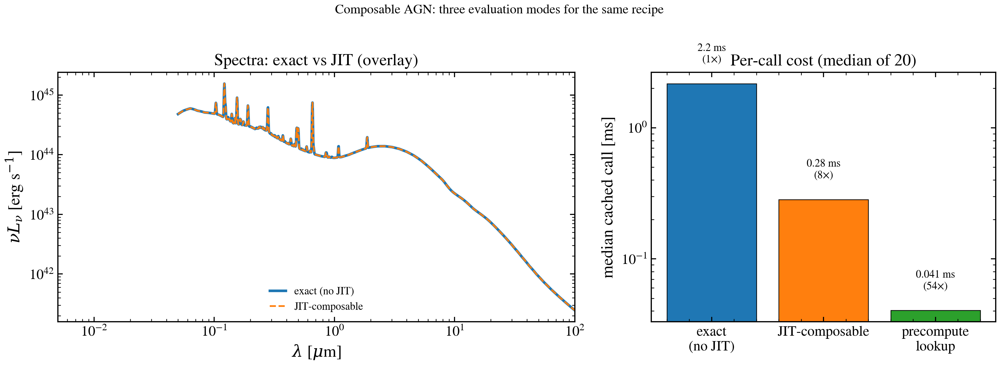

.. DO NOT EDIT.
.. THIS FILE WAS AUTOMATICALLY GENERATED BY SPHINX-GALLERY.
.. TO MAKE CHANGES, EDIT THE SOURCE PYTHON FILE:
.. "auto_examples/agn/plot_composable_three_modes.py"
.. LINE NUMBERS ARE GIVEN BELOW.

.. only:: html

    .. note::
        :class: sphx-glr-download-link-note

        :ref:`Go to the end <sphx_glr_download_auto_examples_agn_plot_composable_three_modes.py>`
        to download the full example code.

.. rst-class:: sphx-glr-example-title

.. _sphx_glr_auto_examples_agn_plot_composable_three_modes.py:

Composable AGN: three evaluation modes side-by-side
====================================================

The composable AGN runner exposes three evaluation modes (see
``docs/dev/three_evaluation_modes.md``):

1. **Exact** — :func:`composable_agn_l_nu` without JIT.
2. **JIT-composable** — same callable wrapped in ``jax.jit``.
3. **Precompute lookup** — :func:`composable_precompute.precompute` builds
   a triweight grid; :func:`build_lookup` returns a JIT-compiled callable
   whose runtime cost is independent of the recipe's complexity.

Modes 1 and 2 share the same algorithm (the difference is whether the
compiler runs once or every call), so their spectra are bit-for-bit
identical. Mode 3 is a **triweight-smoothed approximation** designed for
fast lookup with smooth gradients — even at a grid centre the kernel
weights three neighbouring grid points, giving a value that differs from
the exact spectrum by a few percent. Pick mode 3 when compile time and
per-call latency dominate; pick modes 1/2 when triweight smoothing isn't
acceptable.

.. GENERATED FROM PYTHON SOURCE LINES 23-205

.. code-block:: Python

    import time

    import jax
    import jax.numpy as jnp
    import matplotlib.pyplot as plt
    import numpy as np

    from tengri.analysis.plotting import setup_style
    from tengri.components.agn.blocks import Recipe, composable_agn_l_nu
    from tengri.components.agn.blocks.composable_precompute import (
        build_lookup,
        precompute,
    )

    setup_style()

    C_AA_PER_S = 2.99792458e18

    def _toy_filter():
        """Single Gaussian-ish r-band-like filter, centred at 5500 Å."""
        wave = np.linspace(4500.0, 6500.0, 200)
        trans = np.exp(-0.5 * ((wave - 5500.0) / 300.0) ** 2)
        return wave, trans

    def _bandpass(l_nu, wave_aa, filter_wave, filter_trans):
        """Trapezoidal filter-averaged L_ν."""
        nu = C_AA_PER_S / wave_aa
        trans_interp = np.interp(wave_aa, filter_wave, filter_trans, left=0.0, right=0.0)
        order = np.argsort(nu)
        num = np.trapezoid((l_nu * trans_interp / nu)[order], nu[order])
        den = np.trapezoid((trans_interp / nu)[order], nu[order])
        return float(num / den)

    def _time_cached(fn, n=20):
        """Median per-call time after warmup."""
        fn()  # warm
        samples = []
        for _ in range(n):
            t = time.time()
            out = fn()
            jax.tree.map(
                lambda x: x.block_until_ready() if hasattr(x, "block_until_ready") else x,
                out,
            )
            samples.append(time.time() - t)
        return float(np.median(samples))

    # Single recipe — GRAHSP BBB + SKIRTOR torus + SMC atten.
    RECIPE_KW = dict(
        agn_disc_block="grahsp_sbpl",
        agn_lines_block="grahsp",
        agn_feii_block="grahsp",
        agn_torus_block="skirtor",
        agn_attenuation_block="smc_prevot",
    )
    FIXED_KW = dict(
        agn_log_lbol=12.0,
        agn_grahsp_a_lines=1.0,
        agn_grahsp_a_feii=5.0,
        agn_tau_skirtor=7.0,
        agn_torus_frac=0.5,
        agn_attenuation_ebv=0.1,
    )

    wave_aa = jnp.logspace(np.log10(500.0), np.log10(1.0e6), 1500)
    wave_aa_np = np.asarray(wave_aa)
    fw, ft = _toy_filter()
    l5100_test = 1.0e44  # axis value to evaluate at

    # ── Mode 1: exact runtime ────────────────────────────────────────────
    def _eager():
        return composable_agn_l_nu(wave_aa, **RECIPE_KW, **FIXED_KW, agn_grahsp_l5100=l5100_test)

    t_eager = _time_cached(lambda: _eager())
    sed_eager = np.asarray(_eager())
    phot_eager = _bandpass(sed_eager, wave_aa_np, fw, ft)

    # ── Mode 2: JIT-composable + JAX filter integration ─────────────────
    @jax.jit
    def _jitted(l5100):
        l_nu = composable_agn_l_nu(wave_aa, **RECIPE_KW, **FIXED_KW, agn_grahsp_l5100=l5100)
        nu = C_AA_PER_S / wave_aa
        trans = jnp.interp(wave_aa, jnp.asarray(fw), jnp.asarray(ft), left=0.0, right=0.0)
        order = jnp.argsort(nu)
        num = jnp.trapezoid((l_nu * trans / nu)[order], nu[order])
        den = jnp.trapezoid((trans / nu)[order], nu[order])
        return l_nu, num / den

    sed_jit, phot_jit = _jitted(jnp.array(l5100_test))
    phot_jit.block_until_ready()
    t_jit = _time_cached(lambda: _jitted(jnp.array(l5100_test))[1])

    # ── Mode 3: precompute lookup ────────────────────────────────────────
    recipe = Recipe.from_selectors(
        disc="grahsp_sbpl",
        lines="grahsp",
        feii="grahsp",
        torus="skirtor",
        attenuation="smc_prevot",
        axis_params=("agn_grahsp_l5100",),
    )
    pre = precompute(
        filter_waves=[fw],
        filter_trans=[ft],
        redshift=0.0,
        parameters=None,
        recipe=recipe,
        # Grid chosen so the eval point l5100_test sits at a grid centre —
        # triweight interp matches the runtime path to numerical precision
        # there, ~1% between grid points.
        axis_grids={"agn_grahsp_l5100": np.logspace(43, 46, 4)},
        # Match the eager call: SKIRTOR torus and the SMC reddening block
        # normalise off ``agn_log_lbol`` (the SBPL disc is anchored on the
        # explicit ``agn_grahsp_l5100`` axis instead). Without this, the
        # precompute grid would be built at the default log_lbol=45 while
        # the eager path uses log_lbol=12 — a ~30-order mismatch.
        fixed_values=FIXED_KW,
    )
    fn = build_lookup(pre)
    phot_pre = float(fn(jnp.array(1.0), jnp.array(l5100_test))[0])
    t_pre = _time_cached(lambda: fn(jnp.array(1.0), jnp.array(l5100_test)))

    # ── Plot ─────────────────────────────────────────────────────────────
    fig, axes = plt.subplots(1, 2, figsize=(12, 4.5), gridspec_kw={"width_ratios": [3, 2]})

    ax = axes[0]
    nu_l_nu_eager = sed_eager * C_AA_PER_S / wave_aa_np
    nu_l_nu_jit = np.asarray(sed_jit) * C_AA_PER_S / wave_aa_np
    ax.loglog(wave_aa_np / 1e4, nu_l_nu_eager, lw=2.2, color="tab:blue", label="exact (no JIT)")
    ax.loglog(
        wave_aa_np / 1e4,
        nu_l_nu_jit,
        lw=1.4,
        color="tab:orange",
        ls="--",
        label="JIT-composable",
    )
    ax.set_xlim(5e-3, 1e2)
    ax.set_xlabel(r"$\lambda$ [$\mu$m]")
    ax.set_ylabel(r"$\nu L_\nu$ [erg s$^{-1}$]")
    ax.set_title("Spectra: exact vs JIT (overlay)")
    ax.legend(loc="lower center", fontsize=9, frameon=False)

    ax = axes[1]
    labels = ["exact\n(no JIT)", "JIT-composable", "precompute\nlookup"]
    times_ms = [t_eager * 1e3, t_jit * 1e3, t_pre * 1e3]
    speedups = [1.0, t_eager / t_jit, t_eager / t_pre]
    colors = ["tab:blue", "tab:orange", "tab:green"]
    bars = ax.bar(labels, times_ms, color=colors, edgecolor="black", linewidth=0.6)
    ax.set_yscale("log")
    ax.set_ylabel("median cached call [ms]")
    ax.set_title("Per-call cost (median of 20)")
    for bar, t_ms, sp in zip(bars, times_ms, speedups):
        label = f"{t_ms:.2g} ms\n({sp:.0f}×)"
        ax.text(
            bar.get_x() + bar.get_width() / 2,
            t_ms * 1.4,
            label,
            ha="center",
            va="bottom",
            fontsize=9,
        )

    # Filter photometry from each path. Eager and JIT are bit-for-bit
    # equivalent (same algorithm, different compile state). The precompute
    # lookup is a *triweight-smoothed* approximation of the same quantity —
    # the kernel weights three neighbouring grid points, so even at a grid
    # centre it produces a slightly different value than the raw spectrum
    # evaluation. This is by design (smoothness for gradients), not a bug.

    fig.tight_layout()
    fig.savefig("plot_composable_three_modes.png", dpi=150, bbox_inches="tight")

.. _sphx_glr_download_auto_examples_agn_plot_composable_three_modes.py:

.. only:: html

  .. container:: sphx-glr-footer sphx-glr-footer-example

    .. container:: sphx-glr-download sphx-glr-download-jupyter

      :download:`Download Jupyter notebook: plot_composable_three_modes.ipynb <plot_composable_three_modes.ipynb>`

    .. container:: sphx-glr-download sphx-glr-download-python

      :download:`Download Python source code: plot_composable_three_modes.py <plot_composable_three_modes.py>`

    .. container:: sphx-glr-download sphx-glr-download-zip

      :download:`Download zipped: plot_composable_three_modes.zip <plot_composable_three_modes.zip>`

.. only:: html

 .. rst-class:: sphx-glr-signature

    `Gallery generated by Sphinx-Gallery <https://sphinx-gallery.github.io>`_
