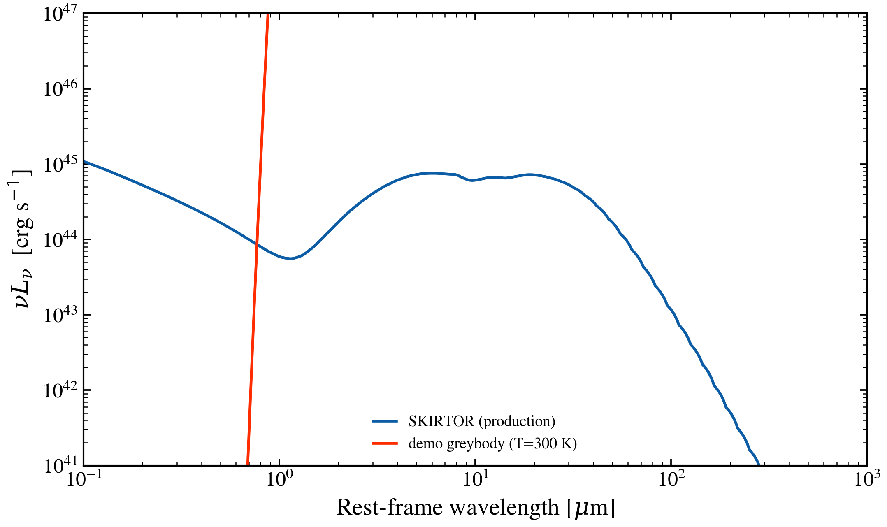

.. DO NOT EDIT.
.. THIS FILE WAS AUTOMATICALLY GENERATED BY SPHINX-GALLERY.
.. TO MAKE CHANGES, EDIT THE SOURCE PYTHON FILE:
.. "auto_examples/agn/plot_custom_torus_extension.py"
.. LINE NUMBERS ARE GIVEN BELOW.

.. only:: html

    .. note::
        :class: sphx-glr-download-link-note

        :ref:`Go to the end <sphx_glr_download_auto_examples_agn_plot_custom_torus_extension.py>`
        to download the full example code.

.. rst-class:: sphx-glr-example-title

.. _sphx_glr_auto_examples_agn_plot_custom_torus_extension.py:

Registering a custom AGN torus model and using it through ``SEDModel.build``
=============================================================================

The collaborator workflow for adding a new AGN model. We define a toy
single-temperature blackbody torus, register it with
``register_agn_model``, confirm it is discoverable through
``tengri.list_agn_models`` and ``tengri.describe``, then evaluate it on
the public ``SEDModel.build`` path and plot it next to the production
SKIRTOR torus at the same bolometric luminosity. The toy curve is a
greybody; the SKIRTOR curve carries the silicate 9.7 micron feature
and the inclination-dependent geometry the toy elides.

The same pattern (registration + introspection + ``SEDModel.build``)
is the entry point for any new AGN model. For dust attenuation /
emission and SFH, the modern path is the ``SEDModelComponent`` base
class — see ``docs/dev/sed-model-components.md``.

.. GENERATED FROM PYTHON SOURCE LINES 19-138

.. code-block:: Python

    import os

    os.environ["TF_CPP_MIN_LOG_LEVEL"] = "2"  # suppress XLA/PjRt C++ INFO+WARNING logs

    import warnings

    import jax
    import jax.numpy as jnp
    import matplotlib.pyplot as plt
    import numpy as np

    import tengri
    from tengri.analysis.plotting import setup_style
    from tengri.components.agn.unified import register_agn_model

    setup_style()
    warnings.filterwarnings("ignore", message=".*BakedInBackend.*")

    C_AA_PER_S = 2.998e18
    LSUN_ERG = 3.828e33

    @register_agn_model(
        "demo_greybody_torus",
        citation="gallery demo (replace with your reference)",
        status="experimental",
        short_doc="Single-T greybody torus — demonstration only",
    )
    def demo_greybody_torus(
        wavelength: jnp.ndarray,
        agn_log_lbol: float,
        agn_frac: float = 1.0,
        agn_T_torus: float = 300.0,
        agn_torus_frac: float = 0.5,
        **_kwargs,
    ) -> jnp.ndarray:
        """Greybody torus emission at a single dust temperature.

        Parameters
        ----------
        wavelength : array_like
            Rest-frame wavelength [Angstrom].
        agn_log_lbol : float
            log10(L_bol / L_sun).
        agn_frac, agn_torus_frac : float
            AGN fraction of total SED, and torus covering / luminosity
            fraction of L_bol.
        agn_T_torus : float
            Dust temperature [K].
        """
        h = 6.626e-27
        k_B = 1.381e-16
        c_cgs = 2.998e10

        nu = c_cgs / (wavelength * 1.0e-8)
        B_nu = (2 * h * nu**3 / c_cgs**2) / (jnp.exp(h * nu / (k_B * agn_T_torus)) - 1.0)

        L_bol_erg = 10.0**agn_log_lbol * LSUN_ERG
        nu_ref = c_cgs / 1.0e-4
        B_ref = (2 * h * nu_ref**3 / c_cgs**2) / (jnp.exp(h * nu_ref / (k_B * agn_T_torus)) - 1.0)
        L_nu = (B_nu / B_ref) * (L_bol_erg / 1.0e10) * agn_torus_frac
        return L_nu * agn_frac

    # Discoverability check — the registry now sees the demo entry.
    registered = {m["name"] for m in tengri.list_agn_models(status="experimental")}
    assert "demo_greybody_torus" in registered, "Registration failed"

    # Negligible host SFH: total mass ~1e-10 Msun, completely subdominant
    # to the AGN luminosity below. ``log_sfr`` was the legacy kwarg; current
    # ``const`` SFH parametrises by total mass over [start_gyr, end_gyr].
    SFH = {"type": "const", "*": tengri.FIXED, "log_total_mass": -10.0}
    DUST = {"type": "two_component", "*": tengri.FIXED, "tau_diff": 0.0, "tau_bc": 0.0}
    LOG_LBOL = 12.0
    ssp = tengri.load_ssp()

    model_skirtor = tengri.SEDModel.build(
        ssp,
        sfh=SFH,
        dust=DUST,
        agn={
            "*": tengri.FIXED,
            "log_lbol": LOG_LBOL,
            "frac": 1.0,
            "disc": {"type": "multicolor", "*": tengri.FIXED},
            "torus": {"type": "skirtor", "*": tengri.FIXED},
        },
        redshift=tengri.Fixed(0.0),
    )
    p_skirtor = dict(model_skirtor.spec.sample(jax.random.PRNGKey(0)))
    out_skirtor = model_skirtor.predict_rest_sed(p_skirtor)

    wave_um = np.asarray(out_skirtor.wavelength) * 1.0e-4
    nu_lnu_skirtor = C_AA_PER_S / np.asarray(out_skirtor.wavelength) * np.asarray(out_skirtor.sed)

    L_nu_toy = np.asarray(
        demo_greybody_torus(
            jnp.asarray(out_skirtor.wavelength),
            agn_log_lbol=LOG_LBOL,
            agn_frac=1.0,
            agn_T_torus=300.0,
            agn_torus_frac=0.5,
        )
    )
    nu_lnu_toy = C_AA_PER_S / np.asarray(out_skirtor.wavelength) * L_nu_toy

    fig, ax = plt.subplots(figsize=(7.5, 4.6))
    ax.loglog(wave_um, nu_lnu_skirtor, color="C0", lw=1.6, label="SKIRTOR (production)")
    ax.loglog(wave_um, nu_lnu_toy, color="C3", lw=1.6, label="demo greybody (T=300 K)")
    ax.set(
        xlim=(0.1, 1.0e3),
        ylim=(1.0e41, 1.0e47),
        xlabel=r"Rest-frame wavelength [$\mu$m]",
        ylabel=r"$\nu L_\nu$  [erg s$^{-1}$]",
    )
    ax.legend(frameon=False, fontsize=9, loc="lower center")
    fig.tight_layout()
    plt.savefig("plot_custom_torus_extension.png", dpi=150, bbox_inches="tight")

.. _sphx_glr_download_auto_examples_agn_plot_custom_torus_extension.py:

.. only:: html

  .. container:: sphx-glr-footer sphx-glr-footer-example

    .. container:: sphx-glr-download sphx-glr-download-jupyter

      :download:`Download Jupyter notebook: plot_custom_torus_extension.ipynb <plot_custom_torus_extension.ipynb>`

    .. container:: sphx-glr-download sphx-glr-download-python

      :download:`Download Python source code: plot_custom_torus_extension.py <plot_custom_torus_extension.py>`

    .. container:: sphx-glr-download sphx-glr-download-zip

      :download:`Download zipped: plot_custom_torus_extension.zip <plot_custom_torus_extension.zip>`

.. only:: html

 .. rst-class:: sphx-glr-signature

    `Gallery generated by Sphinx-Gallery <https://sphinx-gallery.github.io>`_
