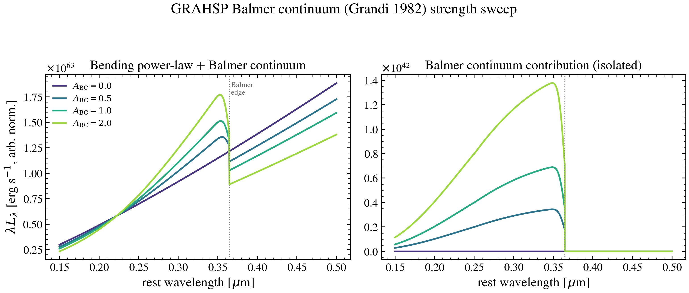

.. DO NOT EDIT.
.. THIS FILE WAS AUTOMATICALLY GENERATED BY SPHINX-GALLERY.
.. TO MAKE CHANGES, EDIT THE SOURCE PYTHON FILE:
.. "auto_examples/agn/plot_grahsp_balmer_continuum.py"
.. LINE NUMBERS ARE GIVEN BELOW.

.. only:: html

    .. note::
        :class: sphx-glr-download-link-note

        :ref:`Go to the end <sphx_glr_download_auto_examples_agn_plot_grahsp_balmer_continuum.py>`
        to download the full example code.

.. rst-class:: sphx-glr-example-title

.. _sphx_glr_auto_examples_agn_plot_grahsp_balmer_continuum.py:

GRAHSP Balmer continuum: building the small blue bump
======================================================

The GRAHSP AGN model (Buchner+ 2024) optionally adds a **Balmer continuum**
following Grandi (1982): a 15,000 K blackbody truncated at the Balmer edge
(3646 Å) and Gaussian-broadened by the line width. Together with the FeII
forest it builds the "small blue bump" seen blueward of ~4000 Å in type-1
quasars.

To isolate the effect we switch the emission lines, FeII forest and torus
**off** (``a_lines=0``, ``a_feii=0``, ``fcov=0``), leaving only the bending
power-law continuum, and sweep the strength parameter ``agn_grahsp_a_bc``
(upstream ``ABC``) from off to strong. The left panel shows the continuum +
Balmer bump zoomed on the edge; the right shows the Balmer contribution in
isolation (zero above the edge, rising blueward).

.. GENERATED FROM PYTHON SOURCE LINES 18-84

.. image-sg:: /auto_examples/agn/images/sphx_glr_plot_grahsp_balmer_continuum_001.png
   :alt: GRAHSP Balmer continuum (Grandi 1982) strength sweep, Bending power-law + Balmer continuum, Balmer continuum contribution (isolated)
   :srcset: /auto_examples/agn/images/sphx_glr_plot_grahsp_balmer_continuum_001.png
   :class: sphx-glr-single-img

.. code-block:: Python

    import os

    os.environ["TF_CPP_MIN_LOG_LEVEL"] = "2"

    import warnings

    import jax.numpy as jnp
    import matplotlib.pyplot as plt
    import numpy as np

    from tengri.analysis.plotting import setup_style
    from tengri.components.agn.grahsp.model import (
        GRAHSPParams,
        compute_grahsp_sed,
        evaluate_grahsp_agn,
    )
    from tengri.components.agn.grahsp.templates import load_grahsp_templates

    setup_style()
    warnings.filterwarnings("ignore", message=".*BakedInBackend.*")

    # Rest-frame near-UV/optical window bracketing the Balmer edge.
    wave_aa = jnp.linspace(1500.0, 5000.0, 1400)
    wave_um = np.asarray(wave_aa) / 1e4
    templates = load_grahsp_templates()

    A_BC = [0.0, 0.5, 1.0, 2.0]
    colors = plt.cm.viridis(np.linspace(0.15, 0.85, len(A_BC)))

    fig, (ax1, ax2) = plt.subplots(1, 2, figsize=(10.6, 4.4), sharex=True)

    for a_bc, c in zip(A_BC, colors):
        # Continuum + Balmer only (lines / FeII / torus suppressed).
        total = np.asarray(
            compute_grahsp_sed(
                wave_aa,
                agn_log_lbol=45.0,
                agn_grahsp_a_lines=0.0,
                agn_grahsp_a_feii=0.0,
                agn_grahsp_fcov=0.0,
                agn_grahsp_a_bc=a_bc,
            )
        )
        ax1.plot(wave_um, wave_um * total, color=c, lw=1.8, label=rf"$A_{{\rm BC}}={a_bc}$")

        # Balmer contribution in isolation (erg/s/nm -> lambda*L_lambda).
        sed = evaluate_grahsp_agn(
            wave_aa * 0.1,  # nm
            GRAHSPParams(l5100=1e44, a_lines=0.0, a_feii=0.0, fcov=0.0, a_bc=a_bc),
            templates,
        )
        balmer_llam = np.asarray(sed.balmer)  # erg/s/nm
        ax2.plot(wave_um, wave_um * balmer_llam * 1e1, color=c, lw=1.8)

    for ax in (ax1, ax2):
        ax.axvline(3646.0 / 1e4, color="0.5", ls=":", lw=1.0)
        ax.set_xlabel(r"rest wavelength [$\mu$m]")
    ax1.text(3646.0 / 1e4, ax1.get_ylim()[1] * 0.9, " Balmer\n edge", fontsize=8, color="0.4")
    ax1.set_ylabel(r"$\lambda L_\lambda$ [erg s$^{-1}$, arb. norm.]")
    ax1.set_title("Bending power-law + Balmer continuum")
    ax1.legend(frameon=False, fontsize=9)
    ax2.set_title("Balmer continuum contribution (isolated)")
    fig.suptitle("GRAHSP Balmer continuum (Grandi 1982) strength sweep", y=1.02)
    fig.tight_layout()
    plt.show()

.. _sphx_glr_download_auto_examples_agn_plot_grahsp_balmer_continuum.py:

.. only:: html

  .. container:: sphx-glr-footer sphx-glr-footer-example

    .. container:: sphx-glr-download sphx-glr-download-jupyter

      :download:`Download Jupyter notebook: plot_grahsp_balmer_continuum.ipynb <plot_grahsp_balmer_continuum.ipynb>`

    .. container:: sphx-glr-download sphx-glr-download-python

      :download:`Download Python source code: plot_grahsp_balmer_continuum.py <plot_grahsp_balmer_continuum.py>`

    .. container:: sphx-glr-download sphx-glr-download-zip

      :download:`Download zipped: plot_grahsp_balmer_continuum.zip <plot_grahsp_balmer_continuum.zip>`

.. only:: html

 .. rst-class:: sphx-glr-signature

    `Gallery generated by Sphinx-Gallery <https://sphinx-gallery.github.io>`_
