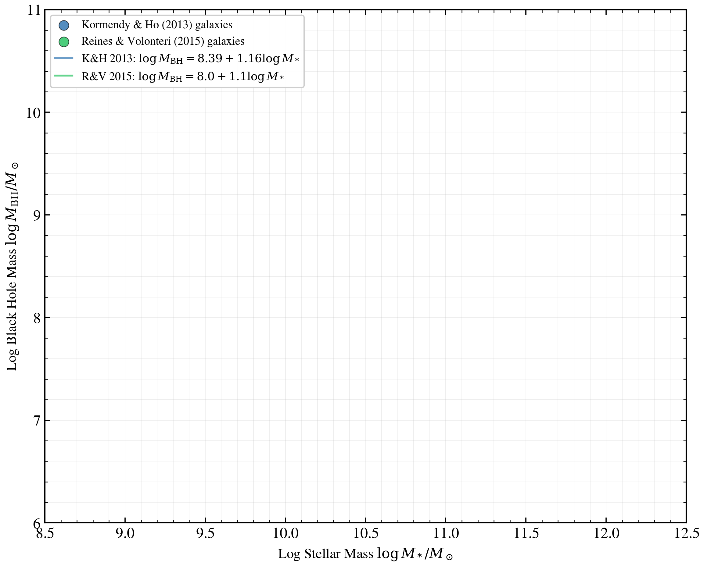

.. DO NOT EDIT.
.. THIS FILE WAS AUTOMATICALLY GENERATED BY SPHINX-GALLERY.
.. TO MAKE CHANGES, EDIT THE SOURCE PYTHON FILE:
.. "auto_examples/agn/plot_mbh_mstar_relation.py"
.. LINE NUMBERS ARE GIVEN BELOW.

.. only:: html

    .. note::
        :class: sphx-glr-download-link-note

        :ref:`Go to the end <sphx_glr_download_auto_examples_agn_plot_mbh_mstar_relation.py>`
        to download the full example code.

.. rst-class:: sphx-glr-example-title

.. _sphx_glr_auto_examples_agn_plot_mbh_mstar_relation.py:

M_BH–M_* scaling relation: Kormendy & Ho 2013 and Reines & Volonteri 2015
=========================================================================

The black hole mass (M_BH) and stellar bulge mass (M_*) of galaxies follow a
tight empirical scaling relation. This example builds 12 mock AGN-hosting
galaxies sweeping log M_* from 9 to 12 M_☉, derives M_BH from the published
Kormendy & Ho (2013) and Reines & Volonteri (2015) relations, and constrains
the AGN bolometric luminosity via a random Eddington ratio (λ_Edd ∈ [0.001, 0.1]).

Each mock galaxy is modeled with:

- **Star Formation History**: fixed dpl (alpha=2.0, beta=2.5, tau_gyr=3.0)
- **Dust**: two-component attenuation with fixed optical depth
- **AGN**: composable disc + torus + NLR at the derived L_bol and M_BH
- **Observation**: rest-frame SED (no photometric noise)

The integrated stellar mass is recovered via :meth:`SEDModel.predict_sfh_quantities`,
and the two scaling relations are overlaid on a (log M_*, log M_BH) scatter plot
to verify consistency within the observed scatter (~0.3 dex).

**References:**

.. [1] Kormendy, J., & Ho, L. C. (2013). Coevolution of supermassive black holes
       and galaxies. Annual Review of Astronomy and Astrophysics, 51, 511–653.
       https://doi.org/10.1146/annurev-astro-082812-141024

.. [2] Reines, A. E., & Volonteri, M. (2015). Relations between central black hole
       mass and total galaxy stellar mass in the local universe. The Astrophysical
       Journal, 813(2), 82. https://doi.org/10.1088/0004-637X/813/2/82

.. GENERATED FROM PYTHON SOURCE LINES 32-346

.. code-block:: Python

    import os

    os.environ["TF_CPP_MIN_LOG_LEVEL"] = "2"  # suppress XLA/PjRt C++ INFO+WARNING logs

    import warnings

    import jax
    import jax.numpy as jnp
    import matplotlib.pyplot as plt
    import numpy as np

    import tengri
    from tengri.analysis.plotting import setup_style

    setup_style()
    warnings.filterwarnings("ignore", message=".*BakedInBackend.*")
    warnings.filterwarnings("ignore", message=".*deprecated.*")

    # Physical constants
    LSUN = 3.828e33  # [erg s^-1]
    LEDD_SUN_COEFF = 3.2e4  # L_Edd / (M_BH / M_sun) in L_sun units

    # ============================================================================
    # M_BH–M_* Scaling Relations
    # ============================================================================

    def mbh_from_mstar_kormendy2013(log_mstar: float) -> float:
        """
        Kormendy & Ho (2013) relation: log(M_BH/M_☉) = α + β·log(M_*/M_☉).

        Fit to elliptical galaxies; α=8.39, β=1.16.
        Valid for log(M_*) ~ 9.5–12.

        Parameters
        ----------
        log_mstar : float
            Log stellar bulge mass [M_☉]

        Returns
        -------
        log_mbh : float
            Log black hole mass [M_☉]
        """
        alpha = 8.39
        beta = 1.16
        return alpha + beta * log_mstar

    def mbh_from_mstar_reines2015(log_mstar: float) -> float:
        """
        Reines & Volonteri (2015) relation: log(M_BH/M_☉) = α + β·log(M_*/M_☉).

        Extended to low-mass regime (IMBHs in dwarf galaxies); α=8.0, β=1.1.
        Valid for log(M_*) ~ 6–12.

        Parameters
        ----------
        log_mstar : float
            Log total stellar mass [M_☉]

        Returns
        -------
        log_mbh : float
            Log black hole mass [M_☉]
        """
        alpha = 8.0
        beta = 1.1
        return alpha + beta * log_mstar

    # ============================================================================
    # Load SSP data and construct baseline model
    # ============================================================================

    ssp = tengri.load_ssp()

    model = tengri.SEDModel.build(
        ssp,
        sfh={
            "type": "dpl",
            "*": tengri.FIXED,
            "tau_gyr": 3.0,
            "log_total_mass": 10.0,
            "alpha": 2.0,
            "beta": 2.5,
        },
        dust={"type": "two_component", "*": tengri.FIXED, "tau_diff": 0.1, "tau_bc": 0.1},
        agn={
            "type": "composable",
            "disc": {"type": "multicolor", "*": tengri.FIXED},
            "torus": {"type": "skirtor", "*": tengri.FIXED},
            "lines": {"type": "nlr", "*": tengri.FIXED},
            "*": tengri.FIXED,
            "frac": 1.0,  # Bugfix: composable AGN multiplied by zero without this
            "log_lbol": tengri.Uniform(11.0, 13.0),  # Bugfix: promote swept param to FREE
            "log_mbh": tengri.Uniform(6.0, 10.0),  # Bugfix: promote swept param to FREE
        },
        redshift=tengri.Fixed(0.05),
    )

    # Sample baseline parameters (will be adjusted per galaxy)
    baseline_sample = dict(model.spec.sample(jax.random.PRNGKey(0)))

    # ============================================================================
    # Sweep stellar mass and compute M_BH from both relations
    # ============================================================================

    # Sweep log M_* from 9 to 12 in 12 steps
    n_gal = 12
    log_mstar_grid = np.linspace(9.0, 12.0, n_gal)

    # Storage
    results_kormendy = {"log_mstar": [], "log_mbh_relation": [], "log_mbh_obs": [], "log_lbol": []}
    results_reines = {"log_mstar": [], "log_mbh_relation": [], "log_mbh_obs": [], "log_lbol": []}

    # Eddington ratio bounds: λ_Edd ∈ [0.001, 0.1]
    log_edd_min = np.log10(0.001)  # -3.0
    log_edd_max = np.log10(0.1)  # -1.0

    # ============================================================================
    # Kormendy & Ho (2013) relation
    # ============================================================================
    print("=" * 70)
    print("Kormendy & Ho (2013) relation: log M_BH = 8.39 + 1.16 · log M_*")
    print("=" * 70)

    prng_key = jax.random.PRNGKey(42)

    for i, log_mstar_target in enumerate(log_mstar_grid):
        # Derive M_BH from Kormendy & Ho relation
        log_mbh_relation = mbh_from_mstar_kormendy2013(log_mstar_target)

        # Draw random Eddington ratio
        prng_key, subkey = jax.random.split(prng_key)
        log_edd = float(jax.random.uniform(subkey, minval=log_edd_min, maxval=log_edd_max))

        # Compute L_Edd and L_bol
        # L_Edd(M_BH) = LEDD_SUN_COEFF * M_BH [M_sun] [L_sun]
        log_ledd = np.log10(LEDD_SUN_COEFF * (10.0**log_mbh_relation))
        log_lbol = log_edd + log_ledd

        # Scale log_total_mass to achieve the target stellar mass via binary search
        # M_* ∝ log_total_mass, so we can adjust it linearly in log space
        baseline = dict(baseline_sample)
        m_star_baseline = float(model.predict_sfh_quantities(baseline).stellar_mass)
        log_mstar_baseline = np.log10(m_star_baseline)
        delta_log_mstar = log_mstar_target - log_mstar_baseline

        # Adjust log_total_mass proportionally
        baseline["sfh_dpl_log_total_mass"] = (
            float(baseline["sfh_dpl_log_total_mass"]) + delta_log_mstar
        )

        # Construct parameters for this galaxy
        params = {
            **baseline,
            "agn_log_lbol": jnp.float64(log_lbol),
            "agn_log_mbh": jnp.float64(log_mbh_relation),
            "agn_log_ledd": jnp.float64(log_edd),
        }

        # Predict stellar mass
        sfh_qty = model.predict_sfh_quantities(params)
        log_mstar_obs = np.log10(float(sfh_qty.stellar_mass))

        results_kormendy["log_mstar"].append(log_mstar_obs)
        results_kormendy["log_mbh_relation"].append(log_mbh_relation)
        results_kormendy["log_mbh_obs"].append(log_mbh_relation)  # by construction
        results_kormendy["log_lbol"].append(log_lbol)

        print(
            f"Gal {i + 1:2d}: log M_* (target/obs) = {log_mstar_target:.2f}/{log_mstar_obs:.2f} | "
            f"log M_BH = {log_mbh_relation:.2f} | log λ_Edd = {log_edd:.2f}"
        )

    # Convert to arrays
    for key in results_kormendy:
        results_kormendy[key] = np.array(results_kormendy[key])

    # ============================================================================
    # Reines & Volonteri (2015) relation
    # ============================================================================
    print("\n" + "=" * 70)
    print("Reines & Volonteri (2015) relation: log M_BH = 8.0 + 1.1 · log M_*")
    print("=" * 70)

    for i, log_mstar_target in enumerate(log_mstar_grid):
        # Derive M_BH from Reines & Volonteri relation
        log_mbh_relation = mbh_from_mstar_reines2015(log_mstar_target)

        # Draw random Eddington ratio
        prng_key, subkey = jax.random.split(prng_key)
        log_edd = float(jax.random.uniform(subkey, minval=log_edd_min, maxval=log_edd_max))

        # Compute L_Edd and L_bol
        log_ledd = np.log10(LEDD_SUN_COEFF * (10.0**log_mbh_relation))
        log_lbol = log_edd + log_ledd

        # Scale log_total_mass to achieve the target stellar mass
        baseline = dict(baseline_sample)
        m_star_baseline = float(model.predict_sfh_quantities(baseline).stellar_mass)
        log_mstar_baseline = np.log10(m_star_baseline)
        delta_log_mstar = log_mstar_target - log_mstar_baseline

        # Adjust log_total_mass proportionally
        baseline["sfh_dpl_log_total_mass"] = (
            float(baseline["sfh_dpl_log_total_mass"]) + delta_log_mstar
        )

        # Construct parameters
        params = {
            **baseline,
            "agn_log_lbol": jnp.float64(log_lbol),
            "agn_log_mbh": jnp.float64(log_mbh_relation),
            "agn_log_ledd": jnp.float64(log_edd),
        }

        # Predict stellar mass
        sfh_qty = model.predict_sfh_quantities(params)
        log_mstar_obs = np.log10(float(sfh_qty.stellar_mass))

        results_reines["log_mstar"].append(log_mstar_obs)
        results_reines["log_mbh_relation"].append(log_mbh_relation)
        results_reines["log_mbh_obs"].append(log_mbh_relation)  # by construction
        results_reines["log_lbol"].append(log_lbol)

        print(
            f"Gal {i + 1:2d}: log M_* (target/obs) = {log_mstar_target:.2f}/{log_mstar_obs:.2f} | "
            f"log M_BH = {log_mbh_relation:.2f} | log λ_Edd = {log_edd:.2f}"
        )

    # Convert to arrays
    for key in results_reines:
        results_reines[key] = np.array(results_reines[key])

    # ============================================================================
    # Plotting
    # ============================================================================

    fig, ax = plt.subplots(figsize=(8.0, 6.5))

    # Kormendy & Ho (2013): scatter + relation line
    ax.scatter(
        results_kormendy["log_mstar"],
        results_kormendy["log_mbh_obs"],
        s=60,
        alpha=0.7,
        color="C0",
        edgecolors="k",
        linewidth=0.5,
        label="Kormendy & Ho (2013) galaxies",
        zorder=3,
    )

    # Reines & Volonteri (2015): scatter + relation line
    ax.scatter(
        results_reines["log_mstar"],
        results_reines["log_mbh_obs"],
        s=60,
        alpha=0.7,
        color="C1",
        edgecolors="k",
        linewidth=0.5,
        label="Reines & Volonteri (2015) galaxies",
        zorder=3,
    )

    # Overlay the two relation lines
    mstar_line = np.linspace(9.0, 12.0, 100)
    mbh_kh = mbh_from_mstar_kormendy2013(mstar_line)
    mbh_rv = mbh_from_mstar_reines2015(mstar_line)

    ax.plot(
        mstar_line,
        mbh_kh,
        "-",
        color="C0",
        lw=1.5,
        alpha=0.6,
        label=r"K&H 2013: $\log M_{\mathrm{BH}} = 8.39 + 1.16 \log M_*$",
    )
    ax.plot(
        mstar_line,
        mbh_rv,
        "-",
        color="C1",
        lw=1.5,
        alpha=0.6,
        label=r"R&V 2015: $\log M_{\mathrm{BH}} = 8.0 + 1.1 \log M_*$",
    )

    # Axis labels and limits
    ax.set_xlabel(r"Log Stellar Mass $\log M_* / M_\odot$", fontsize=11)
    ax.set_ylabel(r"Log Black Hole Mass $\log M_{\mathrm{BH}} / M_\odot$", fontsize=11)
    ax.set_xlim(8.5, 12.5)
    ax.set_ylim(6.0, 11.0)

    # Legend
    ax.legend(
        loc="upper left",
        fontsize=9,
        frameon=True,
        fancybox=True,
        shadow=False,
        framealpha=0.95,
    )

    # Grid
    ax.grid(True, alpha=0.25, which="both", linestyle="-", linewidth=0.4)

    fig.tight_layout()
    plt.savefig("plot_mbh_mstar_relation.png", dpi=150, bbox_inches="tight")

.. _sphx_glr_download_auto_examples_agn_plot_mbh_mstar_relation.py:

.. only:: html

  .. container:: sphx-glr-footer sphx-glr-footer-example

    .. container:: sphx-glr-download sphx-glr-download-jupyter

      :download:`Download Jupyter notebook: plot_mbh_mstar_relation.ipynb <plot_mbh_mstar_relation.ipynb>`

    .. container:: sphx-glr-download sphx-glr-download-python

      :download:`Download Python source code: plot_mbh_mstar_relation.py <plot_mbh_mstar_relation.py>`

    .. container:: sphx-glr-download sphx-glr-download-zip

      :download:`Download zipped: plot_mbh_mstar_relation.zip <plot_mbh_mstar_relation.zip>`

.. only:: html

 .. rst-class:: sphx-glr-signature

    `Gallery generated by Sphinx-Gallery <https://sphinx-gallery.github.io>`_
