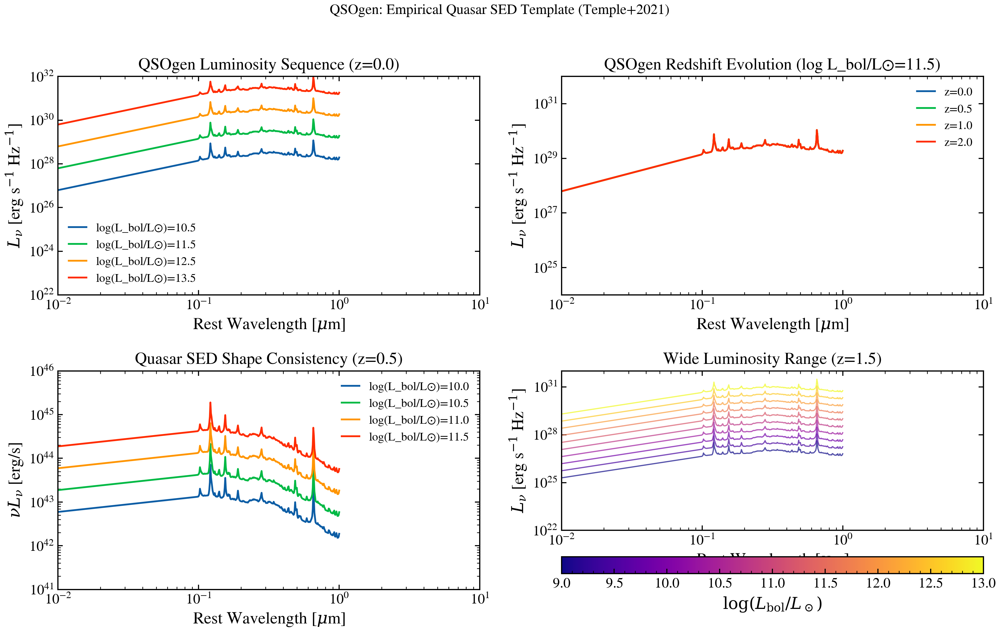

.. DO NOT EDIT.
.. THIS FILE WAS AUTOMATICALLY GENERATED BY SPHINX-GALLERY.
.. TO MAKE CHANGES, EDIT THE SOURCE PYTHON FILE:
.. "auto_examples/agn/plot_qsogen_spectrum.py"
.. LINE NUMBERS ARE GIVEN BELOW.

.. only:: html

    .. note::
        :class: sphx-glr-download-link-note

        :ref:`Go to the end <sphx_glr_download_auto_examples_agn_plot_qsogen_spectrum.py>`
        to download the full example code.

.. rst-class:: sphx-glr-example-title

.. _sphx_glr_auto_examples_agn_plot_qsogen_spectrum.py:

QSOgen Empirical Quasar Template
=================================

Plot QSOgen (Temple, Hewett & Banerji 2021) empirical quasar SEDs.
Shows how an empirically-trained surrogate matches observed quasar spectra
across the UV through near-IR, with parametric control over redshift and
luminosity.

.. sphx-glr-precomputed-img:

.. GENERATED FROM PYTHON SOURCE LINES 17-119

.. code-block:: Python

    import jax.numpy as jnp
    import matplotlib.pyplot as plt
    import numpy as np

    from tengri.analysis.plotting import setup_style
    from tengri.components.agn import qsogen

    setup_style()

    # Wavelength grid: 100 - 10000 Angstrom (UV to near-IR)
    wavelength = jnp.logspace(np.log10(100), np.log10(1e4), 512)
    wave_um = np.array(wavelength) / 1e4

    fig, axes = plt.subplots(2, 2, figsize=(12, 8))

    # --- Panel 1: Luminosity sequence at z=0 ---
    ax = axes[0, 0]

    z = 0.0
    # agn_log_lbol expects log10(L_bol / L_sun). Quasar regime: L_bol ~ 10^44-10^47 erg/s
    # → log10(L_bol/Lsun) ≈ 10.4–13.4  (since log10(Lsun_erg/s) = 33.58).
    for log_lbol in [10.5, 11.5, 12.5, 13.5]:
        sed = qsogen(wavelength, agn_log_lbol=log_lbol, z=z)
        ax.loglog(wave_um, np.array(sed), lw=1.5, label=f"log(L_bol/L⊙)={log_lbol:.1f}")

    ax.set_xlabel(r"Rest Wavelength [$\mu$m]")
    ax.set_ylabel(r"$L_\nu$ [erg s$^{-1}$ Hz$^{-1}$]")
    ax.set_title(f"QSOgen Luminosity Sequence (z={z})")
    ax.legend(fontsize=10, frameon=False)
    ax.set_xlim(0.01, 10)
    ax.set_ylim(1e22, 1e32)

    # --- Panel 2: Redshift evolution (fixed luminosity) ---
    ax = axes[0, 1]

    log_lbol = 11.5  # log10(L_bol / L_sun) ≈ 10^45 erg/s (bright quasar)
    for z in [0.0, 0.5, 1.0, 2.0]:
        sed = qsogen(wavelength, agn_log_lbol=log_lbol, z=z)
        ax.loglog(wave_um, np.array(sed), lw=1.5, label=f"z={z:.1f}")

    ax.set_xlabel(r"Rest Wavelength [$\mu$m]")
    ax.set_ylabel(r"$L_\nu$ [erg s$^{-1}$ Hz$^{-1}$]")
    ax.set_title(f"QSOgen Redshift Evolution (log L_bol/L⊙={log_lbol})")
    ax.legend(fontsize=10, frameon=False)
    ax.set_xlim(0.01, 10)
    ax.set_ylim(1e24, 1e32)

    # --- Panel 3: νLν space (luminosity-normalized) ---
    ax = axes[1, 0]

    z = 0.5
    for log_lbol in [10.0, 10.5, 11.0, 11.5]:
        sed = qsogen(wavelength, agn_log_lbol=log_lbol, z=z)
        nu = 3e18 / np.array(wavelength)
        nu_lnu = np.array(sed) * nu
        ax.loglog(wave_um, nu_lnu, lw=1.5, label=f"log(L_bol/L⊙)={log_lbol:.1f}")

    ax.set_xlabel(r"Rest Wavelength [$\mu$m]")
    ax.set_ylabel(r"$\nu L_\nu$ [erg/s]")
    ax.set_title(f"Quasar SED Shape Consistency (z={z})")
    ax.legend(fontsize=10, frameon=False)
    ax.set_xlim(0.01, 10)
    ax.set_ylim(1e41, 1e46)

    # --- Panel 4: Extreme luminosity range ---
    ax = axes[1, 1]

    z = 1.5
    log_lbol_vals = np.linspace(9.0, 13.0, 10)  # log10(L_bol / L_sun)
    colors = plt.cm.plasma(np.linspace(0, 1, len(log_lbol_vals)))

    for log_lbol, color in zip(log_lbol_vals, colors):
        sed = qsogen(wavelength, agn_log_lbol=log_lbol, z=z)
        mask = np.array(sed) > 0
        ax.loglog(
            wave_um[mask],
            np.array(sed)[mask],
            lw=1.0,
            color=color,
            alpha=0.7,
        )

    ax.set_xlabel(r"Rest Wavelength [$\mu$m]")
    ax.set_ylabel(r"$L_\nu$ [erg s$^{-1}$ Hz$^{-1}$]")
    ax.set_title(f"Wide Luminosity Range (z={z})")
    ax.set_xlim(0.01, 10)
    ax.set_ylim(1e22, 1e32)

    # Add colorbar-like legend
    sm = plt.cm.ScalarMappable(
        cmap=plt.cm.plasma,
        norm=plt.Normalize(vmin=log_lbol_vals.min(), vmax=log_lbol_vals.max()),
    )
    sm.set_array([])
    cbar = fig.colorbar(sm, ax=ax, orientation="horizontal", pad=0.12, aspect=25)
    cbar.set_label(r"$\log(L_{\mathrm{bol}} / L_\odot)$")

    fig.suptitle("QSOgen: Empirical Quasar SED Template (Temple+2021)", fontsize=12)
    fig.tight_layout(rect=[0, 0.04, 1, 0.97])
    plt.savefig("plot_qsogen_spectrum.png", dpi=100, bbox_inches="tight")
    plt.show()

.. _sphx_glr_download_auto_examples_agn_plot_qsogen_spectrum.py:

.. only:: html

  .. container:: sphx-glr-footer sphx-glr-footer-example

    .. container:: sphx-glr-download sphx-glr-download-jupyter

      :download:`Download Jupyter notebook: plot_qsogen_spectrum.ipynb <plot_qsogen_spectrum.ipynb>`

    .. container:: sphx-glr-download sphx-glr-download-python

      :download:`Download Python source code: plot_qsogen_spectrum.py <plot_qsogen_spectrum.py>`

    .. container:: sphx-glr-download sphx-glr-download-zip

      :download:`Download zipped: plot_qsogen_spectrum.zip <plot_qsogen_spectrum.zip>`

.. only:: html

 .. rst-class:: sphx-glr-signature

    `Gallery generated by Sphinx-Gallery <https://sphinx-gallery.github.io>`_
