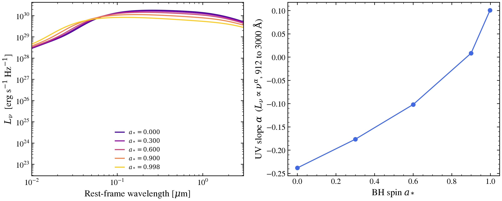

.. DO NOT EDIT.
.. THIS FILE WAS AUTOMATICALLY GENERATED BY SPHINX-GALLERY.
.. TO MAKE CHANGES, EDIT THE SOURCE PYTHON FILE:
.. "auto_examples/agn/plot_relagn_spin.py"
.. LINE NUMBERS ARE GIVEN BELOW.

.. only:: html

    .. note::
        :class: sphx-glr-download-link-note

        :ref:`Go to the end <sphx_glr_download_auto_examples_agn_plot_relagn_spin.py>`
        to download the full example code.

.. rst-class:: sphx-glr-example-title

.. _sphx_glr_auto_examples_agn_plot_relagn_spin.py:

RELAGN Spin Sweep
=================

Demonstrate the effect of BH spin on the relativistic outer-disc SED using
the RELAGN model (Hagen & Done 2023) with KYCONV Kerr-metric ray-tracing
(Dovciak, Karas & Yaqoob 2004).

Higher spin → smaller ISCO → hotter inner-disc boundary → harder UV spectral
slope.  The UV slope α (where L_ν ∝ ν^α in 912–3000 Å) is a direct observable
of the spin-dependent inner boundary condition.

Requires the precomputed grid ``data/relagn_disc_grid.h5``.

.. sphx-glr-precomputed-img:

.. GENERATED FROM PYTHON SOURCE LINES 22-32

.. code-block:: Python

    import jax.numpy as jnp
    import matplotlib.pyplot as plt
    import numpy as np

    from tengri.agn import resolve_agn_model
    from tengri.analysis.plotting import setup_style

    setup_style()

.. GENERATED FROM PYTHON SOURCE LINES 33-34

Wavelength grid: 100 Å (UV) to 3 µm (NIR)

.. GENERATED FROM PYTHON SOURCE LINES 34-47

.. code-block:: Python

    wavelength = jnp.logspace(np.log10(100), np.log10(3e4), 800)
    wave_aa = np.array(wavelength)
    wave_um = wave_aa / 1e4
    nu = 2.99792458e18 / wave_aa  # Hz

    # Fixed BH properties: 10^8.5 Msun, 0.3× Eddington
    log_mbh = 8.5
    log_mdot = -0.5

    # Spin nodes — prograde range [0, 0.998]
    astar_values = [0.0, 0.3, 0.6, 0.9, 0.998]
    colors = plt.cm.plasma(np.linspace(0.1, 0.9, len(astar_values)))

.. GENERATED FROM PYTHON SOURCE LINES 48-49

Load RELAGN model from registry

.. GENERATED FROM PYTHON SOURCE LINES 49-96

.. code-block:: Python

    try:
        relagn_fn = resolve_agn_model("relagn")
    except KeyError as exc:
        raise SystemExit("relagn model not registered — rebuild grid first.") from exc

    fig, (ax_sed, ax_slope) = plt.subplots(1, 2, figsize=(12, 5))

    uv_slopes = []

    for astar, color in zip(astar_values, colors):
        l_nu = np.array(
            relagn_fn(
                wavelength,
                agn_log_mbh=log_mbh,
                agn_log_mdot=log_mdot,
                agn_astar=float(astar),
                agn_cos_inc=0.5,
                agn_torus_frac=0.0,  # disc only for clarity
            )
        )
        mask = l_nu > 0
        if not mask.any():
            uv_slopes.append(np.nan)
            continue

        ax_sed.loglog(
            wave_um[mask],
            l_nu[mask],
            lw=1.8,
            color=color,
            label=rf"$a_* = {astar:.3f}$",
        )

        # UV spectral slope: fit L_nu ~ nu^alpha in the 912–3000 Å band
        uv = (wave_aa >= 912) & (wave_aa <= 3000) & mask
        if uv.sum() > 5:
            slope = np.polyfit(np.log10(nu[uv]), np.log10(l_nu[uv]), 1)[0]
        else:
            slope = np.nan
        uv_slopes.append(slope)

    ax_sed.set_xlabel(r"Wavelength [$\mu$m]")
    ax_sed.set_ylabel(r"$L_\nu$ [erg s$^{-1}$ Hz$^{-1}$]")
    ax_sed.set_title(rf"RELAGN outer disc: $\log M = {log_mbh}$, $\log \dot{{m}} = {log_mdot}$")
    ax_sed.set_xlim(0.01, 3)
    ax_sed.legend(frameon=False, fontsize=9)

.. GENERATED FROM PYTHON SOURCE LINES 97-101

Panel 2: UV spectral slope α vs spin
α becomes less negative (harder) as spin increases because the shrinking ISCO
pushes the inner-disc temperature blueward, contributing more flux at
912–3000 Å.  α = d log L_ν / d log ν; Rayleigh-Jeans limit → α = +2.

.. GENERATED FROM PYTHON SOURCE LINES 101-120

.. code-block:: Python

    ax_slope.plot(
        astar_values,
        uv_slopes,
        "o-",
        color="royalblue",
        lw=2,
        ms=7,
    )
    ax_slope.set_xlabel(r"BH spin $a_*$")
    ax_slope.set_ylabel(r"UV slope $\alpha$  ($L_\nu \propto \nu^\alpha$, 912–3000 Å)")
    ax_slope.set_title("Harder UV slope at high spin")

    fig.tight_layout()
    # Higher spin concentrates disc emission at smaller ISCO radii.  KYCONV
    # (Dovciak+2004) applies full Kerr ray-tracing per annulus up to r = 1000 Rg;
    # the Novikov-Thorne outer disc uses the non-relativistic formula beyond that.

    plt.savefig("plot_relagn_spin.png", dpi=150, bbox_inches="tight")
    plt.show()

.. _sphx_glr_download_auto_examples_agn_plot_relagn_spin.py:

.. only:: html

  .. container:: sphx-glr-footer sphx-glr-footer-example

    .. container:: sphx-glr-download sphx-glr-download-jupyter

      :download:`Download Jupyter notebook: plot_relagn_spin.ipynb <plot_relagn_spin.ipynb>`

    .. container:: sphx-glr-download sphx-glr-download-python

      :download:`Download Python source code: plot_relagn_spin.py <plot_relagn_spin.py>`

    .. container:: sphx-glr-download sphx-glr-download-zip

      :download:`Download zipped: plot_relagn_spin.zip <plot_relagn_spin.zip>`

.. only:: html

 .. rst-class:: sphx-glr-signature

    `Gallery generated by Sphinx-Gallery <https://sphinx-gallery.github.io>`_
