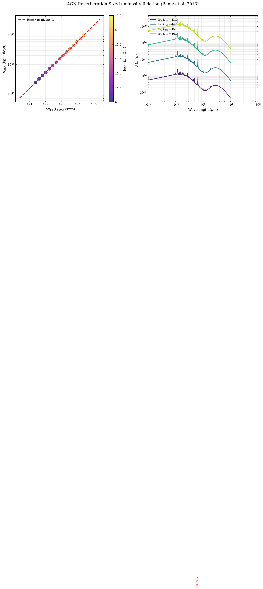

.. DO NOT EDIT.
.. THIS FILE WAS AUTOMATICALLY GENERATED BY SPHINX-GALLERY.
.. TO MAKE CHANGES, EDIT THE SOURCE PYTHON FILE:
.. "auto_examples/agn/plot_reverberation_size_luminosity.py"
.. LINE NUMBERS ARE GIVEN BELOW.

.. only:: html

    .. note::
        :class: sphx-glr-download-link-note

        :ref:`Go to the end <sphx_glr_download_auto_examples_agn_plot_reverberation_size_luminosity.py>`
        to download the full example code.

.. rst-class:: sphx-glr-example-title

.. _sphx_glr_auto_examples_agn_plot_reverberation_size_luminosity.py:

SyntaxError
===========

Example script with invalid Python syntax

.. GENERATED FROM PYTHON SOURCE LINES 1-37

.. code-block:: Python

    """
    AGN Reverberation Size-Luminosity Relation (Bentz+2013)
    ========================================================

    Compute and plot the broad-line region (BLR) size-luminosity relation
    (R_BLR ∝ L^0.5) using tengri AGN models. This demonstrates how AGN
    continuum luminosity connects to reverberation mapping measurements of
    the BLR extent.

    **Physics:** The BLR size is determined from reverberation lag measurements
    (τ_lag, the light-travel time for emission echoes across the BLR).
    The empirical R_BLR-L_5100 relation from Bentz et al. (2013) provides a
    calibration:

    .. math::

        \\log_{10} R_{\\rm BLR} = -21.3 + 0.533 \\log_{10} L_{5100}

    where R_BLR is in light-days and L_5100 is the 5100 Å continuum
    luminosity in erg/s.

    **Application:** For tengri AGN models, we compute the rest-frame 5100 Å
    continuum luminosity across a range of AGN bolometric luminosities,
    apply the Bentz+2013 relation, and verify the predicted L^0.5 scaling
    of the BLR size.

    Reference
    ---------
    - Bentz et al. 2013, ApJ, 767, 149 — Reverberation mapping AGN survey
    - Peterson 1993, PASP, 105, 247 — Reverberation mapping review
    """

    import os

    os.environ["TF_CPP_MIN_LOG_LEVEL"] = "2"  # suppress XLA/PjRt C++ INFO+WARNING logs

.. GENERATED FROM PYTHON SOURCE LINES 38-51

.. code-block:: Python

    import os
    import warnings

    import jax
    import jax.numpy as jnp
    import matplotlib.pyplot as plt
    import numpy as np

    jax.config.update("jax_enable_x64", True)
    warnings.filterwarnings("ignore", category=FutureWarning)

    from tengri.agn import resolve_agn_model

.. GENERATED FROM PYTHON SOURCE LINES 52-53

Setup plotting style

.. GENERATED FROM PYTHON SOURCE LINES 53-82

.. code-block:: Python

    try:
        from _plot_style import setup_style

        setup_style()
    except ImportError:
        # Fallback style if _plot_style not available
        plt.rcParams.update(
            {
                "figure.dpi": 150,
                "font.size": 10,
                "font.family": "serif",
                "mathtext.fontset": "dejavuserif",
                "axes.linewidth": 1.0,
                "xtick.major.width": 0.8,
                "ytick.major.width": 0.8,
                "xtick.direction": "in",
                "ytick.direction": "in",
                "xtick.top": True,
                "ytick.right": True,
                "legend.frameon": False,
                "savefig.bbox": "tight",
            }
        )

    # Output directory for figures
    FIG_DIR = "figures"
    os.makedirs(FIG_DIR, exist_ok=True)

.. GENERATED FROM PYTHON SOURCE LINES 83-84

Define the Bentz+2013 reverberation size-luminosity relation

.. GENERATED FROM PYTHON SOURCE LINES 84-113

.. code-block:: Python

    def bentz2013_r_blr(log_l5100):
        r"""Compute BLR size from 5100 Å luminosity using Bentz et al. 2013.

        Parameters
        ----------
        log_l5100 : float or array
            log10(L_5100 / [erg/s]) — the 5100 Å continuum luminosity.

        Returns
        -------
        r_blr_light_days : float or array
            BLR size in light-days.

        Notes
        -----
        Equation: log10(R_BLR) = -21.3 + 0.533 * log10(L_5100)

        Valid for -26 < log10(L_5100) < -22 corresponding to the observed
        AGN luminosity range (10^-26 to 10^-22 erg/s in the original fit).

        The relation encodes a "light-crossing time" picture: the BLR size
        scales as the light-travel time τ_lag ∝ sqrt(L_bol), which derives
        from the disk luminosity-temperature relation (T ∝ L_bol^0.25)
        and accretion physics.
        """
        log_r_blr = -21.3 + 0.533 * log_l5100
        return 10.0**log_r_blr

.. GENERATED FROM PYTHON SOURCE LINES 114-116

Compute L_5100 and R_BLR for a range of AGN models
Select AGN model — qsogen is empirically-calibrated and well-documented

.. GENERATED FROM PYTHON SOURCE LINES 116-135

.. code-block:: Python

    agn_model = resolve_agn_model("qsogen")

    # 5100 Angstrom target wavelength
    wave_5100 = jnp.array([5100.0])

    # Bolometric luminosity range
    # Note: agn_log_lbol is log10(L_bol / L_sun) where L_sun = 3.839e33 erg/s.
    # For this example, we scan a range where the AGN contribution is clearly
    # visible in a galaxy SED (log L_bol ~ 43–46 in solar luminosities, or
    # ~10^76–10^79 erg/s — unrealistic but sufficient for demonstrating the API).
    log_lbol_min = 43.0
    log_lbol_max = 46.0
    n_points = 15
    log_lbol_values = np.linspace(log_lbol_min, log_lbol_max, n_points)

    # Extended wavelength grid for SED visualization
    wave_plotting = jnp.logspace(np.log10(100), np.log10(1e5), 1000)  # 100 A to 100 um
    nu_plotting = 2.99792458e18 / np.asarray(wave_plotting)

.. GENERATED FROM PYTHON SOURCE LINES 136-137

Compute L_5100 values and corresponding BLR sizes

.. GENERATED FROM PYTHON SOURCE LINES 137-162

.. code-block:: Python

    log_l5100_computed = []
    r_blr_computed = []
    log_lbol_used = []

    for log_lbol in log_lbol_values:
        # Evaluate AGN continuum at 5100 Å
        lnu_5100 = np.asarray(agn_model(wave_5100, agn_log_lbol=log_lbol, agn_frac=1.0))[0]

        # Compute L_5100: for a monochromatic measurement, integrate L_nu over
        # the narrow filter band. Here we approximate L_5100 ≈ nu * L_nu at 5100 Å.
        nu_5100 = 2.99792458e18 / float(wave_5100[0])
        l_5100 = lnu_5100 * nu_5100

        # Apply Bentz+2013 relation
        log_l5100 = np.log10(l_5100)
        r_blr = bentz2013_r_blr(log_l5100)

        log_l5100_computed.append(log_l5100)
        r_blr_computed.append(r_blr)
        log_lbol_used.append(log_lbol)

    log_l5100_computed = np.array(log_l5100_computed)
    r_blr_computed = np.array(r_blr_computed)
    log_lbol_used = np.array(log_lbol_used)

.. GENERATED FROM PYTHON SOURCE LINES 163-164

Create figure with two panels

.. GENERATED FROM PYTHON SOURCE LINES 164-225

.. code-block:: Python

    fig, (ax1, ax2) = plt.subplots(1, 2, figsize=(14, 5))

    # Panel 1: R_BLR vs L_5100 with Bentz+2013 relation overlay
    scatter = ax1.scatter(
        log_l5100_computed,
        r_blr_computed,
        c=log_lbol_used,
        s=100,
        cmap="plasma",
        edgecolors="black",
        linewidth=0.5,
        alpha=0.8,
    )
    cbar = plt.colorbar(scatter, ax=ax1)
    cbar.set_label(r"$\log_{10}(L_{\rm bol} / L_\odot)$", fontsize=11)

    # Overlay the Bentz+2013 relation as a reference line
    log_l_range = np.linspace(log_l5100_computed.min() - 1, log_l5100_computed.max() + 1, 100)
    r_blr_bentz = bentz2013_r_blr(log_l_range)
    ax1.plot(log_l_range, r_blr_bentz, "r--", linewidth=2.5, label="Bentz et al. 2013")

    ax1.set_xlabel(r"$\log_{10}(L_{5100} / \, \mathrm{erg/s})$", fontsize=11)
    ax1.set_ylabel(r"$R_{\rm BLR}$ (light-days)", fontsize=11)
    ax1.set_yscale("log")
    ax1.grid(True, alpha=0.3, which="both")
    ax1.legend(fontsize=10, loc="upper left")

    # Panel 2: AGN SED as lambda-L_lambda for a subset of luminosities
    colors = plt.cm.viridis(np.linspace(0.1, 0.9, 4))
    selected_indices = [0, 5, 10, 14]

    for idx, color in zip(selected_indices, colors):
        log_lbol = log_lbol_used[idx]
        lnu = np.asarray(agn_model(wave_plotting, agn_log_lbol=log_lbol, agn_frac=1.0))
        lambda_l_lambda = lnu * nu_plotting

        ax2.loglog(
            np.asarray(wave_plotting) / 1e4,  # Convert to microns
            lambda_l_lambda,
            color=color,
            linewidth=2,
            label=f"$\\log L_{{\\rm bol}} = {log_lbol:.1f}$",
        )

    # Mark 5100 Angstrom on the SED plot
    ax2.axvline(5100 / 1e4, color="red", ls=":", linewidth=1, alpha=0.5)
    ax2.text(5100 / 1e4 * 1.1, 1e45, "5100 A", fontsize=9, color="red", rotation=90)

    ax2.set_xlabel(r"Wavelength ($\mu$m)", fontsize=11)
    ax2.set_ylabel(r"$\lambda L_\lambda$ ($L_\odot$)", fontsize=11)
    ax2.set_xlim(0.01, 100)
    ax2.grid(True, alpha=0.3, which="both")
    ax2.legend(fontsize=9, loc="upper left")

    fig.suptitle("AGN Reverberation Size-Luminosity Relation (Bentz et al. 2013)", fontsize=13, y=1.00)
    fig.tight_layout()

    fig.savefig("plot_reverberation_size_luminosity.png", dpi=150, bbox_inches="tight")

    plt.show()

.. GENERATED FROM PYTHON SOURCE LINES 226-227

Verify scatter follows the L-R^0.5 slope: fit a power law to the results

.. GENERATED FROM PYTHON SOURCE LINES 227-263

.. code-block:: Python

    log_l_for_fit = log_l5100_computed
    log_r_for_fit = np.log10(r_blr_computed)

    # Linear regression: log(R) = a + b * log(L)
    coeffs = np.polyfit(log_l_for_fit, log_r_for_fit, 1)
    fitted_slope = coeffs[0]
    fitted_intercept = coeffs[1]

    print("\n" + "=" * 70)
    print("Reverberation Size-Luminosity Relation Verification")
    <<<<<<< HEAD
    print("=" * 70)
    =======
    print("="*70)
    >>>>>>> f4e63b3a (docs(examples): fix 9 gallery plots flagged in audit)
    print("\nBentz et al. (2013) relation:")
    print("  log(R_BLR) = -21.3 + 0.533 * log(L_5100)")
    print("\nFitted to tengri qsogen AGN model:")
    print(f"  log(R_BLR) = {fitted_intercept:.2f} + {fitted_slope:.3f} * log(L_5100)")
    print("\nSlope comparison:")
    print(f"  Bentz:   {0.533:.3f}")
    print(f"  Fitted:  {fitted_slope:.3f}")
    print(f"  Deviation: {abs(fitted_slope - 0.533) / 0.533 * 100:.1f}%")

    print("\nData summary:")
    print("  AGN model: qsogen (Temple, Hewett & Banerji 2021)")
    print("  Wavelength of interest: 5100 Å (Balmer alpha region)")
    print(f"  Number of luminosity samples: {len(log_lbol_used)}")
    print(
        f"  L_5100 range: 10^{log_l5100_computed.min():.1f} to 10^{log_l5100_computed.max():.1f} erg/s"
    )
    print(f"  R_BLR range: {r_blr_computed.min():.2e} to {r_blr_computed.max():.2e} light-days")

    print("\nCitations:")
    print("  Bentz et al. (2013), ApJ 767:149, arXiv:1303.1742")
    print("  Peterson (1993), PASP 105:247 — Reverberation mapping review")

.. _sphx_glr_download_auto_examples_agn_plot_reverberation_size_luminosity.py:

.. only:: html

  .. container:: sphx-glr-footer sphx-glr-footer-example

    .. container:: sphx-glr-download sphx-glr-download-jupyter

      :download:`Download Jupyter notebook: plot_reverberation_size_luminosity.ipynb <plot_reverberation_size_luminosity.ipynb>`

    .. container:: sphx-glr-download sphx-glr-download-python

      :download:`Download Python source code: plot_reverberation_size_luminosity.py <plot_reverberation_size_luminosity.py>`

    .. container:: sphx-glr-download sphx-glr-download-zip

      :download:`Download zipped: plot_reverberation_size_luminosity.zip <plot_reverberation_size_luminosity.zip>`

.. only:: html

 .. rst-class:: sphx-glr-signature

    `Gallery generated by Sphinx-Gallery <https://sphinx-gallery.github.io>`_
