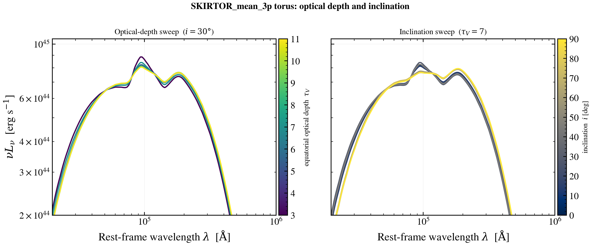

.. DO NOT EDIT.
.. THIS FILE WAS AUTOMATICALLY GENERATED BY SPHINX-GALLERY.
.. TO MAKE CHANGES, EDIT THE SOURCE PYTHON FILE:
.. "auto_examples/agn/plot_skirtor_agnfitter_sweep.py"
.. LINE NUMBERS ARE GIVEN BELOW.

.. only:: html

    .. note::
        :class: sphx-glr-download-link-note

        :ref:`Go to the end <sphx_glr_download_auto_examples_agn_plot_skirtor_agnfitter_sweep.py>`
        to download the full example code.

.. rst-class:: sphx-glr-example-title

.. _sphx_glr_auto_examples_agn_plot_skirtor_agnfitter_sweep.py:

SKIRTOR_mean_3p torus: optical depth and inclination
====================================================

The SKIRTOR_mean_3p torus is the Stalevski+2016 clumpy two-phase torus library
averaged over its clumpiness parameters, as packaged by AGNfitter-rX. Three
observables remain: the half-opening angle ``oa``, the equatorial optical depth
``tau_V``, and the inclination ``incl``.

This example sweeps the **equatorial optical depth** (left) and the
**inclination** (right). A higher optical depth deepens the silicate absorption
and cools the apparent emission; the inclination controls whether the line of
sight grazes the optically-thick equatorial dust (edge-on, Type-2-like) or looks
down the polar funnel (face-on, Type-1-like). The torus contribution is isolated
by subtracting the disc-only SED.

Because this is a parameter-*averaged* library, its sensitivity to any single
axis is modest (a few to ~10 percent in shape) — the panels are zoomed on the
mid/far-IR bump to make that dependence visible. Unlike tengri's full-grid
X-CIGALE ``skirtor`` torus (which peaks near 40 um), the AGNfitter-averaged
library peaks near 25 um; tengri reproduces its grid nodes node-exactly via
monotone-cubic interpolation.

References
----------
.. [1] M. Stalevski et al., "The dust covering factor in active galactic
   nuclei," MNRAS 458, 2288 (2016). arXiv:1602.01954.
.. [2] L. N. Martínez-Ramírez et al., "AGNfitter-rx: Modeling the radio-to-X-ray
   spectral energy distributions of AGNs," A&A 688, A46 (2024).
   arXiv:2405.12111. https://doi.org/10.1051/0004-6361/202449329

.. GENERATED FROM PYTHON SOURCE LINES 32-140

.. image-sg:: /auto_examples/agn/images/sphx_glr_plot_skirtor_agnfitter_sweep_001.png
   :alt: SKIRTOR_mean_3p torus: optical depth and inclination, Optical-depth sweep  ($i = 30\degree$), Inclination sweep  ($\tau_V = 7$)
   :srcset: /auto_examples/agn/images/sphx_glr_plot_skirtor_agnfitter_sweep_001.png
   :class: sphx-glr-single-img

.. code-block:: Python

    import os

    os.environ["TF_CPP_MIN_LOG_LEVEL"] = "2"  # suppress XLA/PjRt C++ INFO+WARNING logs

    import warnings

    import jax
    import matplotlib as mpl
    import matplotlib.pyplot as plt
    import numpy as np

    import tengri
    from tengri.analysis.plotting import setup_style
    from tengri.utils.physics_constants import C_AA  # speed of light [Angstrom/s]

    setup_style()
    warnings.filterwarnings("ignore", message=".*BakedInBackend.*")
    warnings.filterwarnings("ignore", message=".*deprecated.*")

    ssp = tengri.load_ssp()

    SFH = {"type": "const", "*": tengri.FIXED, "log_total_mass": -10.0}
    DUST = {"type": "two_component", "*": tengri.FIXED, "tau_diff": 0.0, "tau_bc": 0.0}

    # SKIRTOR_mean_3p grid: oa 10-80, incl 0-90, tau_V 3-11.
    TV_VALUES = np.linspace(3.0, 11.0, 7)
    INCL_VALUES = np.linspace(0.0, 90.0, 7)
    OA_REF = 40.0
    INCL_REF = 30.0
    TV_REF = 7.0

    BASE_AGN = {
        "disc": {"type": "multicolor", "*": tengri.FIXED},
        "*": tengri.FIXED,
        "log_lbol": 12.0,
        "frac": 1.0,
    }

    def _build_sed(torus: dict | None) -> tuple[np.ndarray, np.ndarray]:
        agn = dict(BASE_AGN)
        if torus is not None:
            agn["torus"] = torus
        model = tengri.SEDModel.build(ssp, sfh=SFH, dust=DUST, agn=agn, redshift=tengri.Fixed(0.05))
        p = dict(model.spec.sample(jax.random.PRNGKey(0)))
        out = model.predict_rest_sed(p)
        return np.asarray(out.wavelength), np.asarray(out.sed)

    WAVE, DISC_ONLY = _build_sed(None)

    def torus_sed(oa: float, incl: float, tv: float) -> tuple[np.ndarray, np.ndarray]:
        """Return (wavelength [AA], nu*L_nu [erg/s]) for the SKIRTOR_mean_3p torus alone."""
        wave, total = _build_sed(
            {
                "type": "skirtor_agnfitter",
                "*": tengri.FIXED,
                "oa_skirtor": oa,
                "incl_skirtor": incl,
                "tv_skirtor": tv,
            }
        )
        disc = np.interp(wave, WAVE, DISC_ONLY)
        return wave, C_AA / wave * np.clip(total - disc, 0.0, None)

    fig, axes = plt.subplots(1, 2, figsize=(11.0, 4.6), sharey=True)

    # ── Panel 1: equatorial optical depth sweep ─────────────────────────────
    ax = axes[0]
    norm_t = mpl.colors.Normalize(vmin=TV_VALUES.min(), vmax=TV_VALUES.max())
    cmap_t = plt.get_cmap("viridis")
    for tv in TV_VALUES:
        wave, nu_l_nu = torus_sed(OA_REF, INCL_REF, tv)
        ax.loglog(wave, nu_l_nu, color=cmap_t(norm_t(tv)), lw=1.6)
    ax.set_title(rf"Optical-depth sweep  ($i = {INCL_REF:.0f}\degree$)", fontsize=10)
    ax.set_ylabel(r"$\nu L_\nu$  [erg s$^{-1}$]")
    sm_t = mpl.cm.ScalarMappable(norm=norm_t, cmap=cmap_t)
    fig.colorbar(sm_t, ax=ax, pad=0.01).set_label(r"equatorial optical depth  $\tau_V$", fontsize=9)

    # ── Panel 2: inclination sweep ──────────────────────────────────────────
    ax = axes[1]
    norm_i = mpl.colors.Normalize(vmin=INCL_VALUES.min(), vmax=INCL_VALUES.max())
    cmap_i = plt.get_cmap("cividis")
    for incl in INCL_VALUES:
        wave, nu_l_nu = torus_sed(OA_REF, incl, TV_REF)
        ax.loglog(wave, nu_l_nu, color=cmap_i(norm_i(incl)), lw=1.6)
    ax.set_title(rf"Inclination sweep  ($\tau_V = {TV_REF:.0f}$)", fontsize=10)
    sm_i = mpl.cm.ScalarMappable(norm=norm_i, cmap=cmap_i)
    fig.colorbar(sm_i, ax=ax, pad=0.01).set_label(r"inclination  $i$ [deg]", fontsize=9)

    for ax in axes:
        # Zoom on the mid/far-IR torus bump, where the (modest) parameter
        # dependence of the *averaged* library concentrates.
        ax.set_xlim(2e4, 1e6)
        ax.set_ylim(2e44, 1.05e45)
        ax.set_xlabel(r"Rest-frame wavelength $\lambda$  [$\mathrm{\AA}$]")
        ax.grid(True, which="major", alpha=0.2)

    fig.suptitle(
        "SKIRTOR_mean_3p torus: optical depth and inclination",
        fontsize=11.5,
        weight="bold",
    )
    fig.tight_layout()
    plt.savefig("plot_skirtor_agnfitter_sweep.png", dpi=150, bbox_inches="tight")

.. rst-class:: sphx-glr-timing

   **Total running time of the script:** (0 minutes 2.923 seconds)

.. _sphx_glr_download_auto_examples_agn_plot_skirtor_agnfitter_sweep.py:

.. only:: html

  .. container:: sphx-glr-footer sphx-glr-footer-example

    .. container:: sphx-glr-download sphx-glr-download-jupyter

      :download:`Download Jupyter notebook: plot_skirtor_agnfitter_sweep.ipynb <plot_skirtor_agnfitter_sweep.ipynb>`

    .. container:: sphx-glr-download sphx-glr-download-python

      :download:`Download Python source code: plot_skirtor_agnfitter_sweep.py <plot_skirtor_agnfitter_sweep.py>`

    .. container:: sphx-glr-download sphx-glr-download-zip

      :download:`Download zipped: plot_skirtor_agnfitter_sweep.zip <plot_skirtor_agnfitter_sweep.zip>`

.. only:: html

 .. rst-class:: sphx-glr-signature

    `Gallery generated by Sphinx-Gallery <https://sphinx-gallery.github.io>`_
