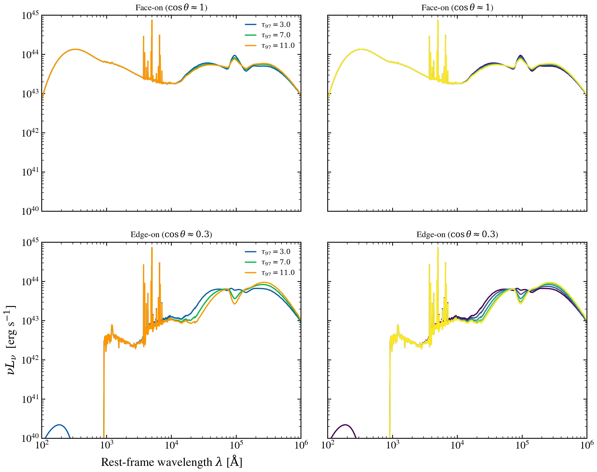

.. DO NOT EDIT.
.. THIS FILE WAS AUTOMATICALLY GENERATED BY SPHINX-GALLERY.
.. TO MAKE CHANGES, EDIT THE SOURCE PYTHON FILE:
.. "auto_examples/agn/plot_skirtor_variants.py"
.. LINE NUMBERS ARE GIVEN BELOW.

.. only:: html

    .. note::
        :class: sphx-glr-download-link-note

        :ref:`Go to the end <sphx_glr_download_auto_examples_agn_plot_skirtor_variants.py>`
        to download the full example code.

.. rst-class:: sphx-glr-example-title

.. _sphx_glr_auto_examples_agn_plot_skirtor_variants.py:

SKIRTOR torus: viewing angle and optical depth effects
========================================================

The SKIRTOR clumpy torus model (Stalevski et al. 2016) emits thermal IR
radiation that depends strongly on two parameters: viewing angle
(inclination θ via ``cos_inc``) and optical depth (``tau_97`` at 9.7 μm).
Face-on systems show a smooth thermal continuum; edge-on systems develop
deep 9.7 μm silicate absorption. Higher τ increases reprocessed flux.

.. GENERATED FROM PYTHON SOURCE LINES 11-94

.. code-block:: Python

    import warnings

    import jax
    import matplotlib.pyplot as plt
    import numpy as np

    import tengri
    from tengri.analysis.plotting import setup_style

    setup_style()
    warnings.filterwarnings("ignore", message=".*BakedInBackend.*")
    warnings.filterwarnings("ignore", message=".*deprecated.*")

    ssp = tengri.load_ssp()
    model = tengri.SEDModel.build(
        ssp,
        sfh={
            "type": "dpl",
            "*": tengri.FIXED,
            "tau_gyr": 3.0,
            "log_peak_sfr": 0.5,
            "alpha": 2.0,
            "beta": 2.5,
        },
        dust={"type": "two_component", "*": tengri.FIXED, "tau_diff": 0.1, "tau_bc": 0.1},
        agn={
            "type": "composable",
            "disc": {"type": "multicolor", "*": tengri.FIXED},
            "torus": {"type": "skirtor", "*": tengri.FIXED},
            "lines": {"type": "nlr", "*": tengri.FIXED},
            "*": tengri.FIXED,
            "log_lbol": 11.0,
        },
        redshift=tengri.Fixed(0.05),
    )
    baseline = dict(model.spec.sample(jax.random.PRNGKey(0)))

    fig, axes = plt.subplots(2, 2, figsize=(10, 8), sharex=True, sharey=True)

    # Left: inclination sweep at fixed optical depth
    for ax, cos_inc, title in zip(
        axes[:, 0],
        [0.95, 0.3],
        [r"Face-on ($\cos \theta \approx 1$)", r"Edge-on ($\cos \theta \approx 0.3$)"],
    ):
        for tau_97 in [3.0, 7.0, 11.0]:
            params = {**baseline, "agn_tau_skirtor": tau_97, "agn_cos_inc": cos_inc}
            out = model.predict_rest_sed(params)
            wave = np.asarray(out.wavelength)
            nu = 2.998e18 / wave
            nu_l_nu = nu * np.asarray(out.sed)
            ax.loglog(wave, nu_l_nu, lw=1.4, label=rf"$\tau_{{97}}={tau_97:.1f}$")
        ax.set_title(title, fontsize=10)
        ax.legend(fontsize=8, frameon=False)

    # Right: optical depth sweep at fixed inclination
    for ax, cos_inc, title in zip(
        axes[:, 1],
        [0.95, 0.3],
        [r"Face-on ($\cos \theta \approx 1$)", r"Edge-on ($\cos \theta \approx 0.3$)"],
    ):
        tau_97_vals = np.linspace(3.0, 11.0, 5)
        colors = plt.cm.viridis(np.linspace(0, 1, len(tau_97_vals)))
        for tau_97, color in zip(tau_97_vals, colors):
            params = {**baseline, "agn_tau_skirtor": tau_97, "agn_cos_inc": cos_inc}
            out = model.predict_rest_sed(params)
            wave = np.asarray(out.wavelength)
            nu = 2.998e18 / wave
            nu_l_nu = nu * np.asarray(out.sed)
            ax.loglog(wave, nu_l_nu, color=color, lw=1.4)
        ax.set_title(title, fontsize=10)

    for ax in axes.flat:
        ax.set_xlim(100, 1e6)
        ax.set_ylim(1e40, 1e45)
        ax.label_outer()

    axes[1, 0].set_xlabel(r"Rest-frame wavelength $\lambda$ [$\mathrm{\AA}$]")
    axes[1, 0].set_ylabel(r"$\nu L_\nu$  [erg s$^{-1}$]")

    fig.tight_layout()
    fig.savefig("plot_skirtor_variants.png", dpi=150, bbox_inches="tight")

.. _sphx_glr_download_auto_examples_agn_plot_skirtor_variants.py:

.. only:: html

  .. container:: sphx-glr-footer sphx-glr-footer-example

    .. container:: sphx-glr-download sphx-glr-download-jupyter

      :download:`Download Jupyter notebook: plot_skirtor_variants.ipynb <plot_skirtor_variants.ipynb>`

    .. container:: sphx-glr-download sphx-glr-download-python

      :download:`Download Python source code: plot_skirtor_variants.py <plot_skirtor_variants.py>`

    .. container:: sphx-glr-download sphx-glr-download-zip

      :download:`Download zipped: plot_skirtor_variants.zip <plot_skirtor_variants.zip>`

.. only:: html

 .. rst-class:: sphx-glr-signature

    `Gallery generated by Sphinx-Gallery <https://sphinx-gallery.github.io>`_
