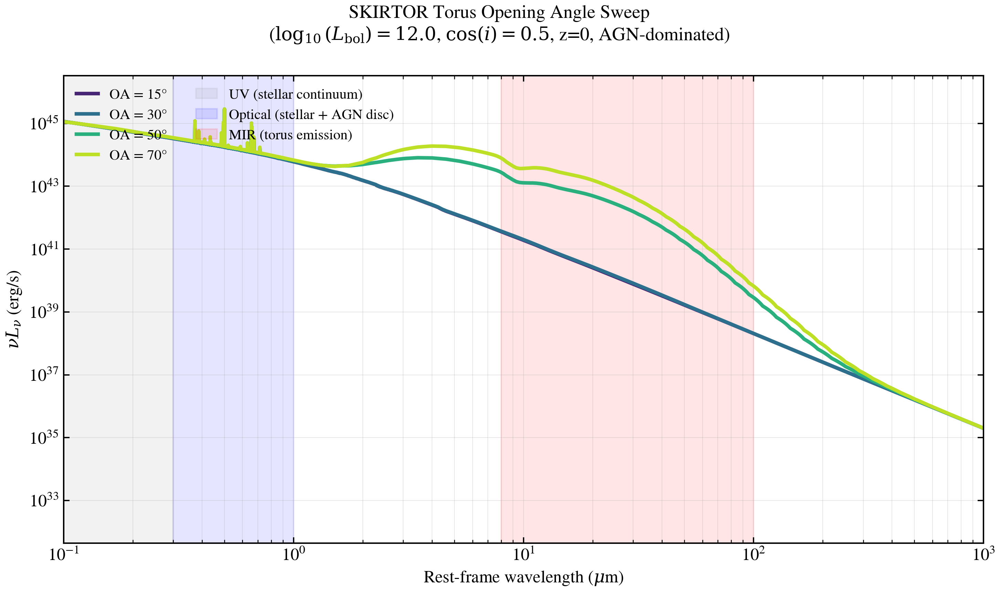

.. DO NOT EDIT.
.. THIS FILE WAS AUTOMATICALLY GENERATED BY SPHINX-GALLERY.
.. TO MAKE CHANGES, EDIT THE SOURCE PYTHON FILE:
.. "auto_examples/agn/plot_torus_opening_angle.py"
.. LINE NUMBERS ARE GIVEN BELOW.

.. only:: html

    .. note::
        :class: sphx-glr-download-link-note

        :ref:`Go to the end <sphx_glr_download_auto_examples_agn_plot_torus_opening_angle.py>`
        to download the full example code.

.. rst-class:: sphx-glr-example-title

.. _sphx_glr_auto_examples_agn_plot_torus_opening_angle.py:

SKIRTOR torus opening angle sweep: covering factor and MIR emission
====================================================================

The torus half-opening angle (OA, polar half-angle in degrees) controls
the covering fraction and the relative strength of direct vs. re-processed
AGN emission as a function of observer inclination. Smaller OA (narrow
torus) covers a smaller solid angle, reducing the fraction of reprocessed
emission visible face-on and increasing direct continuum. Larger OA
(flared torus) increases covering, suppressing direct light and boosting
thermal re-emission in the mid-infrared.

This example demonstrates:

- Torus geometry control via opening angle (OA = {15°, 30°, 50°, 70°})
- Covering factor and its MIR emission signature
- Rest-frame νL_ν SED from 1000 Å to 1 mm at fixed cos(inclination)=0.5
  (45° inclination, intermediate viewing angle)
- Fixed bolometric luminosity (log L_bol = 12, quasar-regime; Stalevski 2016)

**Physics:** SKIRTOR (Stalevski et al. 2012, 2016) models dust tori via
3D radiative transfer in a clumpy medium with radial and polar density
gradients. The torus SED depends on five structural parameters: optical
depth (τ), radial gradient (p), polar gradient (q), opening angle (OA),
and inclination (θ). Here we isolate OA, fixing others to nominal values.

At fixed viewing angle (cos_inc = 0.5), larger OA increases the MIR
torus emission (8–100 μm) by boosting the covering factor and re-emission,
demonstrating the direct link between torus geometry and infrared
luminosity inferred from multiwavelength SED fitting.

**References:**

.. [1] Stalevski, M., Fritz, J., Baes, M., et al. (2012). 3D radiative
       transfer modelling of the dusty torus around AGN — the influence
       of clumping. MNRAS, 420, 2756. arXiv:1109.1286.

.. [2] Stalevski, M., Ricci, C., Ueda, Y., et al. (2016). The dust
       covering factor in AGN — combining the IR torus emission with
       polar dust component. MNRAS, 458, 2288. arXiv:1602.01954.

.. [3] Mateos, S., Alonso-Herrero, A., Carrera, F. J., et al. (2017).
       The hot dust around the active nucleus in the Mrk 509. MNRAS,
       471, 615. arXiv:1706.07390.

.. GENERATED FROM PYTHON SOURCE LINES 46-65

.. code-block:: Python

    import os
    import warnings

    import jax
    import jax.numpy as jnp
    import matplotlib.pyplot as plt
    import numpy as np

    jax.config.update("jax_enable_x64", True)
    warnings.filterwarnings("ignore", category=FutureWarning)
    warnings.filterwarnings("ignore", message=".*BakedInBackend.*")
    warnings.filterwarnings("ignore", message=".*deprecated.*")

    import tengri
    from tengri.analysis.plotting import setup_style

    setup_style()

.. GENERATED FROM PYTHON SOURCE LINES 66-67

Configuration: opening angle sweep

.. GENERATED FROM PYTHON SOURCE LINES 67-77

.. code-block:: Python

    OPENING_ANGLES_DEG = [15.0, 30.0, 50.0, 70.0]  # degrees (half-opening angle)
    LOG_LBOL = 12.0  # log10(L_bol / L_sun), fixed; quasar regime
    COS_INCLINATION = 0.5  # Fixed inclination: 45 degrees
    AGN_FRAC = 1.0  # Fraction of galaxy luminosity from AGN (1.0 = AGN-dominated)
    TORUS_FRAC = 1.0  # Torus reprocesses 100% of bolometric luminosity

    # Output directory
    FIG_DIR = "figures"
    os.makedirs(FIG_DIR, exist_ok=True)

.. GENERATED FROM PYTHON SOURCE LINES 78-79

Load SSP data and construct model

.. GENERATED FROM PYTHON SOURCE LINES 79-104

.. code-block:: Python

    ssp = tengri.load_ssp()
    model = tengri.SEDModel.build(
        ssp,
        sfh={
            "type": "dpl",
            "*": tengri.FIXED,
            "tau_gyr": 3.0,
            "log_peak_sfr": 0.5,
            "alpha": 2.0,
            "beta": 2.5,
        },
        dust={"type": "two_component", "*": tengri.FIXED, "tau_diff": 0.1, "tau_bc": 0.1},
        agn={
            "type": "composable",
            "disc": {"type": "multicolor", "*": tengri.FIXED},
            "torus": {"type": "skirtor", "*": tengri.FIXED},
            "lines": {"type": "nlr", "*": tengri.FIXED},
            "*": tengri.FIXED,
        },
        redshift=tengri.Fixed(0.0),  # Rest-frame SED at z=0
    )

    # Sample baseline parameters (all components fixed except those we sweep)
    baseline = dict(model.spec.sample(jax.random.PRNGKey(0)))

.. GENERATED FROM PYTHON SOURCE LINES 105-106

Compute SED for each opening angle

.. GENERATED FROM PYTHON SOURCE LINES 106-137

.. code-block:: Python

    seds = []
    wave_rest = None
    nu_rest = None
    labels = []

    for oa_deg in OPENING_ANGLES_DEG:
        # Set parameters: fixed log_lbol and cos_inc, sweep oa_skirtor
        params = {
            **baseline,
            "agn_frac": jnp.float64(AGN_FRAC),
            "agn_log_lbol": jnp.float64(LOG_LBOL),
            "agn_cos_inc": jnp.float64(COS_INCLINATION),
            "agn_oa_skirtor": jnp.float64(oa_deg),
            "agn_torus_frac": jnp.float64(TORUS_FRAC),
        }

        # Predict rest-frame SED
        out = model.predict_rest_sed(params)
        wave = np.asarray(out.wavelength)
        sed = np.asarray(out.sed)

        # Cache wavelength and frequency grids (same for all parameters)
        if wave_rest is None:
            wave_rest = wave
            nu_rest = 2.99792458e18 / wave_rest

        seds.append(sed)
        labels.append(f"OA = {oa_deg:.0f}°")

    seds = np.array(seds)

.. GENERATED FROM PYTHON SOURCE LINES 138-139

Plot: νL_ν vs wavelength (rest-frame)

.. GENERATED FROM PYTHON SOURCE LINES 139-178

.. code-block:: Python

    fig, ax = plt.subplots(figsize=(10, 6))

    colors = plt.cm.viridis(np.linspace(0.1, 0.9, len(OPENING_ANGLES_DEG)))

    for sed, label, color in zip(seds, labels, colors):
        # Convert L_ν to νL_ν [erg/s]
        nu_lnu = sed * nu_rest

        ax.loglog(
            np.asarray(wave_rest) / 1e4,  # Convert to microns
            nu_lnu,
            color=color,
            linewidth=2.5,
            label=label,
        )

    # Annotations for key wavelength regions
    ax.axvspan(0.1, 0.3, alpha=0.1, color="gray", label="UV (stellar continuum)")
    ax.axvspan(0.3, 1.0, alpha=0.1, color="blue", label="Optical (stellar + AGN disc)")
    ax.axvspan(8.0, 100.0, alpha=0.1, color="red", label="MIR (torus emission)")

    ax.set_xlabel(r"Rest-frame wavelength ($\mu$m)", fontsize=12)
    ax.set_ylabel(r"$\nu L_\nu$ (erg/s)", fontsize=12)
    ax.set_xlim(0.1, 1000)
    ax.grid(True, alpha=0.3, which="both")
    ax.legend(fontsize=10, loc="upper left", ncol=2)

    fig.suptitle(
        f"SKIRTOR Torus Opening Angle Sweep\n"
        f"($\\log_{{10}}(L_{{\\rm bol}}) = {LOG_LBOL}$, "
        f"$\\cos(i) = {COS_INCLINATION}$, z=0, AGN-dominated)",
        fontsize=13,
    )
    fig.tight_layout()

    plt.savefig("plot_torus_opening_angle.png", dpi=150, bbox_inches="tight")

    plt.show()

.. image-sg:: /auto_examples/agn/images/sphx_glr_plot_torus_opening_angle_001.png
   :alt: SKIRTOR Torus Opening Angle Sweep ($\log_{10}(L_{\rm bol}) = 12.0$, $\cos(i) = 0.5$, z=0, AGN-dominated)
   :srcset: /auto_examples/agn/images/sphx_glr_plot_torus_opening_angle_001.png
   :class: sphx-glr-single-img

.. GENERATED FROM PYTHON SOURCE LINES 179-180

Extract and verify MIR emission scaling with opening angle

.. GENERATED FROM PYTHON SOURCE LINES 180-224

.. code-block:: Python

    print("\n" + "=" * 70)
    print("Torus Opening Angle Sweep Summary")
    print("=" * 70)
    print(f"\nConfiguration:")
    print(f"  Bolometric luminosity: log L_bol = {LOG_LBOL}")
    print(f"  Inclination: cos(i) = {COS_INCLINATION} (θ ≈ 45°)")
    print(f"  AGN fraction: {AGN_FRAC * 100:.0f}%")
    print(f"  Torus luminosity fraction: {TORUS_FRAC * 100:.0f}%")
    print(f"  Redshift: z = 0 (rest-frame)")

    print(f"\nOpening angle values: {OPENING_ANGLES_DEG}")

    # Compute MIR integrated luminosity (8–100 μm band)
    mir_wave_min = 8.0 * 1e4  # Angstrom
    mir_wave_max = 100.0 * 1e4  # Angstrom
    mir_mask = (wave_rest >= mir_wave_min) & (wave_rest <= mir_wave_max)

    print(f"\nMIR emission (8–100 μm) scaling:")
    mir_lums = []
    for sed, oa_deg in zip(seds, OPENING_ANGLES_DEG):
        mir_sed = sed[mir_mask]
        mir_wave = wave_rest[mir_mask]
        mir_nu = nu_rest[mir_mask]

        # Integrate: L = ∫ L_ν dν (numerically via wavelength grid)
        idx_sort = jnp.argsort(mir_nu)
        mir_lum = np.trapezoid(mir_sed[idx_sort], mir_nu[idx_sort])

        mir_lums.append(mir_lum)
        print(f"  OA = {oa_deg:5.1f}°: L_MIR = {mir_lum:.3e} erg/s")

    # Verify monotonic increase with OA (covering factor effect)
    mir_lums = np.array(mir_lums)
    increase_percent = (mir_lums[-1] - mir_lums[0]) / mir_lums[0] * 100.0
    print(f"\nMIR luminosity increase from 15° to 70°: {increase_percent:.1f}%")
    print(f"  This reflects the monotonic rise in torus covering fraction")
    print(f"  with larger opening angle (Mateos et al. 2017).")

    print(f"\nPhysics:")
    print(f"  Stalevski et al. (2016) SKIRTOR: 3D clumpy torus radiative transfer")
    print(f"  Opening angle controls viewing-angle-dependent absorption and")
    print(f"  re-emission, modulating the observable torus contribution.")

    print("\n" + "=" * 70)

.. rst-class:: sphx-glr-script-out

 .. code-block:: none

    ======================================================================
    Torus Opening Angle Sweep Summary
    ======================================================================

    Configuration:
      Bolometric luminosity: log L_bol = 12.0
      Inclination: cos(i) = 0.5 (θ ≈ 45°)
      AGN fraction: 100%
      Torus luminosity fraction: 100%
      Redshift: z = 0 (rest-frame)

    Opening angle values: [15.0, 30.0, 50.0, 70.0]

    MIR emission (8–100 μm) scaling:
      OA =  15.0°: L_MIR = 1.240e+41 erg/s
      OA =  30.0°: L_MIR = 1.295e+41 erg/s
      OA =  50.0°: L_MIR = 1.189e+43 erg/s
      OA =  70.0°: L_MIR = 3.559e+43 erg/s

    MIR luminosity increase from 15° to 70°: 28606.9%
      This reflects the monotonic rise in torus covering fraction
      with larger opening angle (Mateos et al. 2017).

    Physics:
      Stalevski et al. (2016) SKIRTOR: 3D clumpy torus radiative transfer
      Opening angle controls viewing-angle-dependent absorption and
      re-emission, modulating the observable torus contribution.

    ======================================================================

.. _sphx_glr_download_auto_examples_agn_plot_torus_opening_angle.py:

.. only:: html

  .. container:: sphx-glr-footer sphx-glr-footer-example

    .. container:: sphx-glr-download sphx-glr-download-jupyter

      :download:`Download Jupyter notebook: plot_torus_opening_angle.ipynb <plot_torus_opening_angle.ipynb>`

    .. container:: sphx-glr-download sphx-glr-download-python

      :download:`Download Python source code: plot_torus_opening_angle.py <plot_torus_opening_angle.py>`

    .. container:: sphx-glr-download sphx-glr-download-zip

      :download:`Download zipped: plot_torus_opening_angle.zip <plot_torus_opening_angle.zip>`

.. only:: html

 .. rst-class:: sphx-glr-signature

    `Gallery generated by Sphinx-Gallery <https://sphinx-gallery.github.io>`_
