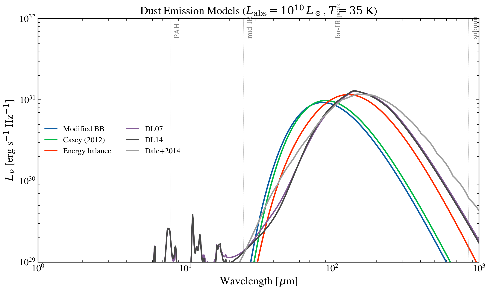

.. DO NOT EDIT.
.. THIS FILE WAS AUTOMATICALLY GENERATED BY SPHINX-GALLERY.
.. TO MAKE CHANGES, EDIT THE SOURCE PYTHON FILE:
.. "auto_examples/dust/plot_dust_emission_models.py"
.. LINE NUMBERS ARE GIVEN BELOW.

.. only:: html

    .. note::
        :class: sphx-glr-download-link-note

        :ref:`Go to the end <sphx_glr_download_auto_examples_dust_plot_dust_emission_models.py>`
        to download the full example code.

.. rst-class:: sphx-glr-example-title

.. _sphx_glr_auto_examples_dust_plot_dust_emission_models.py:

Dust Emission Models: Overview
================================

All tengri dust emission models evaluated at L_absorbed = 1e10 L☉ and
T = 35 K. Template-based models (DL07, DL14, Dale+2014) are shown only
when data files are present; they are skipped gracefully otherwise.

.. sphx-glr-precomputed-img:

.. GENERATED FROM PYTHON SOURCE LINES 16-115

.. code-block:: Python

    import jax.numpy as jnp
    import matplotlib.pyplot as plt
    import numpy as np

    from tengri import setup_style
    from tengri.dust import (
        casey2012,
        dale2014,
        draine_li2007,
        draine_li2014,
        energy_balance_split,
        modified_blackbody,
    )

    setup_style()

    # --- Wavelength grid: 1–1000 μm ---
    wave_aa = jnp.logspace(np.log10(1e4), np.log10(1e7), 2000)
    wave_um = np.array(wave_aa) * 1e-4
    # modified_blackbody is unit-agnostic — output L_nu is in (input)/Hz.
    # Pass erg/s so output is in erg/s/Hz (tengri's canonical SED unit).
    L_ABS = 1e10 * 3.828e33  # 10^10 L_sun expressed in erg/s

    def _mbb():
        return modified_blackbody(wave_aa, L_ABS, dust_T=35.0, dust_beta_ir=1.8)

    def _casey():
        return casey2012(wave_aa, L_ABS, dust_T=35.0, dust_beta_ir=1.8, dust_alpha_mir=2.0)

    def _magphys():
        return None  # magphys_dc08 not yet implemented

    def _ebs():
        return energy_balance_split(wave_aa, L_ABS, dust_T_warm=35.0, dust_T_cold=20.0)

    def _dl07():
        try:
            return draine_li2007(wave_aa, L_ABS, dust_umin=1.0, dust_gamma_dl=0.01, dust_qpah=2.5)
        except FileNotFoundError:
            return None

    def _dl14():
        try:
            return draine_li2014(wave_aa, L_ABS, dust_umin=1.0, dust_gamma_dl=0.01, dust_qpah=2.5)
        except FileNotFoundError:
            return None

    def _dale():
        try:
            return dale2014(wave_aa, L_ABS, dust_alpha_dale=2.0)
        except FileNotFoundError:
            return None

    MODELS = [
        ("Modified BB", "C0", _mbb()),
        ("Casey (2012)", "C1", _casey()),
        ("MAGPHYS (dC+08)", "C2", _magphys()),
        ("Energy balance", "C3", _ebs()),
        ("DL07", "C4", _dl07()),
        ("DL14", "C5", _dl14()),
        ("Dale+2014", "C6", _dale()),
    ]

    fig, ax = plt.subplots(figsize=(10, 6))
    for label, color, lnu in MODELS:
        if lnu is None:
            continue
        y = np.array(lnu)
        mask = (wave_um > 1) & (y > 0)
        ax.loglog(wave_um[mask], y[mask], color=color, lw=2.0, label=label)

    # Zoom out to standard astro IR-SED window (1 µm – 1 mm) and span ~5
    # decades in L_nu so the PAH features (~6–15 µm in DL07/DL14) sit clearly
    # above the floor instead of being clipped under the FIR peak.
    ax.set_xlim(1, 1000)
    ax.set_ylim(1e27, 5e31)
    ax.set_xlabel(r"Wavelength [$\mu$m]")
    ax.set_ylabel(r"$L_\nu$ [erg s$^{-1}$ Hz$^{-1}$]")
    ax.set_title(r"Dust Emission Models ($L_{\rm abs} = 10^{10}\,L_\odot$, $T = 35$ K)")
    ax.legend(fontsize=10, frameon=False, ncol=2)

    # Mark key wavelengths
    for wl_um, name in [(8, "PAH"), (25, "mid-IR"), (100, "far-IR peak"), (850, "submm")]:
        ax.axvline(wl_um, color="grey", ls=":", lw=0.5, alpha=0.5)
        ax.text(wl_um * 1.05, 0.97, name, fontsize=10, color="grey", rotation=90,
                transform=ax.get_xaxis_transform(), va="top")

    fig.tight_layout()
    plt.savefig("plot_dust_emission_models.png", dpi=150, bbox_inches="tight")
    plt.show()

.. _sphx_glr_download_auto_examples_dust_plot_dust_emission_models.py:

.. only:: html

  .. container:: sphx-glr-footer sphx-glr-footer-example

    .. container:: sphx-glr-download sphx-glr-download-jupyter

      :download:`Download Jupyter notebook: plot_dust_emission_models.ipynb <plot_dust_emission_models.ipynb>`

    .. container:: sphx-glr-download sphx-glr-download-python

      :download:`Download Python source code: plot_dust_emission_models.py <plot_dust_emission_models.py>`

    .. container:: sphx-glr-download sphx-glr-download-zip

      :download:`Download zipped: plot_dust_emission_models.zip <plot_dust_emission_models.zip>`

.. only:: html

 .. rst-class:: sphx-glr-signature

    `Gallery generated by Sphinx-Gallery <https://sphinx-gallery.github.io>`_
