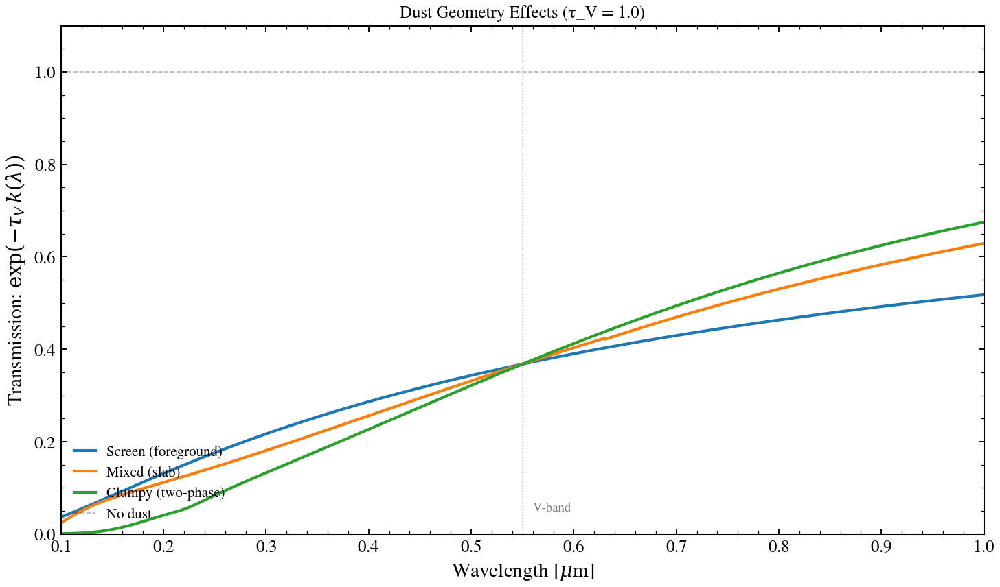

.. DO NOT EDIT.
.. THIS FILE WAS AUTOMATICALLY GENERATED BY SPHINX-GALLERY.
.. TO MAKE CHANGES, EDIT THE SOURCE PYTHON FILE:
.. "auto_examples/dust/plot_dust_geometry_sweep.py"
.. LINE NUMBERS ARE GIVEN BELOW.

.. only:: html

    .. note::
        :class: sphx-glr-download-link-note

        :ref:`Go to the end <sphx_glr_download_auto_examples_dust_plot_dust_geometry_sweep.py>`
        to download the full example code.

.. rst-class:: sphx-glr-example-title

.. _sphx_glr_auto_examples_dust_plot_dust_geometry_sweep.py:

Dust Geometry: Screen vs Mixed vs Clumpy
=========================================

Compare transmission curves for three dust geometries (Witt & Gordon 2000):
screen (foreground), mixed (slab), and clumpy (two-phase medium). At fixed
optical depth τ_V = 1.0, geometry controls the spectral shape: screens are
reddest, mixed intermediate, clumpy greyest.

.. sphx-glr-precomputed-img:

.. GENERATED FROM PYTHON SOURCE LINES 17-65

.. code-block:: Python

    import jax.numpy as jnp
    import matplotlib.pyplot as plt
    import numpy as np

    from tengri.analysis.plotting import setup_style
    from tengri.dust import resolve_dust_law

    setup_style()

    wavelength = jnp.linspace(1000.0, 10000.0, 2000)
    wave_um = np.array(wavelength) / 1e4

    tau_v = 1.0

    # --- Geometries via dust law proxies ---
    # Screen (power_law): minimal wavelength dependence, k(λ) ∝ λ^(-0.7)
    # Mixed (Calzetti): intermediate, smooth k(λ) curve
    # Clumpy (SMC): greyest attenuation, flattest k(λ), no 2175 Å bump

    geometries = [
        ("power_law", {"n_slope": -0.7}, "Screen (foreground)", "#1f77b4"),
        ("calzetti", {}, "Mixed (slab)", "#ff7f0e"),
        ("smc", {}, "Clumpy (two-phase)", "#2ca02c"),
    ]

    fig, ax = plt.subplots(figsize=(10, 6))

    for law_name, kwargs, label, color in geometries:
        dust_fn = resolve_dust_law(law_name)
        k = dust_fn(wavelength, **kwargs)
        # Transmission = exp(-tau_v * k)
        transmission = np.exp(-tau_v * np.array(k))
        ax.plot(wave_um, transmission, lw=2.0, color=color, label=label)

    ax.axhline(1.0, ls="--", color="black", lw=0.8, alpha=0.3, label="No dust")
    ax.axvline(0.55, ls=":", color="grey", lw=0.8, alpha=0.5)
    ax.text(0.56, 0.05, "V-band", fontsize=9, color="grey")

    ax.set_xlabel(r"Wavelength [$\mu$m]")
    ax.set_ylabel(r"Transmission: $\exp(-\tau_V \, k(\lambda))$")
    ax.set_title(f"Dust Geometry Effects (τ_V = {tau_v:.1f})", fontsize=12)
    ax.set_xlim(0.1, 1.0)
    ax.set_ylim(0, 1.1)
    ax.legend(fontsize=10, frameon=False, loc="lower left")
    fig.tight_layout()
    plt.savefig("plot_dust_geometry_sweep.png", dpi=150, bbox_inches="tight")
    plt.show()

.. _sphx_glr_download_auto_examples_dust_plot_dust_geometry_sweep.py:

.. only:: html

  .. container:: sphx-glr-footer sphx-glr-footer-example

    .. container:: sphx-glr-download sphx-glr-download-jupyter

      :download:`Download Jupyter notebook: plot_dust_geometry_sweep.ipynb <plot_dust_geometry_sweep.ipynb>`

    .. container:: sphx-glr-download sphx-glr-download-python

      :download:`Download Python source code: plot_dust_geometry_sweep.py <plot_dust_geometry_sweep.py>`

    .. container:: sphx-glr-download sphx-glr-download-zip

      :download:`Download zipped: plot_dust_geometry_sweep.zip <plot_dust_geometry_sweep.zip>`

.. only:: html

 .. rst-class:: sphx-glr-signature

    `Gallery generated by Sphinx-Gallery <https://sphinx-gallery.github.io>`_
