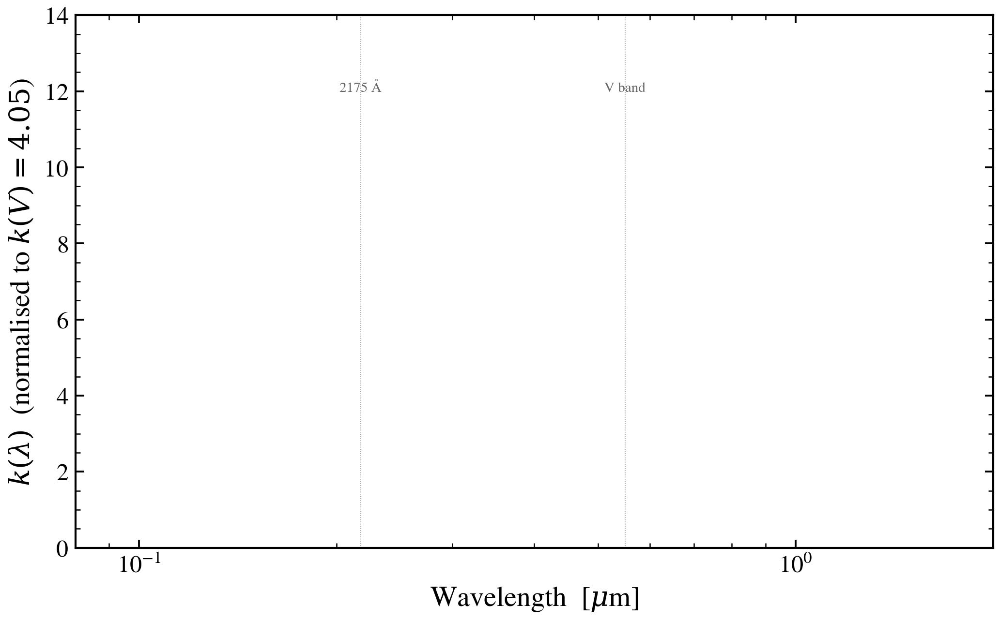

.. DO NOT EDIT.
.. THIS FILE WAS AUTOMATICALLY GENERATED BY SPHINX-GALLERY.
.. TO MAKE CHANGES, EDIT THE SOURCE PYTHON FILE:
.. "auto_examples/dust_attenuation/plot_attenuation_curves_klam.py"
.. LINE NUMBERS ARE GIVEN BELOW.

.. only:: html

    .. note::
        :class: sphx-glr-download-link-note

        :ref:`Go to the end <sphx_glr_download_auto_examples_dust_attenuation_plot_attenuation_curves_klam.py>`
        to download the full example code.

.. rst-class:: sphx-glr-example-title

.. _sphx_glr_auto_examples_dust_attenuation_plot_attenuation_curves_klam.py:

Attenuation curves k(λ) for the shipped law family
======================================================

Direct view of the attenuation k(λ) function (in mag of attenuation
per E(B−V), normalised to ``k(V) = R_V``) for the production
attenuation laws. The shape of each curve is what determines how the
underlying intrinsic SED gets reshaped by a given amount of dust;
``plot_dust_law_application.py`` and ``plot_dust_law_uv_slope_response.py``
show downstream consequences on the SED and on β.

We synthesise k(λ) by attenuating a flat-in-F_λ reference at
``τ_diff = 1`` mag and reading out −2.5 log₁₀(F_λ,attenuated / F_λ,intrinsic)
in finely-sampled bins. The result is the attenuation per unit τ_V
for that law.

.. GENERATED FROM PYTHON SOURCE LINES 17-89

.. image-sg:: /auto_examples/dust_attenuation/images/sphx_glr_plot_attenuation_curves_klam_001.png
   :alt: plot attenuation curves klam
   :srcset: /auto_examples/dust_attenuation/images/sphx_glr_plot_attenuation_curves_klam_001.png
   :class: sphx-glr-single-img

.. rst-class:: sphx-glr-script-out

 .. code-block:: none

    /Users/suchethacooray/.claude-squad/worktrees/cs/examples-sweep_18b2090a1299ea18/examples/dust_attenuation/plot_attenuation_curves_klam.py:85: UserWarning: No artists with labels found to put in legend.  Note that artists whose label start with an underscore are ignored when legend() is called with no argument.
      ax.legend(frameon=False, fontsize=8, loc="upper right")

|

.. code-block:: Python

    import warnings

    import jax
    import matplotlib.pyplot as plt
    import numpy as np

    import tengri
    from tengri.analysis.plotting import setup_style

    setup_style()
    warnings.filterwarnings("ignore", message=".*BakedInBackend.*")

    C_AA_PER_S = 2.998e18
    LAWS = [
        ("calzetti",     "Calzetti+2000",     "#3377cc"),
        ("salim",        "Salim+2018",        "#33aa55"),
        ("cardelli",     "Cardelli+1989 MW",  "#cc6633"),
        ("smc",          "SMC (Pei 1992)",    "#cc3333"),
        ("kriek_conroy", "Kriek & Conroy 2013", "#9933aa"),
        ("noll09",       "Noll+2009",         "#999933"),
    ]
    SFH = {"type": "tsnorm", "*": tengri.FIXED, "peak_lbt_gyr": 0.05,
           "width_gyr": 0.03, "log_peak_sfr": 1.0, "skew": 0.0, "trunc": 13.0}
    ssp = tengri.load_ssp()

    def _attn_curve(law):
        model0 = tengri.SEDModel.build(
            ssp, sfh=SFH,
            dust={"type": "two_component", "*": tengri.FIXED,
                  "tau_diff": 0.0, "tau_bc": 0.0, "law_diff": law},
            redshift=tengri.Fixed(0.05),
        )
        model1 = tengri.SEDModel.build(
            ssp, sfh=SFH,
            dust={"type": "two_component", "*": tengri.FIXED,
                  "tau_diff": 1.0, "tau_bc": 0.0, "law_diff": law},
            redshift=tengri.Fixed(0.05),
        )
        p = dict(model0.spec.sample(jax.random.PRNGKey(0)))
        out0 = np.asarray(model0.predict_rest_sed(p).sed)
        out1 = np.asarray(model1.predict_rest_sed(p).sed)
        wave = np.asarray(model0.predict_rest_sed(p).wavelength)
        # A(lambda) in mag = -2.5 log10(attenuated/intrinsic)
        pos = (out0 > 0) & (out1 > 0)
        A_lam = np.where(pos, -2.5 * np.log10(np.maximum(out1, 1e-30) /
                                              np.maximum(out0, 1e-30)), np.nan)
        return wave, A_lam

    fig, ax = plt.subplots(figsize=(7.2, 4.6))
    for law, label, color in LAWS:
        wave, A = _attn_curve(law)
        # Convert mag attenuation to k(λ) by normalising to A(V)
        iV = int(np.argmin(np.abs(wave - 5500.0)))
        if np.isfinite(A[iV]) and A[iV] > 0:
            k = A / A[iV] * 4.05  # k(V) = R_V for Calzetti
            ax.plot(wave / 1.0e4, k, color=color, lw=1.4, label=label)

    ax.axvline(5500.0 / 1.0e4, color="0.55", lw=0.4, ls=":")
    ax.text(5500.0 / 1.0e4, 12, "V band", fontsize=7, color="0.4", ha="center")
    ax.axvline(2175.0 / 1.0e4, color="0.55", lw=0.4, ls=":")
    ax.text(2175.0 / 1.0e4, 12, "2175 Å", fontsize=7, color="0.4", ha="center")
    ax.set(xlim=(0.08, 2.0), ylim=(0, 14),
           xscale="log",
           xlabel=r"Wavelength  [$\mu$m]",
           ylabel=r"$k(\lambda)$  (normalised to $k(V) = 4.05$)")
    ax.legend(frameon=False, fontsize=8, loc="upper right")

    fig.tight_layout()
    plt.savefig("plot_attenuation_curves_klam.png", dpi=150, bbox_inches="tight")

.. rst-class:: sphx-glr-timing

   **Total running time of the script:** (0 minutes 3.174 seconds)

.. _sphx_glr_download_auto_examples_dust_attenuation_plot_attenuation_curves_klam.py:

.. only:: html

  .. container:: sphx-glr-footer sphx-glr-footer-example

    .. container:: sphx-glr-download sphx-glr-download-jupyter

      :download:`Download Jupyter notebook: plot_attenuation_curves_klam.ipynb <plot_attenuation_curves_klam.ipynb>`

    .. container:: sphx-glr-download sphx-glr-download-python

      :download:`Download Python source code: plot_attenuation_curves_klam.py <plot_attenuation_curves_klam.py>`

    .. container:: sphx-glr-download sphx-glr-download-zip

      :download:`Download zipped: plot_attenuation_curves_klam.zip <plot_attenuation_curves_klam.zip>`

.. only:: html

 .. rst-class:: sphx-glr-signature

    `Gallery generated by Sphinx-Gallery <https://sphinx-gallery.github.io>`_
