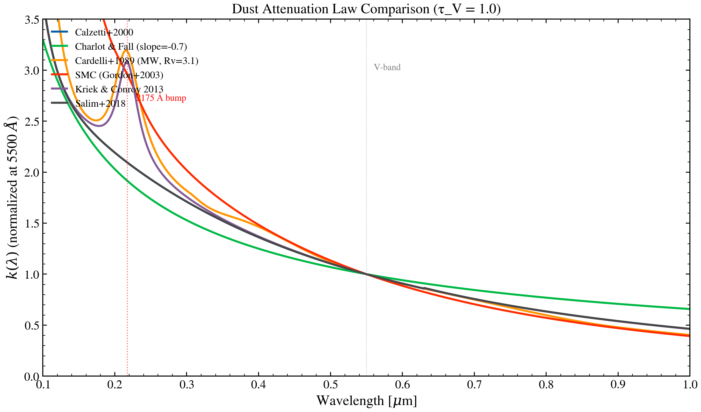

.. DO NOT EDIT.
.. THIS FILE WAS AUTOMATICALLY GENERATED BY SPHINX-GALLERY.
.. TO MAKE CHANGES, EDIT THE SOURCE PYTHON FILE:
.. "auto_examples/dust_attenuation/plot_attenuation_law_compare.py"
.. LINE NUMBERS ARE GIVEN BELOW.

.. only:: html

    .. note::
        :class: sphx-glr-download-link-note

        :ref:`Go to the end <sphx_glr_download_auto_examples_dust_attenuation_plot_attenuation_law_compare.py>`
        to download the full example code.

.. rst-class:: sphx-glr-example-title

.. _sphx_glr_auto_examples_dust_attenuation_plot_attenuation_law_compare.py:

Attenuation Law Comparison
==========================

The six headline attenuation laws at fixed τ_V = 1, UV through NIR.
Highlights the 2175 Å bump and the slope differences between Milky Way,
SMC, and starburst families.

.. sphx-glr-precomputed-img:

.. GENERATED FROM PYTHON SOURCE LINES 16-47

.. image-sg:: /auto_examples/dust_attenuation/images/sphx_glr_plot_attenuation_law_compare_001.png
   :alt: Dust Attenuation Law Comparison (τ_V = 1.0)
   :srcset: /auto_examples/dust_attenuation/images/sphx_glr_plot_attenuation_law_compare_001.png
   :class: sphx-glr-single-img

.. code-block:: Python

    import jax.numpy as jnp
    import matplotlib.pyplot as plt

    from tengri.analysis.plotting import setup_style
    from tengri.dust import list_laws

    setup_style()

    wave = jnp.linspace(1000.0, 10000.0, 2000)

    fig, ax = plt.subplots(figsize=(10, 6))
    for label, fn in list_laws().items():
        ax.plot(wave / 1e4, fn(wave), label=label, lw=2.0)

    ax.axvline(0.55, ls=":", color="grey", lw=0.8, alpha=0.5)
    ax.text(0.56, 3.0, "V-band", fontsize=9, color="grey")
    ax.axvline(0.2175, ls=":", color="red", lw=1.0, alpha=0.6)
    ax.text(0.23, 2.7, "2175 Å bump", fontsize=9, color="red")

    ax.set(
        xlabel=r"Wavelength [$\mu$m]",
        ylabel=r"$k(\lambda)$ (normalized at 5500 $\AA$)",
        title="Dust Attenuation Law Comparison (τ_V = 1.0)",
        xlim=(0.1, 1.0),
        ylim=(0, 3.5),
    )
    ax.legend(fontsize=10, frameon=False, loc="upper left")
    fig.tight_layout()
    plt.savefig("plot_attenuation_law_compare.png", dpi=150, bbox_inches="tight")
    plt.show()

.. _sphx_glr_download_auto_examples_dust_attenuation_plot_attenuation_law_compare.py:

.. only:: html

  .. container:: sphx-glr-footer sphx-glr-footer-example

    .. container:: sphx-glr-download sphx-glr-download-jupyter

      :download:`Download Jupyter notebook: plot_attenuation_law_compare.ipynb <plot_attenuation_law_compare.ipynb>`

    .. container:: sphx-glr-download sphx-glr-download-python

      :download:`Download Python source code: plot_attenuation_law_compare.py <plot_attenuation_law_compare.py>`

    .. container:: sphx-glr-download sphx-glr-download-zip

      :download:`Download zipped: plot_attenuation_law_compare.zip <plot_attenuation_law_compare.zip>`

.. only:: html

 .. rst-class:: sphx-glr-signature

    `Gallery generated by Sphinx-Gallery <https://sphinx-gallery.github.io>`_
