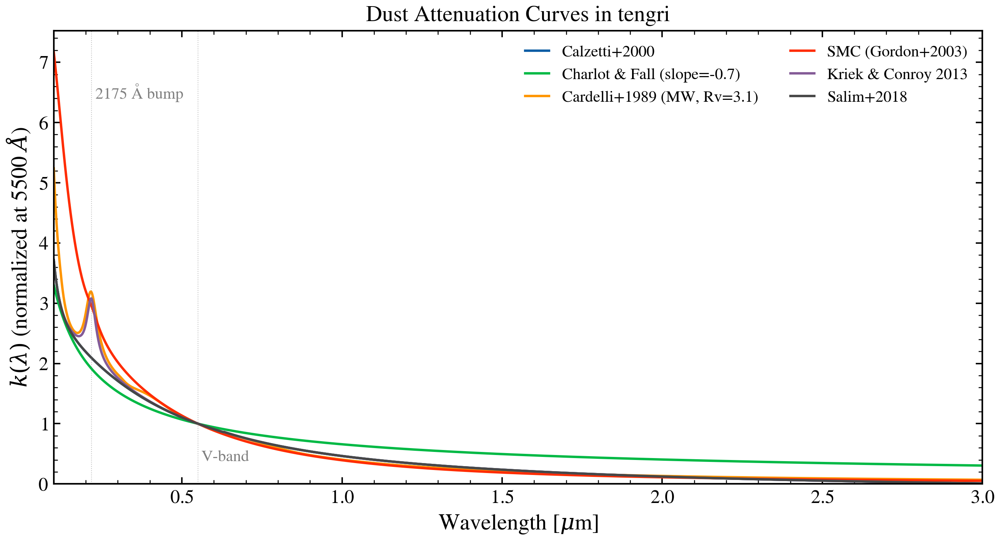

.. DO NOT EDIT.
.. THIS FILE WAS AUTOMATICALLY GENERATED BY SPHINX-GALLERY.
.. TO MAKE CHANGES, EDIT THE SOURCE PYTHON FILE:
.. "auto_examples/dust_attenuation/plot_dust_curves.py"
.. LINE NUMBERS ARE GIVEN BELOW.

.. only:: html

    .. note::
        :class: sphx-glr-download-link-note

        :ref:`Go to the end <sphx_glr_download_auto_examples_dust_attenuation_plot_dust_curves.py>`
        to download the full example code.

.. rst-class:: sphx-glr-example-title

.. _sphx_glr_auto_examples_dust_attenuation_plot_dust_curves.py:

Dust Attenuation Curves (UV to NIR)
====================================

Same six headline laws as :doc:`plot_attenuation_law_compare`, but plotted
over the full UV-through-NIR range (0.1–3 μm) instead of zooming into the
UV bump region.

.. sphx-glr-precomputed-img:

.. GENERATED FROM PYTHON SOURCE LINES 16-51

.. image-sg:: /auto_examples/dust_attenuation/images/sphx_glr_plot_dust_curves_001.png
   :alt: Dust Attenuation Curves in tengri
   :srcset: /auto_examples/dust_attenuation/images/sphx_glr_plot_dust_curves_001.png
   :class: sphx-glr-single-img

.. code-block:: Python

    import jax.numpy as jnp
    import matplotlib.pyplot as plt

    from tengri.analysis.plotting import setup_style
    from tengri.dust import list_laws

    setup_style()

    wave = jnp.linspace(1000.0, 30000.0, 2000)

    fig, ax = plt.subplots(figsize=(9, 5))
    for label, fn in list_laws().items():
        ax.plot(wave / 1e4, fn(wave), label=label, lw=1.5)

    ax.axvline(0.55, ls=":", color="grey", lw=0.5, alpha=0.5)
    ax.annotate(
        "V-band", xy=(0.56, 0.05), xycoords=("data", "axes fraction"), fontsize=10, color="grey"
    )
    ax.axvline(0.2175, ls=":", color="grey", lw=0.5, alpha=0.5)
    ax.annotate(
        "2175 Å bump", xy=(0.23, 0.85), xycoords=("data", "axes fraction"), fontsize=10, color="grey"
    )

    ax.set(
        xlabel=r"Wavelength [$\mu$m]",
        ylabel=r"$k(\lambda)$ (normalized at 5500 $\AA$)",
        title="Dust Attenuation Curves in tengri",
        xlim=(0.1, 3.0),
        ylim=(0, None),
    )
    ax.legend(fontsize=10, frameon=False, ncol=2)
    fig.tight_layout()
    plt.savefig("plot_dust_curves.png", dpi=150, bbox_inches="tight")
    plt.show()

.. _sphx_glr_download_auto_examples_dust_attenuation_plot_dust_curves.py:

.. only:: html

  .. container:: sphx-glr-footer sphx-glr-footer-example

    .. container:: sphx-glr-download sphx-glr-download-jupyter

      :download:`Download Jupyter notebook: plot_dust_curves.ipynb <plot_dust_curves.ipynb>`

    .. container:: sphx-glr-download sphx-glr-download-python

      :download:`Download Python source code: plot_dust_curves.py <plot_dust_curves.py>`

    .. container:: sphx-glr-download sphx-glr-download-zip

      :download:`Download zipped: plot_dust_curves.zip <plot_dust_curves.zip>`

.. only:: html

 .. rst-class:: sphx-glr-signature

    `Gallery generated by Sphinx-Gallery <https://sphinx-gallery.github.io>`_
