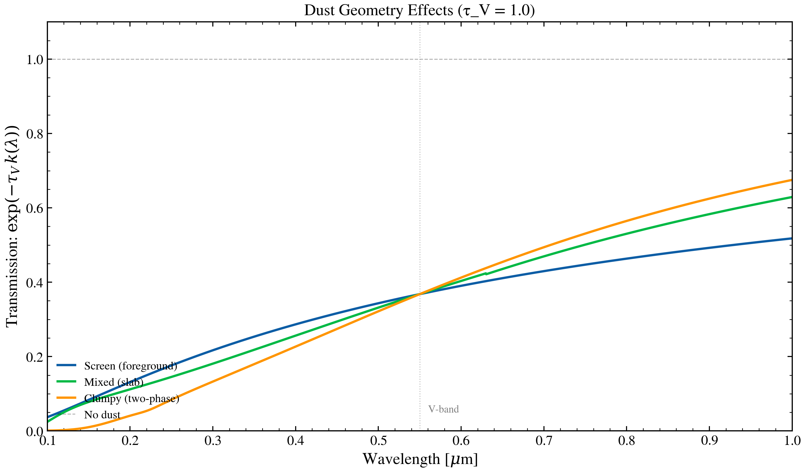

.. DO NOT EDIT.
.. THIS FILE WAS AUTOMATICALLY GENERATED BY SPHINX-GALLERY.
.. TO MAKE CHANGES, EDIT THE SOURCE PYTHON FILE:
.. "auto_examples/dust_attenuation/plot_dust_geometry_sweep.py"
.. LINE NUMBERS ARE GIVEN BELOW.

.. only:: html

    .. note::
        :class: sphx-glr-download-link-note

        :ref:`Go to the end <sphx_glr_download_auto_examples_dust_attenuation_plot_dust_geometry_sweep.py>`
        to download the full example code.

.. rst-class:: sphx-glr-example-title

.. _sphx_glr_auto_examples_dust_attenuation_plot_dust_geometry_sweep.py:

Dust Geometry: Screen vs Mixed vs Clumpy
========================================

Three dust geometries proxied by their characteristic laws (Witt & Gordon
2000): foreground screen (power law), mixed slab (Calzetti), clumpy two-phase
(SMC). At fixed τ_V = 1, geometry controls the spectral shape — screens are
reddest, clumpy is greyest.

.. sphx-glr-precomputed-img:

.. GENERATED FROM PYTHON SOURCE LINES 17-55

.. image-sg:: /auto_examples/dust_attenuation/images/sphx_glr_plot_dust_geometry_sweep_001.png
   :alt: Dust Geometry Effects (τ_V = 1.0)
   :srcset: /auto_examples/dust_attenuation/images/sphx_glr_plot_dust_geometry_sweep_001.png
   :class: sphx-glr-single-img

.. code-block:: Python

    import jax.numpy as jnp
    import matplotlib.pyplot as plt
    import numpy as np

    from tengri.analysis.plotting import setup_style
    from tengri.dust import resolve_dust_law

    setup_style()

    wave = jnp.linspace(1000.0, 10000.0, 2000)
    tau_v = 1.0

    geometries = {
        "Screen (foreground)": resolve_dust_law("power_law")(wave, n_slope=-0.7),
        "Mixed (slab)": resolve_dust_law("calzetti")(wave),
        "Clumpy (two-phase)": resolve_dust_law("smc")(wave),
    }

    fig, ax = plt.subplots(figsize=(10, 6))
    for label, k in geometries.items():
        ax.plot(wave / 1e4, np.exp(-tau_v * np.array(k)), lw=2.0, label=label)

    ax.axhline(1.0, ls="--", color="black", lw=0.8, alpha=0.3, label="No dust")
    ax.axvline(0.55, ls=":", color="grey", lw=0.8, alpha=0.5)
    ax.text(0.56, 0.05, "V-band", fontsize=9, color="grey")

    ax.set(
        xlabel=r"Wavelength [$\mu$m]",
        ylabel=r"Transmission: $\exp(-\tau_V \, k(\lambda))$",
        title=f"Dust Geometry Effects (τ_V = {tau_v:.1f})",
        xlim=(0.1, 1.0),
        ylim=(0, 1.1),
    )
    ax.legend(fontsize=10, frameon=False, loc="lower left")
    fig.tight_layout()
    plt.savefig("plot_dust_geometry_sweep.png", dpi=150, bbox_inches="tight")
    plt.show()

.. _sphx_glr_download_auto_examples_dust_attenuation_plot_dust_geometry_sweep.py:

.. only:: html

  .. container:: sphx-glr-footer sphx-glr-footer-example

    .. container:: sphx-glr-download sphx-glr-download-jupyter

      :download:`Download Jupyter notebook: plot_dust_geometry_sweep.ipynb <plot_dust_geometry_sweep.ipynb>`

    .. container:: sphx-glr-download sphx-glr-download-python

      :download:`Download Python source code: plot_dust_geometry_sweep.py <plot_dust_geometry_sweep.py>`

    .. container:: sphx-glr-download sphx-glr-download-zip

      :download:`Download zipped: plot_dust_geometry_sweep.zip <plot_dust_geometry_sweep.zip>`

.. only:: html

 .. rst-class:: sphx-glr-signature

    `Gallery generated by Sphinx-Gallery <https://sphinx-gallery.github.io>`_
