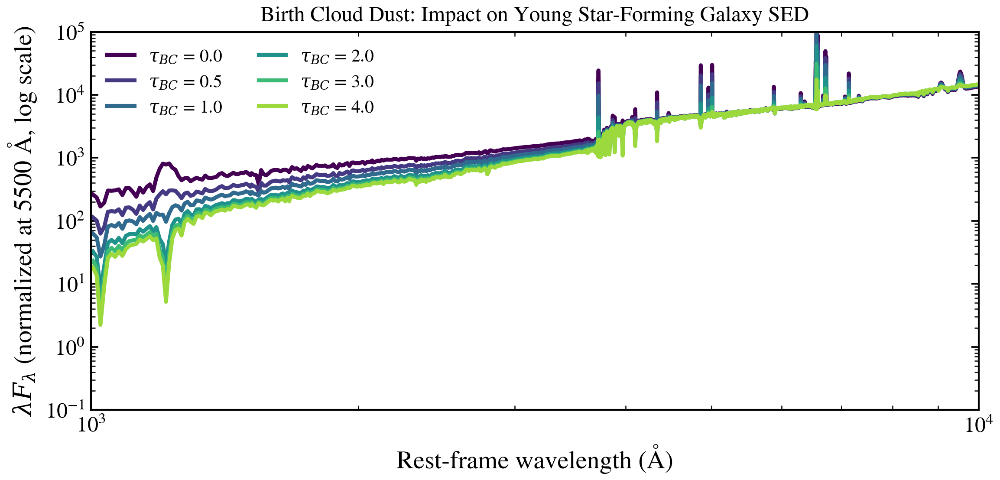

.. DO NOT EDIT.
.. THIS FILE WAS AUTOMATICALLY GENERATED BY SPHINX-GALLERY.
.. TO MAKE CHANGES, EDIT THE SOURCE PYTHON FILE:
.. "auto_examples/dust_attenuation/plot_tau_bc_sweep.py"
.. LINE NUMBERS ARE GIVEN BELOW.

.. only:: html

    .. note::
        :class: sphx-glr-download-link-note

        :ref:`Go to the end <sphx_glr_download_auto_examples_dust_attenuation_plot_tau_bc_sweep.py>`
        to download the full example code.

.. rst-class:: sphx-glr-example-title

.. _sphx_glr_auto_examples_dust_attenuation_plot_tau_bc_sweep.py:

Birth Cloud Optical Depth (τ_BC)
=================================

Birth-cloud dust optical depth `τ_BC` controls how much of the youngest
stellar light escapes the cocoon. Higher `τ_BC` reddens the UV and
suppresses nebular emission from embedded HII regions.

.. sphx-glr-precomputed-img:

.. GENERATED FROM PYTHON SOURCE LINES 16-88

.. image-sg:: /auto_examples/dust_attenuation/images/sphx_glr_plot_tau_bc_sweep_001.png
   :alt: Birth Cloud Dust: Impact on Young Star-Forming Galaxy SED
   :srcset: /auto_examples/dust_attenuation/images/sphx_glr_plot_tau_bc_sweep_001.png
   :class: sphx-glr-single-img

.. rst-class:: sphx-glr-script-out

 .. code-block:: none

    /Users/suchethacooray/Projects/tengri/.claude/worktrees/gallery-audit-2026-05-17/src/tengri/forward/sed_model.py:637: BakedInNebularWarning: BakedInBackend: nebular emission is baked into the SSP file at a FIXED logU and FIXED escape fraction determined when the SSP grid was generated (commonly logU = −3, but depends on the SSP file). The ionization parameter and escape fraction are NOT free parameters — varying neb_logU or neb_fesc in your Parameters will have no effect. Check your SSP file's nebular assumptions. Switch to CloudyGridBackend or CueBackend to vary nebular properties. To suppress: pass ionizing_source_warning='suppress'.
      self._nebular_backend = BakedInBackend()

|

.. code-block:: Python

    from pathlib import Path

    import jax
    import matplotlib.pyplot as plt

    jax.config.update("jax_enable_x64", True)

    from tengri import Fixed, Parameters, SEDModel, load_ssp_data
    from tengri.analysis.plotting import SWEEP_CMAPS, setup_style, sweep_parameter

    setup_style()

    def _find_ssp():
        """Find SSP data file in standard locations."""
        name = "ssp_prsc_miles_chabrier_wNE_logGasU-3.0_logGasZ0.0.h5"
        for p in [
            Path("data") / name,
            Path("../data") / name,
            Path("../../data") / name,
            Path("../../../data") / name,
        ]:
            if p.exists():
                return str(p)
        return None

    SSP_PATH = _find_ssp()
    if SSP_PATH is None:
        raise FileNotFoundError("SSP data not found — skipping example")

    ssp = load_ssp_data(SSP_PATH)

    # --- Build model: young star-forming galaxy ---
    spec = Parameters(
        sfh_tsnorm_log_peak_sfr=Fixed(1.0),
        sfh_tsnorm_peak_lbt_gyr=Fixed(0.5),  # Peak ~500 Myr ago (young)
        sfh_tsnorm_width_gyr=Fixed(0.3),
        sfh_tsnorm_skew=Fixed(0.2),
        sfh_tsnorm_trunc=Fixed(3.0),
        met_logzsol=Fixed(-0.3),  # Solar-ish
        dust_tau_bc=Fixed(1.0),  # Will sweep this
        dust_tau_diff=Fixed(0.3),  # Keep diffuse component modest
        dust_slope=Fixed(-0.7),  # Calzetti-like
        redshift=Fixed(0.1),
    )
    model = SEDModel(spec, ssp)

    # --- Sweep τ_BC ---
    values = [0.0, 0.5, 1.0, 2.0, 3.0, 4.0]

    # # The sweep_parameter helper creates a single SEDModel instance and calls
    # # model.predict_rest_sed(...) in a loop. JAX JIT compilation is cached
    # # automatically via tengri's persistent compilation cache (enabled at
    # # import time), so repeated forward model calls reuse the compiled kernel.
    fig, ax = sweep_parameter(
        model,
        "dust_tau_bc",
        values,
        cmap=SWEEP_CMAPS["dust"],
        label_fmt=r"$\tau_{{BC}}$ = {:.1f}",
        wave_range=(1000, 10000),
    )
    ax.set_yscale("log")
    ax.set_ylim(1e-1, 1e5)
    ax.set_title("Birth Cloud Dust: Impact on Young Star-Forming Galaxy SED", fontsize=12)
    ax.set_ylabel(r"$\lambda F_\lambda$ (normalized at 5500 Å, log scale)")
    plt.tight_layout()
    plt.savefig("plot_tau_bc_sweep.png", dpi=150, bbox_inches="tight")
    plt.show()

.. _sphx_glr_download_auto_examples_dust_attenuation_plot_tau_bc_sweep.py:

.. only:: html

  .. container:: sphx-glr-footer sphx-glr-footer-example

    .. container:: sphx-glr-download sphx-glr-download-jupyter

      :download:`Download Jupyter notebook: plot_tau_bc_sweep.ipynb <plot_tau_bc_sweep.ipynb>`

    .. container:: sphx-glr-download sphx-glr-download-python

      :download:`Download Python source code: plot_tau_bc_sweep.py <plot_tau_bc_sweep.py>`

    .. container:: sphx-glr-download sphx-glr-download-zip

      :download:`Download zipped: plot_tau_bc_sweep.zip <plot_tau_bc_sweep.zip>`

.. only:: html

 .. rst-class:: sphx-glr-signature

    `Gallery generated by Sphinx-Gallery <https://sphinx-gallery.github.io>`_
