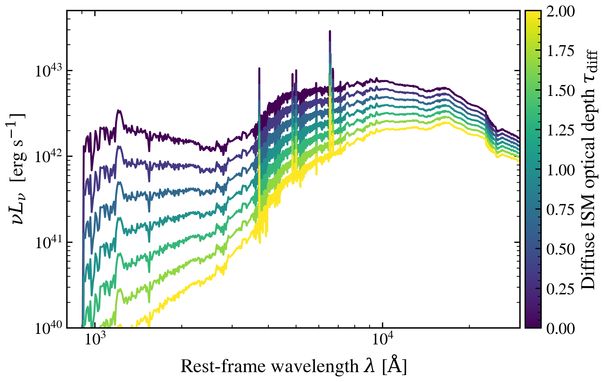

.. DO NOT EDIT.
.. THIS FILE WAS AUTOMATICALLY GENERATED BY SPHINX-GALLERY.
.. TO MAKE CHANGES, EDIT THE SOURCE PYTHON FILE:
.. "auto_examples/dust_attenuation/plot_tau_diff_sweep.py"
.. LINE NUMBERS ARE GIVEN BELOW.

.. only:: html

    .. note::
        :class: sphx-glr-download-link-note

        :ref:`Go to the end <sphx_glr_download_auto_examples_dust_attenuation_plot_tau_diff_sweep.py>`
        to download the full example code.

.. rst-class:: sphx-glr-example-title

.. _sphx_glr_auto_examples_dust_attenuation_plot_tau_diff_sweep.py:

Diffuse ISM dust attenuates all stellar populations
====================================================

Diffuse ISM dust optical depth ``τ_diff`` attenuates all stellar light (young + old).
Higher τ_diff reddens the optical continuum and weakens the 4000 Å break,
signaling aging stellar populations. We vary τ_diff across a range with every
other parameter fixed on a typical star-forming galaxy.

Reference: Charlot & Fall 2000, ApJ, 539, 718 (two-component dust model).

.. GENERATED FROM PYTHON SOURCE LINES 12-75

.. image-sg:: /auto_examples/dust_attenuation/images/sphx_glr_plot_tau_diff_sweep_001.png
   :alt: plot tau diff sweep
   :srcset: /auto_examples/dust_attenuation/images/sphx_glr_plot_tau_diff_sweep_001.png
   :class: sphx-glr-single-img

.. rst-class:: sphx-glr-script-out

 .. code-block:: none

    /private/tmp/tengri-full/src/tengri/forward/orchestrator.py:693: SFHBeforeBigBangWarning: Star formation history forms 24% of its stellar mass before the Big Bang at z=0.10 (cosmic age 12.47 Gyr). That mass is truncated, so the prediction does not reflect the requested SFH — bound the SFH age parameter or the redshift to keep star formation within cosmic time.
      state = component.apply(state, sliced, ssp_data=ssp_data, template_data=template_data)

|

.. code-block:: Python

    import os

    os.environ["TF_CPP_MIN_LOG_LEVEL"] = "2"  # suppress XLA/PjRt C++ INFO+WARNING logs

    import warnings

    import jax
    import jax.numpy as jnp
    import matplotlib as mpl
    import matplotlib.pyplot as plt
    import numpy as np

    import tengri
    from tengri.analysis.plotting import setup_style

    setup_style()
    warnings.filterwarnings("ignore", message=".*BakedInBackend.*")

    ssp = tengri.load_ssp()
    model = tengri.SEDModel.build(
        ssp,
        sfh={
            "type": "dpl",
            "*": tengri.FIXED,
            "alpha": 2.0,
            "beta": 2.5,
            "tau_gyr": 1.5,
            "log_total_mass": 10.0,
        },
        dust={
            "type": "two_component",
            "*": tengri.FIXED,
            "tau_bc": 0.3,
            "tau_diff": tengri.Uniform(0.0, 2.0),
        },
        redshift=tengri.Fixed(0.1),
    )
    baseline = dict(model.spec.sample(jax.random.PRNGKey(0)))

    tau_diff_values = np.linspace(0.0, 2.0, 7)
    norm = mpl.colors.Normalize(vmin=tau_diff_values.min(), vmax=tau_diff_values.max())
    cmap = plt.get_cmap("viridis")

    fig, ax = plt.subplots(figsize=(6.5, 4.2))
    for tau_diff in tau_diff_values:
        params = {**baseline, "dust_tau_diff": jnp.float64(tau_diff)}
        out = model.predict_rest_sed(params)
        wave = np.asarray(out.wavelength)
        nu = 2.998e18 / wave  # Å/s -> Hz
        nu_l_nu = nu * np.asarray(out.sed)
        ax.loglog(wave, nu_l_nu, color=cmap(norm(tau_diff)), lw=1.4)

    ax.set_xlim(800, 3e4)
    ax.set_ylim(1e40, 5e43)
    ax.set_xlabel(r"Rest-frame wavelength $\lambda$ [$\mathrm{\AA}$]")
    ax.set_ylabel(r"$\nu L_\nu$  [erg s$^{-1}$]")

    cbar = fig.colorbar(plt.cm.ScalarMappable(norm=norm, cmap=cmap), ax=ax, pad=0.01)
    cbar.set_label(r"Diffuse ISM optical depth $\tau_{\rm diff}$")

    fig.tight_layout()
    plt.savefig("plot_tau_diff_sweep.png", dpi=150, bbox_inches="tight")

.. _sphx_glr_download_auto_examples_dust_attenuation_plot_tau_diff_sweep.py:

.. only:: html

  .. container:: sphx-glr-footer sphx-glr-footer-example

    .. container:: sphx-glr-download sphx-glr-download-jupyter

      :download:`Download Jupyter notebook: plot_tau_diff_sweep.ipynb <plot_tau_diff_sweep.ipynb>`

    .. container:: sphx-glr-download sphx-glr-download-python

      :download:`Download Python source code: plot_tau_diff_sweep.py <plot_tau_diff_sweep.py>`

    .. container:: sphx-glr-download sphx-glr-download-zip

      :download:`Download zipped: plot_tau_diff_sweep.zip <plot_tau_diff_sweep.zip>`

.. only:: html

 .. rst-class:: sphx-glr-signature

    `Gallery generated by Sphinx-Gallery <https://sphinx-gallery.github.io>`_
