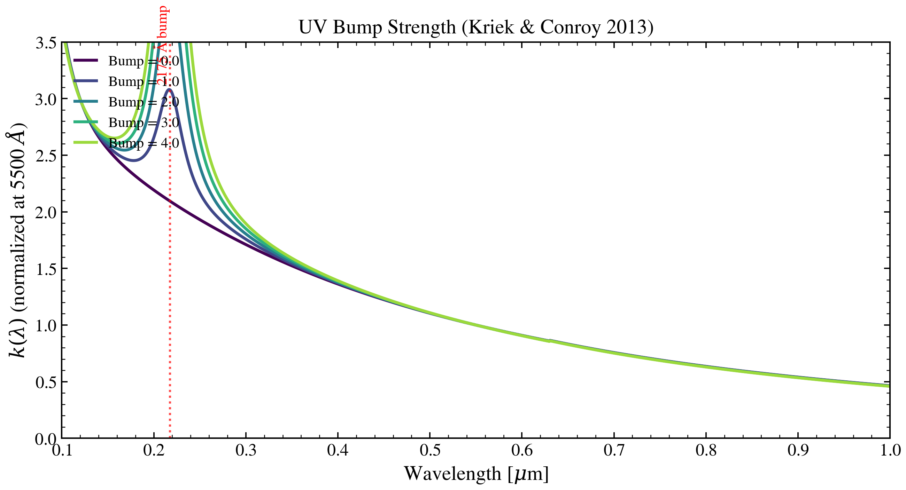

.. DO NOT EDIT.
.. THIS FILE WAS AUTOMATICALLY GENERATED BY SPHINX-GALLERY.
.. TO MAKE CHANGES, EDIT THE SOURCE PYTHON FILE:
.. "auto_examples/dust_attenuation/plot_uv_bump_sweep.py"
.. LINE NUMBERS ARE GIVEN BELOW.

.. only:: html

    .. note::
        :class: sphx-glr-download-link-note

        :ref:`Go to the end <sphx_glr_download_auto_examples_dust_attenuation_plot_uv_bump_sweep.py>`
        to download the full example code.

.. rst-class:: sphx-glr-example-title

.. _sphx_glr_auto_examples_dust_attenuation_plot_uv_bump_sweep.py:

UV Bump Strength
================

The 2175 Å UV bump (PAHs / small graphite grains) sweeps from zero
to MW-like via the Kriek & Conroy 2013 ``dust_bump_strength`` knob.
At zero the curve is a smooth power law; at MW-like values the
bump dominates the UV.

.. sphx-glr-precomputed-img:

.. GENERATED FROM PYTHON SOURCE LINES 17-65

.. image-sg:: /auto_examples/dust_attenuation/images/sphx_glr_plot_uv_bump_sweep_001.png
   :alt: UV Bump Strength (Kriek & Conroy 2013)
   :srcset: /auto_examples/dust_attenuation/images/sphx_glr_plot_uv_bump_sweep_001.png
   :class: sphx-glr-single-img

.. code-block:: Python

    import jax.numpy as jnp
    import matplotlib.pyplot as plt
    import numpy as np

    from tengri.analysis.plotting import setup_style
    from tengri.dust import resolve_dust_law

    setup_style()

    wave = jnp.linspace(1000.0, 10000.0, 2000)
    dust_fn = resolve_dust_law("kriek_conroy")
    values = [0.0, 1.0, 2.0, 3.0, 4.0]
    # Clamp viridis to 0.0–0.85 — the bright-yellow tail washes out on print.
    colors = plt.cm.viridis(np.linspace(0.0, 0.85, len(values)))

    fig, ax = plt.subplots(figsize=(9, 5))
    for v, c in zip(values, colors):
        ax.plot(
            wave / 1e4,
            dust_fn(wave, dust_bump_strength=v, dust_delta=0.0),
            lw=2.0,
            color=c,
            label=f"Bump = {v:.1f}",
        )

    ax.axvline(0.2175, ls=":", color="red", lw=1.5, alpha=0.7)
    ax.annotate(
        "2175 Å bump",
        xy=(0.2175, 0.9),
        xycoords=("data", "axes fraction"),
        fontsize=10,
        color="red",
        rotation=90,
        ha="right",
    )

    ax.set(
        xlabel=r"Wavelength [$\mu$m]",
        ylabel=r"$k(\lambda)$ (normalized at 5500 $\AA$)",
        title="UV Bump Strength (Kriek & Conroy 2013)",
        xlim=(0.1, 1.0),
        ylim=(0, 3.5),
    )
    ax.legend(fontsize=10, frameon=False, loc="upper left")
    fig.tight_layout()
    plt.savefig("plot_uv_bump_sweep.png", dpi=150, bbox_inches="tight")
    plt.show()

.. _sphx_glr_download_auto_examples_dust_attenuation_plot_uv_bump_sweep.py:

.. only:: html

  .. container:: sphx-glr-footer sphx-glr-footer-example

    .. container:: sphx-glr-download sphx-glr-download-jupyter

      :download:`Download Jupyter notebook: plot_uv_bump_sweep.ipynb <plot_uv_bump_sweep.ipynb>`

    .. container:: sphx-glr-download sphx-glr-download-python

      :download:`Download Python source code: plot_uv_bump_sweep.py <plot_uv_bump_sweep.py>`

    .. container:: sphx-glr-download sphx-glr-download-zip

      :download:`Download zipped: plot_uv_bump_sweep.zip <plot_uv_bump_sweep.zip>`

.. only:: html

 .. rst-class:: sphx-glr-signature

    `Gallery generated by Sphinx-Gallery <https://sphinx-gallery.github.io>`_
