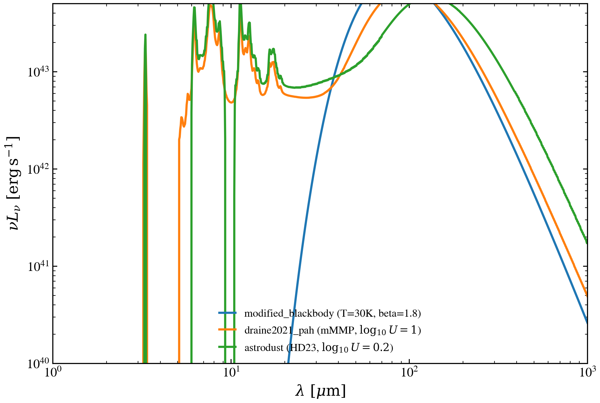

.. DO NOT EDIT.
.. THIS FILE WAS AUTOMATICALLY GENERATED BY SPHINX-GALLERY.
.. TO MAKE CHANGES, EDIT THE SOURCE PYTHON FILE:
.. "auto_examples/dust_emission/plot_astrodust_hd23_04_sedmodel_dust_emission_swap.py"
.. LINE NUMBERS ARE GIVEN BELOW.

.. only:: html

    .. note::
        :class: sphx-glr-download-link-note

        :ref:`Go to the end <sphx_glr_download_auto_examples_dust_emission_plot_astrodust_hd23_04_sedmodel_dust_emission_swap.py>`
        to download the full example code.

.. rst-class:: sphx-glr-example-title

.. _sphx_glr_auto_examples_dust_emission_plot_astrodust_hd23_04_sedmodel_dust_emission_swap.py:

DustEmissionSEDComponent — swap MBB / PAHspec / Astrodust
=========================================================

Compare dust emission templates at fixed infrared luminosity. Shows how
spectral shape changes across modified-blackbody, Draine+2021 PAHspec, and
Hensley & Draine 2023 Astrodust while bolometric output remains conserved.

.. GENERATED FROM PYTHON SOURCE LINES 9-103

.. code-block:: Python

    import warnings

    import jax.numpy as jnp
    import matplotlib.pyplot as plt
    import numpy as np

    from tengri import data_path
    from tengri.analysis.plotting import setup_style
    from tengri.components.dust.emission_component import (
        DustEmissionSEDComponent,
        DustEmissionSEDComponentConfig,
    )
    from tengri.protocols.component import PipelineState

    setup_style()
    warnings.filterwarnings("ignore", message=".*BakedInBackend.*")
    warnings.filterwarnings("ignore", message=".*deprecated.*")

    def _eval(comp: DustEmissionSEDComponent, wave_aa: jnp.ndarray, params: dict) -> np.ndarray:
        state = comp.precompute(wave_grid=wave_aa)
        pipeline = PipelineState(
            wave=wave_aa,
            sed_intrinsic=None,
            derived={"L_ir": 1.0e44},
        )
        out = comp.apply(pipeline, params, precomputed=state)
        return np.asarray(out.sed_intrinsic)

    wave_aa = jnp.asarray(np.geomspace(1.0e4, 1.0e7, 1000))
    wave_um = np.asarray(wave_aa) / 1.0e4

    mbb = DustEmissionSEDComponent()
    mbb_sed = _eval(
        mbb,
        wave_aa,
        {"dust_T": 30.0, "dust_beta_ir": 1.8, "redshift": 0.0},
    )

    d21 = DustEmissionSEDComponent(
        config=DustEmissionSEDComponentConfig(
            template="draine2021_pah",
            pahspec_starlight="mMMP",
            pahspec_template_path=data_path("pahspec_draine2021.h5"),
        ),
    )
    d21_sed = _eval(d21, wave_aa, {"dust_lgU": 1.0, "redshift": 0.0})

    ad = DustEmissionSEDComponent(
        config=DustEmissionSEDComponentConfig(
            template="astrodust",
            astrodust_template_path=data_path("astrodust_templates.h5"),
        ),
    )
    ad_sed = _eval(ad, wave_aa, {"dust_lgU": 0.2, "redshift": 0.0})

    c_aa_per_s = 2.99792458e18
    nu = c_aa_per_s / np.asarray(wave_aa)

    fig, ax = plt.subplots(figsize=(8.0, 5.5))
    ax.plot(
        wave_um,
        nu * mbb_sed,
        lw=2,
        color="#1f77b4",
        label="modified_blackbody (T=30K, beta=1.8)",
    )
    ax.plot(
        wave_um,
        nu * d21_sed,
        lw=2,
        color="#ff7f0e",
        label=r"draine2021_pah (mMMP, $\log_{10}U=1$)",
    )
    ax.plot(
        wave_um,
        nu * ad_sed,
        lw=2,
        color="#2ca02c",
        label=r"astrodust (HD23, $\log_{10}U=0.2$)",
    )
    ax.set(
        xscale="log",
        yscale="log",
        xlabel=r"$\lambda\ [\mu\mathrm{m}]$",
        ylabel=r"$\nu L_\nu\ [\mathrm{erg\,s^{-1}}]$",
        xlim=(1.0, 1.0e3),
        ylim=(1.0e40, 5.0e43),
    )
    ax.legend(loc="lower center", frameon=False, fontsize=10)
    fig.tight_layout()
    plt.savefig("plot_astrodust_hd23_04_sedmodel_dust_emission_swap.png", dpi=150, bbox_inches="tight")

.. _sphx_glr_download_auto_examples_dust_emission_plot_astrodust_hd23_04_sedmodel_dust_emission_swap.py:

.. only:: html

  .. container:: sphx-glr-footer sphx-glr-footer-example

    .. container:: sphx-glr-download sphx-glr-download-jupyter

      :download:`Download Jupyter notebook: plot_astrodust_hd23_04_sedmodel_dust_emission_swap.ipynb <plot_astrodust_hd23_04_sedmodel_dust_emission_swap.ipynb>`

    .. container:: sphx-glr-download sphx-glr-download-python

      :download:`Download Python source code: plot_astrodust_hd23_04_sedmodel_dust_emission_swap.py <plot_astrodust_hd23_04_sedmodel_dust_emission_swap.py>`

    .. container:: sphx-glr-download sphx-glr-download-zip

      :download:`Download zipped: plot_astrodust_hd23_04_sedmodel_dust_emission_swap.zip <plot_astrodust_hd23_04_sedmodel_dust_emission_swap.zip>`

.. only:: html

 .. rst-class:: sphx-glr-signature

    `Gallery generated by Sphinx-Gallery <https://sphinx-gallery.github.io>`_
