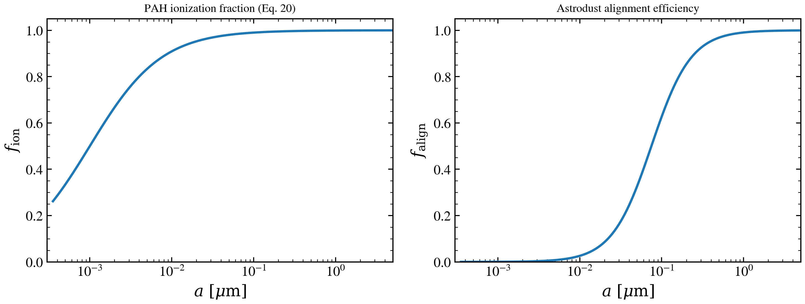

.. DO NOT EDIT.
.. THIS FILE WAS AUTOMATICALLY GENERATED BY SPHINX-GALLERY.
.. TO MAKE CHANGES, EDIT THE SOURCE PYTHON FILE:
.. "auto_examples/dust_emission/plot_astrodust_hd23_05_ionization_alignment.py"
.. LINE NUMBERS ARE GIVEN BELOW.

.. only:: html

    .. note::
        :class: sphx-glr-download-link-note

        :ref:`Go to the end <sphx_glr_download_auto_examples_dust_emission_plot_astrodust_hd23_05_ionization_alignment.py>`
        to download the full example code.

.. rst-class:: sphx-glr-example-title

.. _sphx_glr_auto_examples_dust_emission_plot_astrodust_hd23_05_ionization_alignment.py:

Astrodust+PAH ionization fraction and alignment
===============================================

Ionization fraction and alignment efficiency versus grain size for the
Hensley & Draine 2023 fiducial size distribution.

.. GENERATED FROM PYTHON SOURCE LINES 8-46

.. code-block:: Python

    import warnings

    import h5py
    import matplotlib.pyplot as plt
    import numpy as np

    from tengri import data_path
    from tengri.analysis.plotting import setup_style

    setup_style()
    warnings.filterwarnings("ignore", message=".*BakedInBackend.*")
    warnings.filterwarnings("ignore", message=".*deprecated.*")

    with h5py.File(data_path("astrodust_templates.h5"), "r") as f:
        size_dist = np.asarray(f["size_distribution"])

    rad_um = size_dist[:, 0]
    f_ion = size_dist[:, 3]
    f_align = size_dist[:, 4]

    fig, (ax1, ax2) = plt.subplots(1, 2, figsize=(10, 4))
    for ax, y, lab in (
        (ax1, f_ion, r"$f_{\rm ion}$"),
        (ax2, f_align, r"$f_{\rm align}$"),
    ):
        ax.plot(rad_um, y, lw=2, color="#1f77b4")
        ax.set(
            xscale="log",
            xlabel=r"$a\ [\mu\mathrm{m}]$",
            ylabel=lab,
            xlim=(3.0e-4, 5.0),
            ylim=(0.0, 1.05),
        )

    ax1.set_title("PAH ionization fraction (Eq. 20)", fontsize=10)
    fig.tight_layout()
    fig.savefig("plot_astrodust_hd23_05_ionization_alignment.png", dpi=150, bbox_inches="tight")

.. _sphx_glr_download_auto_examples_dust_emission_plot_astrodust_hd23_05_ionization_alignment.py:

.. only:: html

  .. container:: sphx-glr-footer sphx-glr-footer-example

    .. container:: sphx-glr-download sphx-glr-download-jupyter

      :download:`Download Jupyter notebook: plot_astrodust_hd23_05_ionization_alignment.ipynb <plot_astrodust_hd23_05_ionization_alignment.ipynb>`

    .. container:: sphx-glr-download sphx-glr-download-python

      :download:`Download Python source code: plot_astrodust_hd23_05_ionization_alignment.py <plot_astrodust_hd23_05_ionization_alignment.py>`

    .. container:: sphx-glr-download sphx-glr-download-zip

      :download:`Download zipped: plot_astrodust_hd23_05_ionization_alignment.zip <plot_astrodust_hd23_05_ionization_alignment.zip>`

.. only:: html

 .. rst-class:: sphx-glr-signature

    `Gallery generated by Sphinx-Gallery <https://sphinx-gallery.github.io>`_
