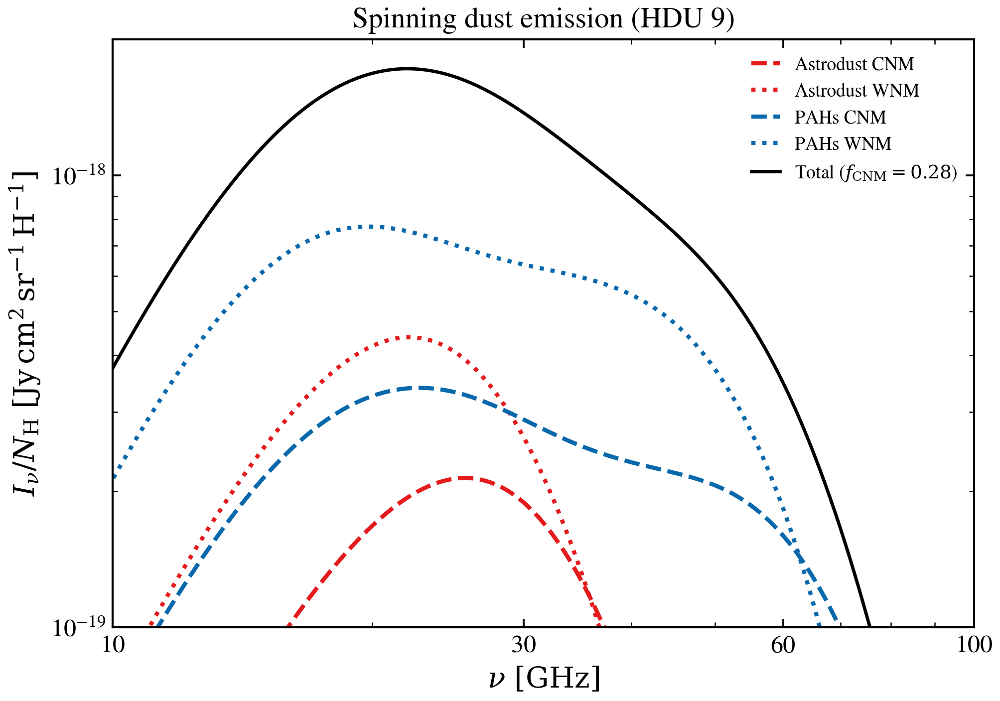

.. DO NOT EDIT.
.. THIS FILE WAS AUTOMATICALLY GENERATED BY SPHINX-GALLERY.
.. TO MAKE CHANGES, EDIT THE SOURCE PYTHON FILE:
.. "auto_examples/dust_emission/plot_astrodust_hd23_07_spinning_dust.py"
.. LINE NUMBERS ARE GIVEN BELOW.

.. only:: html

    .. note::
        :class: sphx-glr-download-link-note

        :ref:`Go to the end <sphx_glr_download_auto_examples_dust_emission_plot_astrodust_hd23_07_spinning_dust.py>`
        to download the full example code.

.. rst-class:: sphx-glr-example-title

.. _sphx_glr_auto_examples_dust_emission_plot_astrodust_hd23_07_spinning_dust.py:

Astrodust+PAH spinning-dust microwave emission
==============================================

Spinning dust microwave emission across 10–100 GHz, decomposed by grain
(Astrodust/PAH) and phase (CNM/WNM), for the Hensley & Draine 2023 fiducial.

.. sphx-glr-precomputed-img:

.. GENERATED FROM PYTHON SOURCE LINES 15-61

.. image-sg:: /auto_examples/dust_emission/images/sphx_glr_plot_astrodust_hd23_07_spinning_dust_001.png
   :alt: Spinning dust emission (HDU 9)
   :srcset: /auto_examples/dust_emission/images/sphx_glr_plot_astrodust_hd23_07_spinning_dust_001.png
   :class: sphx-glr-single-img

.. code-block:: Python

    import matplotlib.pyplot as plt
    import numpy as np

    from tengri import data_path
    from tengri.analysis.plotting import setup_style
    from tengri.components.dust.astrodust_hd23 import load_astrodust_hd23_or_raise

    setup_style()

    tpl = load_astrodust_hd23_or_raise(data_path("astrodust_templates.h5"))
    wave_um = np.asarray(tpl.wavelength_um)
    c_cgs = 2.99792458e10
    nu_hz = c_cgs / (wave_um * 1.0e-4)

    factor = 1.0e23 / (4.0 * np.pi)
    I_nu_total = factor * np.asarray(tpl.L_nu_spdust_total)
    I_nu_Ad_CNM = factor * np.asarray(tpl.L_nu_spdust_Ad_CNM)
    I_nu_Ad_WNM = factor * np.asarray(tpl.L_nu_spdust_Ad_WNM)
    I_nu_PAH_CNM = factor * np.asarray(tpl.L_nu_spdust_PAH_CNM)
    I_nu_PAH_WNM = factor * np.asarray(tpl.L_nu_spdust_PAH_WNM)

    nu_ghz = nu_hz * 1.0e-9
    fig, ax = plt.subplots(figsize=(7.0, 5.0))
    ax.plot(nu_ghz, I_nu_Ad_CNM, color="#e41a1c", ls="--", label="Astrodust CNM")
    ax.plot(nu_ghz, I_nu_Ad_WNM, color="#e41a1c", ls=":", label="Astrodust WNM")
    ax.plot(nu_ghz, I_nu_PAH_CNM, color="#0868ac", ls="--", label="PAHs CNM")
    ax.plot(nu_ghz, I_nu_PAH_WNM, color="#0868ac", ls=":", label="PAHs WNM")
    ax.plot(nu_ghz, I_nu_total, color="k", lw=1.6, label=r"Total ($f_{\rm CNM}=0.28$)", zorder=0)
    ax.set(
        xscale="log",
        yscale="log",
        xlabel=r"$\nu\ [\mathrm{GHz}]$",
        ylabel=r"$I_\nu/N_{\rm H}\ [\mathrm{Jy\,cm^2\,sr^{-1}\,H^{-1}}]$",
        xlim=(10.0, 100.0),
        ylim=(1.0e-19, 2.0e-18),
        title="Spinning dust emission (HDU 9)",
    )
    ax.xaxis.set_minor_formatter(plt.matplotlib.ticker.NullFormatter())
    ax.xaxis.set_major_formatter(plt.matplotlib.ticker.NullFormatter())
    ax.set_xticks([10, 30, 60, 100])
    ax.set_xticklabels(["10", "30", "60", "100"])
    ax.legend(loc="upper right", frameon=False, fontsize=9)
    fig.tight_layout()
    plt.savefig("plot_astrodust_hd23_07_spinning_dust.png", dpi=150, bbox_inches="tight")
    plt.show()

.. _sphx_glr_download_auto_examples_dust_emission_plot_astrodust_hd23_07_spinning_dust.py:

.. only:: html

  .. container:: sphx-glr-footer sphx-glr-footer-example

    .. container:: sphx-glr-download sphx-glr-download-jupyter

      :download:`Download Jupyter notebook: plot_astrodust_hd23_07_spinning_dust.ipynb <plot_astrodust_hd23_07_spinning_dust.ipynb>`

    .. container:: sphx-glr-download sphx-glr-download-python

      :download:`Download Python source code: plot_astrodust_hd23_07_spinning_dust.py <plot_astrodust_hd23_07_spinning_dust.py>`

    .. container:: sphx-glr-download sphx-glr-download-zip

      :download:`Download zipped: plot_astrodust_hd23_07_spinning_dust.zip <plot_astrodust_hd23_07_spinning_dust.zip>`

.. only:: html

 .. rst-class:: sphx-glr-signature

    `Gallery generated by Sphinx-Gallery <https://sphinx-gallery.github.io>`_
