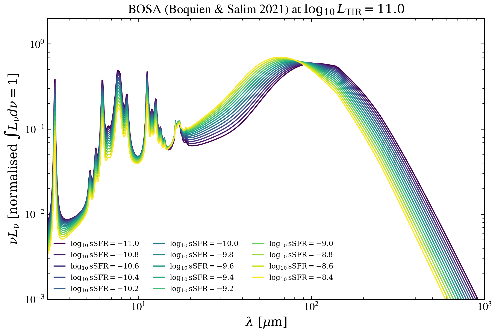

.. DO NOT EDIT.
.. THIS FILE WAS AUTOMATICALLY GENERATED BY SPHINX-GALLERY.
.. TO MAKE CHANGES, EDIT THE SOURCE PYTHON FILE:
.. "auto_examples/dust_emission/plot_bosa_ssfr_sweep.py"
.. LINE NUMBERS ARE GIVEN BELOW.

.. only:: html

    .. note::
        :class: sphx-glr-download-link-note

        :ref:`Go to the end <sphx_glr_download_auto_examples_dust_emission_plot_bosa_ssfr_sweep.py>`
        to download the full example code.

.. rst-class:: sphx-glr-example-title

.. _sphx_glr_auto_examples_dust_emission_plot_bosa_ssfr_sweep.py:

BOSA: log sSFR sweep at fixed log L_TIR
========================================

Sweep specific star formation rate across the BOSA grid at fixed infrared
luminosity. Higher sSFR produces harder mid-IR colors and stronger PAH
features; quiescent galaxies exhibit colder FIR peaks.

.. GENERATED FROM PYTHON SOURCE LINES 9-57

.. code-block:: Python

    import warnings

    import h5py
    import matplotlib.pyplot as plt
    import numpy as np

    from tengri import data_path
    from tengri.analysis.plotting import setup_style

    setup_style()
    warnings.filterwarnings("ignore", message=".*BakedInBackend.*")
    warnings.filterwarnings("ignore", message=".*deprecated.*")

    with h5py.File(data_path("bosa_templates.h5"), "r") as f:
        wave_aa = np.asarray(f["wavelength_aa"][:])
        log_ltir = np.asarray(f["log_ltir_grid"][:])
        log_ssfr = np.asarray(f["log_ssfr_grid"][:])
        spectra = np.asarray(f["spectra"][:])

    wave_um = wave_aa * 1.0e-4
    i_ltir = int(np.argmin(np.abs(log_ltir - 11.0)))

    c_aa_per_s = 2.99792458e18
    nu = c_aa_per_s / wave_aa

    fig, ax = plt.subplots(figsize=(8.0, 5.5))
    cmap = plt.get_cmap("viridis")
    for k, lssfr in enumerate(log_ssfr):
        L_nu = spectra[i_ltir, k]
        ax.plot(
            wave_um,
            nu * L_nu,
            color=cmap(k / max(1, len(log_ssfr) - 1)),
            lw=1.3,
            label=rf"$\log_{{10}} \mathrm{{sSFR}} = {lssfr:+.1f}$",
        )
    ax.set(
        xscale="log",
        yscale="log",
        xlabel=r"$\lambda\ [\mu\mathrm{m}]$",
        ylabel=r"$\nu L_\nu\ [\mathrm{normalised}\ \int L_\nu d\nu = 1]$",
        xlim=(3.0, 1.0e3),
        ylim=(1.0e-3, 2.0e0),
    )
    ax.legend(loc="lower left", frameon=False, fontsize=8, ncol=3)
    fig.tight_layout()
    plt.savefig("plot_bosa_ssfr_sweep.png", dpi=150, bbox_inches="tight")

.. _sphx_glr_download_auto_examples_dust_emission_plot_bosa_ssfr_sweep.py:

.. only:: html

  .. container:: sphx-glr-footer sphx-glr-footer-example

    .. container:: sphx-glr-download sphx-glr-download-jupyter

      :download:`Download Jupyter notebook: plot_bosa_ssfr_sweep.ipynb <plot_bosa_ssfr_sweep.ipynb>`

    .. container:: sphx-glr-download sphx-glr-download-python

      :download:`Download Python source code: plot_bosa_ssfr_sweep.py <plot_bosa_ssfr_sweep.py>`

    .. container:: sphx-glr-download sphx-glr-download-zip

      :download:`Download zipped: plot_bosa_ssfr_sweep.zip <plot_bosa_ssfr_sweep.zip>`

.. only:: html

 .. rst-class:: sphx-glr-signature

    `Gallery generated by Sphinx-Gallery <https://sphinx-gallery.github.io>`_
