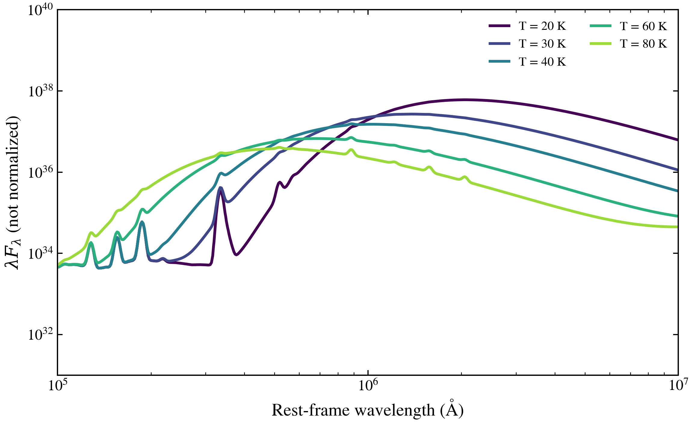

.. DO NOT EDIT.
.. THIS FILE WAS AUTOMATICALLY GENERATED BY SPHINX-GALLERY.
.. TO MAKE CHANGES, EDIT THE SOURCE PYTHON FILE:
.. "auto_examples/dust_emission/plot_dust_T_sweep.py"
.. LINE NUMBERS ARE GIVEN BELOW.

.. only:: html

    .. note::
        :class: sphx-glr-download-link-note

        :ref:`Go to the end <sphx_glr_download_auto_examples_dust_emission_plot_dust_T_sweep.py>`
        to download the full example code.

.. rst-class:: sphx-glr-example-title

.. _sphx_glr_auto_examples_dust_emission_plot_dust_T_sweep.py:

Modified Blackbody Dust Temperature
====================================

Dust temperature T sets the far-infrared peak via Wien's displacement law.
Higher T shifts the peak blueward into the mid-IR; lower T shifts it
redward toward the submillimeter.

.. sphx-glr-precomputed-img:

.. GENERATED FROM PYTHON SOURCE LINES 16-54

.. image-sg:: /auto_examples/dust_emission/images/sphx_glr_plot_dust_T_sweep_001.png
   :alt: Dust Temperature: Far-IR Peak Position and Shape
   :srcset: /auto_examples/dust_emission/images/sphx_glr_plot_dust_T_sweep_001.png
   :class: sphx-glr-single-img

.. rst-class:: sphx-glr-script-out

 .. code-block:: none

    /Users/suchethacooray/Projects/tengri/.claude/worktrees/dust-emission-pilot/src/tengri/forward/sed_model.py:643: BakedInNebularWarning: BakedInBackend: nebular emission is baked into the SSP file at a FIXED logU and FIXED escape fraction determined when the SSP grid was generated (commonly logU = −3, but depends on the SSP file). The ionization parameter and escape fraction are NOT free parameters — varying neb_logU or neb_fesc in your Parameters will have no effect. Check your SSP file's nebular assumptions. Switch to CloudyGridBackend or CueBackend to vary nebular properties. To suppress: pass ionizing_source_warning='suppress'.
      self._nebular_backend = BakedInBackend()

|

.. code-block:: Python

    import matplotlib.pyplot as plt

    from tengri import FIXED, SEDModel, load_ssp, recipes
    from tengri.analysis.plotting import SWEEP_CMAPS, setup_style, sweep_parameter

    setup_style()

    recipe = recipes.dust_demo()
    recipe["dust"]["emission"] = {
        "type": "modified_blackbody",
        "*": FIXED,
        "T": 35.0,
        "beta_ir": 1.6,
    }
    model = SEDModel.build(ssp_data=load_ssp(), **recipe)

    fig, ax = plt.subplots(figsize=(8, 5))
    sweep_parameter(
        model,
        "dust_T",
        [20, 30, 40, 60, 80],
        ax=ax,
        cmap=SWEEP_CMAPS["dust"],
        label_fmt=r"T = {:.0f} K",
        wave_range=(1e5, 1e7),
        normalize_at=None,
    )
    ax.set(
        xscale="log",
        yscale="log",
        ylim=(1e31, 1e40),
        title="Dust Temperature: Far-IR Peak Position and Shape",
        ylabel=r"$\lambda F_\lambda$ (not normalized)",
    )
    fig.tight_layout()
    plt.savefig("plot_dust_T_sweep.png", dpi=150, bbox_inches="tight")
    plt.show()

.. rst-class:: sphx-glr-timing

   **Total running time of the script:** (0 minutes 2.607 seconds)

.. _sphx_glr_download_auto_examples_dust_emission_plot_dust_T_sweep.py:

.. only:: html

  .. container:: sphx-glr-footer sphx-glr-footer-example

    .. container:: sphx-glr-download sphx-glr-download-jupyter

      :download:`Download Jupyter notebook: plot_dust_T_sweep.ipynb <plot_dust_T_sweep.ipynb>`

    .. container:: sphx-glr-download sphx-glr-download-python

      :download:`Download Python source code: plot_dust_T_sweep.py <plot_dust_T_sweep.py>`

    .. container:: sphx-glr-download sphx-glr-download-zip

      :download:`Download zipped: plot_dust_T_sweep.zip <plot_dust_T_sweep.zip>`

.. only:: html

 .. rst-class:: sphx-glr-signature

    `Gallery generated by Sphinx-Gallery <https://sphinx-gallery.github.io>`_
