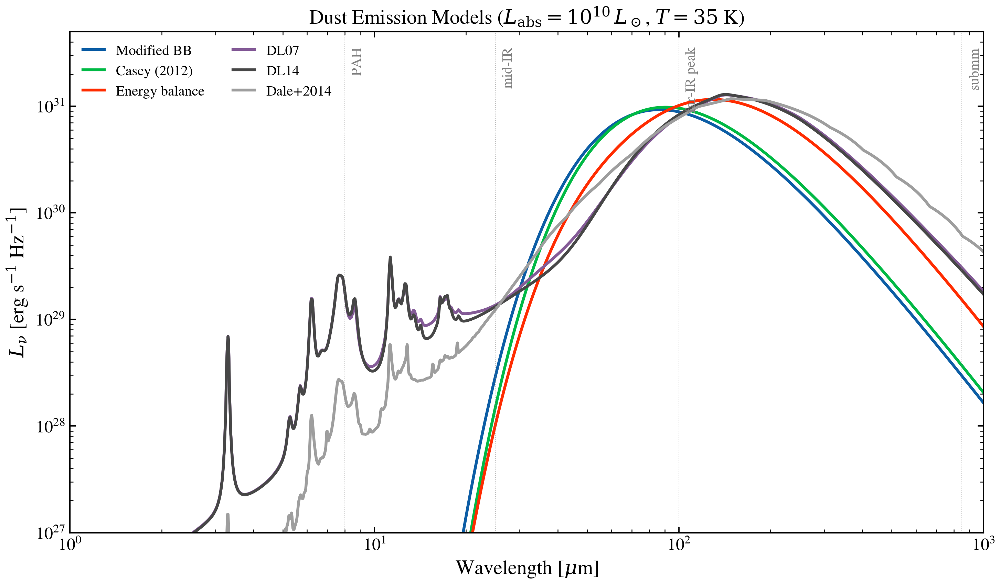

.. DO NOT EDIT.
.. THIS FILE WAS AUTOMATICALLY GENERATED BY SPHINX-GALLERY.
.. TO MAKE CHANGES, EDIT THE SOURCE PYTHON FILE:
.. "auto_examples/dust_emission/plot_dust_emission_models.py"
.. LINE NUMBERS ARE GIVEN BELOW.

.. only:: html

    .. note::
        :class: sphx-glr-download-link-note

        :ref:`Go to the end <sphx_glr_download_auto_examples_dust_emission_plot_dust_emission_models.py>`
        to download the full example code.

.. rst-class:: sphx-glr-example-title

.. _sphx_glr_auto_examples_dust_emission_plot_dust_emission_models.py:

Dust-emission model family at fixed L_abs
=========================================

All six dust-emission ingredients shipped with tengri, called with the same
absorbed bolometric luminosity (1e10 L_sun) and the same warm-dust temperature
(35 K). Analytic models (modified BB, Casey 2012, energy-balance split) drop
sharply blue-ward of the warm-dust peak; template-based libraries (DL07, DL14,
Dale+2014) carry PAH features in the 3-20 μm window. Template models silently
skip if the data files aren't available.

.. GENERATED FROM PYTHON SOURCE LINES 12-110

.. code-block:: Python

    import os

    os.environ["TF_CPP_MIN_LOG_LEVEL"] = "2"  # suppress XLA/PjRt C++ INFO+WARNING logs

    import warnings

    import jax.numpy as jnp
    import matplotlib.pyplot as plt
    import numpy as np

    from tengri.analysis.plotting import setup_style
    from tengri.dust import (
        casey2012,
        dale2014,
        draine_li2007,
        draine_li2014,
        energy_balance_split,
        modified_blackbody,
    )

    setup_style()
    warnings.filterwarnings("ignore", message=".*BakedInBackend.*")

    C_AA_PER_S = 2.998e18
    L_SUN = 3.828e33
    L_ABS = 1e10 * L_SUN

    wave_aa = jnp.logspace(np.log10(1e4), np.log10(1e7), 2000)
    wave_um = np.asarray(wave_aa) * 1e-4

    def _maybe(fn, *args, **kwargs):
        try:
            return fn(*args, **kwargs)
        except FileNotFoundError:
            return None

    MODELS = [
        ("Modified BB", "C0", modified_blackbody(wave_aa, L_ABS, dust_T=35.0, dust_beta_ir=1.8)),
        (
            "Casey 2012",
            "C1",
            casey2012(wave_aa, L_ABS, dust_T=35.0, dust_beta_ir=1.8, dust_alpha_mir=2.0),
        ),
        (
            "Energy balance",
            "C3",
            energy_balance_split(wave_aa, L_ABS, dust_T_warm=35.0, dust_T_cold=20.0),
        ),
        (
            "Draine & Li 2007",
            "C4",
            _maybe(draine_li2007, wave_aa, L_ABS, dust_umin=1.0, dust_gamma_dl=0.01, dust_qpah=2.5),
        ),
        (
            "Draine+2014",
            "C5",
            _maybe(draine_li2014, wave_aa, L_ABS, dust_umin=1.0, dust_gamma_dl=0.01, dust_qpah=2.5),
        ),
        ("Dale+2014", "C6", _maybe(dale2014, wave_aa, L_ABS, dust_alpha_dale=2.0)),
    ]

    fig, ax = plt.subplots(figsize=(7.2, 4.6))
    nu = C_AA_PER_S / np.asarray(wave_aa)

    for label, color, lnu in MODELS:
        if lnu is None:
            continue
        nu_l_nu = nu * np.asarray(lnu)
        # Clip the Wien-tail floor so curves stay above the legend.
        peak = np.nanmax(nu_l_nu)
        mask = nu_l_nu > 1e-3 * peak
        ax.loglog(wave_um[mask], nu_l_nu[mask], color=color, lw=1.5, label=label)

    ax.set(
        xlim=(1, 1000),
        xlabel=r"Rest-frame wavelength $\lambda$ [$\mu$m]",
        ylabel=r"$\nu L_\nu$ [erg s$^{-1}$]",
    )
    ax.legend(frameon=False, fontsize=9, ncol=2, loc="lower center")

    for lam_um, name in [(8, "PAH"), (24, "MIPS 24"), (100, "FIR peak"), (850, "submm")]:
        ax.axvline(lam_um, color="0.85", lw=0.5, alpha=0.7)
        ax.text(
            lam_um,
            1.02,
            name,
            fontsize=8,
            color="0.4",
            ha="center",
            va="bottom",
            transform=ax.get_xaxis_transform(),
        )

    fig.tight_layout()
    plt.savefig("plot_dust_emission_models.png", dpi=150, bbox_inches="tight")

.. _sphx_glr_download_auto_examples_dust_emission_plot_dust_emission_models.py:

.. only:: html

  .. container:: sphx-glr-footer sphx-glr-footer-example

    .. container:: sphx-glr-download sphx-glr-download-jupyter

      :download:`Download Jupyter notebook: plot_dust_emission_models.ipynb <plot_dust_emission_models.ipynb>`

    .. container:: sphx-glr-download sphx-glr-download-python

      :download:`Download Python source code: plot_dust_emission_models.py <plot_dust_emission_models.py>`

    .. container:: sphx-glr-download sphx-glr-download-zip

      :download:`Download zipped: plot_dust_emission_models.zip <plot_dust_emission_models.zip>`

.. only:: html

 .. rst-class:: sphx-glr-signature

    `Gallery generated by Sphinx-Gallery <https://sphinx-gallery.github.io>`_
