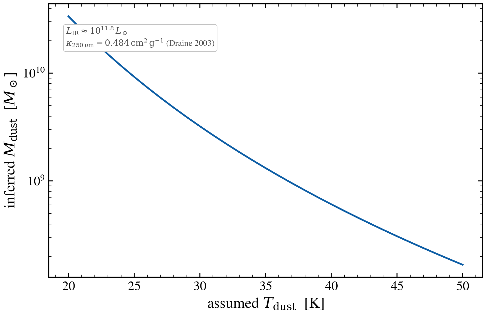

.. DO NOT EDIT.
.. THIS FILE WAS AUTOMATICALLY GENERATED BY SPHINX-GALLERY.
.. TO MAKE CHANGES, EDIT THE SOURCE PYTHON FILE:
.. "auto_examples/dust_emission/plot_dust_mass_from_lir.py"
.. LINE NUMBERS ARE GIVEN BELOW.

.. only:: html

    .. note::
        :class: sphx-glr-download-link-note

        :ref:`Go to the end <sphx_glr_download_auto_examples_dust_emission_plot_dust_mass_from_lir.py>`
        to download the full example code.

.. rst-class:: sphx-glr-example-title

.. _sphx_glr_auto_examples_dust_emission_plot_dust_mass_from_lir.py:

Dust mass inferred from L_IR and modified-blackbody temperature
==================================================================

The single most-used number an observer reads off a sub-mm SED is
``L_IR(8–1000 μm)``. Converting it to a dust mass requires assuming
a dust temperature and emissivity; the standard analytic estimator
is

   M_dust = L_IR / (4 π κ_ν * B_ν(T_dust))

evaluated at a sub-mm reference frequency (typically 250 μm).
Different ``T_dust`` choices change the implied ``M_dust`` by ~1 dex
across the cold-warm range.

We compute ``M_dust(T)`` directly from the modified-blackbody flux at
a fixed observed sub-mm point, sweeping ``T`` over 20–50 K to show
the bias an observer inherits from the assumed temperature.

.. GENERATED FROM PYTHON SOURCE LINES 20-91

.. code-block:: Python

    import warnings

    import jax
    import jax.numpy as jnp
    import matplotlib.pyplot as plt
    import numpy as np

    import tengri
    from tengri.analysis.plotting import setup_style

    setup_style()
    warnings.filterwarnings("ignore", message=".*BakedInBackend.*")

    C_AA_PER_S = 2.998e18
    H = 6.626e-27          # erg s
    KB = 1.381e-16         # erg / K
    KAPPA_250 = 0.484      # cm^2 / g, Draine 2003 at 250 μm
    NU_250 = C_AA_PER_S / (250.0 * 1.0e4)  # Hz
    M_SUN_G = 1.989e33

    ssp = tengri.load_ssp()
    model = tengri.SEDModel.build(
        ssp,
        sfh={"type": "const", "*": tengri.FIXED, "log_sfr": 1.5},
        dust={"type": "two_component", "*": tengri.FIXED,
              "tau_diff": 1.5, "tau_bc": 1.0,
              "emission": {"type": "modified_blackbody", "*": tengri.FIXED}},
        redshift=tengri.Fixed(0.05),
    )

    T_grid = np.linspace(20.0, 50.0, 31)
    M_dust_grid = np.empty_like(T_grid)
    L_IR_grid = np.empty_like(T_grid)

    for i, T in enumerate(T_grid):
        p = dict(model.spec.sample(jax.random.PRNGKey(0)))
        p["dust_T"] = jnp.float64(T)
        p["dust_beta_ir"] = jnp.float64(1.8)
        out = model.predict_rest_sed(p)
        wave = np.asarray(out.wavelength)
        sed = np.asarray(out.sed)
        # L_IR(8–1000 μm)
        ir = (wave > 8e4) & (wave < 1e7)
        nu_ir = C_AA_PER_S / wave[ir]
        order = np.argsort(nu_ir)
        L_IR = float(np.trapezoid(sed[ir][order], nu_ir[order]))
        L_IR_grid[i] = L_IR
        # Flux at 250 μm rest-frame
        i250 = int(np.argmin(np.abs(wave - 250 * 1.0e4)))
        L_nu_250 = float(sed[i250])
        # M_dust = L_nu / (4 π κ B_ν(T))
        x = H * NU_250 / (KB * T)
        B_nu = 2.0 * H * NU_250**3 / (C_AA_PER_S * 1e-8)**2 / (np.exp(x) - 1.0)
        M_dust = L_nu_250 / (4 * np.pi * KAPPA_250 * B_nu) / M_SUN_G
        M_dust_grid[i] = M_dust

    fig, ax = plt.subplots(figsize=(6.6, 4.4))
    ax.semilogy(T_grid, M_dust_grid, color="C0", lw=1.6)
    ax.set(xlabel=r"assumed $T_{\rm dust}$  [K]",
           ylabel=r"inferred $M_{\rm dust}$  [$M_\odot$]")
    ax.text(0.04, 0.92,
            rf"$L_{{\rm IR}} \approx 10^{{{np.log10(L_IR_grid.mean()/3.84e33):.1f}}}\,L_\odot$"
            "\n"
            r"$\kappa_{250\,\mu\mathrm{m}} = 0.484\,\mathrm{cm^2\,g^{-1}}$ (Draine 2003)",
            transform=ax.transAxes, fontsize=8, color="0.3",
            bbox=dict(boxstyle="round,pad=0.3", fc="white", ec="0.7", lw=0.4),
            va="top")

    fig.tight_layout()
    plt.savefig("plot_dust_mass_from_lir.png", dpi=150, bbox_inches="tight")

.. _sphx_glr_download_auto_examples_dust_emission_plot_dust_mass_from_lir.py:

.. only:: html

  .. container:: sphx-glr-footer sphx-glr-footer-example

    .. container:: sphx-glr-download sphx-glr-download-jupyter

      :download:`Download Jupyter notebook: plot_dust_mass_from_lir.ipynb <plot_dust_mass_from_lir.ipynb>`

    .. container:: sphx-glr-download sphx-glr-download-python

      :download:`Download Python source code: plot_dust_mass_from_lir.py <plot_dust_mass_from_lir.py>`

    .. container:: sphx-glr-download sphx-glr-download-zip

      :download:`Download zipped: plot_dust_mass_from_lir.zip <plot_dust_mass_from_lir.zip>`

.. only:: html

 .. rst-class:: sphx-glr-signature

    `Gallery generated by Sphinx-Gallery <https://sphinx-gallery.github.io>`_
