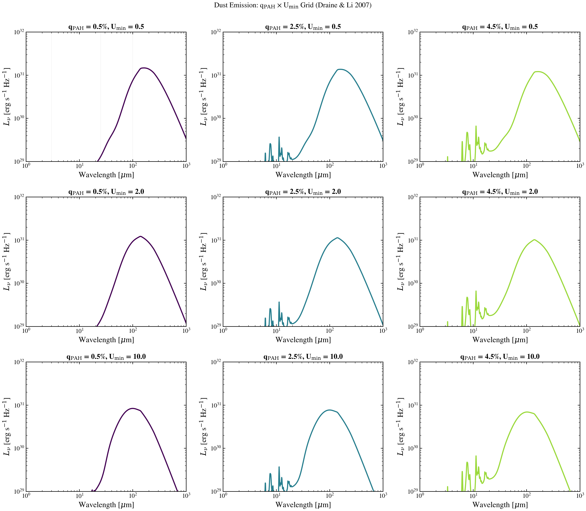

.. DO NOT EDIT.
.. THIS FILE WAS AUTOMATICALLY GENERATED BY SPHINX-GALLERY.
.. TO MAKE CHANGES, EDIT THE SOURCE PYTHON FILE:
.. "auto_examples/dust_emission/plot_dust_qpah_umin_grid.py"
.. LINE NUMBERS ARE GIVEN BELOW.

.. only:: html

    .. note::
        :class: sphx-glr-download-link-note

        :ref:`Go to the end <sphx_glr_download_auto_examples_dust_emission_plot_dust_qpah_umin_grid.py>`
        to download the full example code.

.. rst-class:: sphx-glr-example-title

.. _sphx_glr_auto_examples_dust_emission_plot_dust_qpah_umin_grid.py:

Dust IR SED: q_PAH × U_min Grid
===============================

2D grid of dust IR emission showing how PAH mass fraction and radiation-field
hardness independently shape the mid- and far-infrared SED. Uses Draine & Li
2007 templates across parameter space.

.. sphx-glr-precomputed-img:

.. GENERATED FROM PYTHON SOURCE LINES 16-89

.. image-sg:: /auto_examples/dust_emission/images/sphx_glr_plot_dust_qpah_umin_grid_001.png
   :alt: Dust Emission: q$_{\rm PAH}$ × U$_{\rm min}$ Grid (Draine & Li 2007), q$_{\rm PAH}$ = 0.5%, U$_{\rm min}$ = 0.5, q$_{\rm PAH}$ = 2.5%, U$_{\rm min}$ = 0.5, q$_{\rm PAH}$ = 4.5%, U$_{\rm min}$ = 0.5, q$_{\rm PAH}$ = 0.5%, U$_{\rm min}$ = 2.0, q$_{\rm PAH}$ = 2.5%, U$_{\rm min}$ = 2.0, q$_{\rm PAH}$ = 4.5%, U$_{\rm min}$ = 2.0, q$_{\rm PAH}$ = 0.5%, U$_{\rm min}$ = 10.0, q$_{\rm PAH}$ = 2.5%, U$_{\rm min}$ = 10.0, q$_{\rm PAH}$ = 4.5%, U$_{\rm min}$ = 10.0
   :srcset: /auto_examples/dust_emission/images/sphx_glr_plot_dust_qpah_umin_grid_001.png
   :class: sphx-glr-single-img

.. code-block:: Python

    import jax.numpy as jnp
    import matplotlib.pyplot as plt
    import numpy as np

    from tengri.analysis.plotting import setup_style
    from tengri.dust import draine_li2007

    setup_style()

    wave_aa = jnp.logspace(np.log10(1e4), np.log10(1e7), 2000)
    wave_um = np.array(wave_aa) * 1e-4

    L_ABS = 1e10 * 3.828e33
    qpah_values = [0.5, 2.5, 4.5]
    umin_values = [0.5, 2.0, 10.0]

    colors_grid = plt.cm.viridis(np.linspace(0.0, 0.85, 3))

    fig, axes = plt.subplots(3, 3, figsize=(15, 13))
    fig.suptitle(
        r"Dust Emission: q$_{\rm PAH}$ × U$_{\rm min}$ Grid (Draine & Li 2007)",
        fontsize=13,
        y=0.995,
    )

    for i, umin in enumerate(umin_values):
        for j, qpah in enumerate(qpah_values):
            ax = axes[i, j]

            try:
                lnu = draine_li2007(wave_aa, L_ABS, dust_umin=umin, dust_gamma_dl=0.01, dust_qpah=qpah)
            except FileNotFoundError:
                ax.text(
                    0.5,
                    0.5,
                    "Data not found\n(use synthetic)",
                    ha="center",
                    va="center",
                    transform=ax.transAxes,
                    fontsize=10,
                )
                ax.set(
                    xlabel=r"Wavelength [$\mu$m]",
                    ylabel=r"$L_\nu$ [erg s$^{-1}$ Hz$^{-1}$]",
                )
                continue

            y = np.array(lnu)
            mask = (wave_um > 1) & (y > 0)
            ax.loglog(wave_um[mask], y[mask], color=colors_grid[j], lw=2.0)

            ax.set(
                xlabel=r"Wavelength [$\mu$m]",
                ylabel=r"$L_\nu$ [erg s$^{-1}$ Hz$^{-1}$]",
                xlim=(1, 1000),
                ylim=(1e29, 1e32),
            )
            ax.tick_params(labelsize=11)

            ax.set_title(
                f"q$_{{\\rm PAH}}$ = {qpah:.1f}%, U$_{{\\rm min}}$ = {umin:.1f}",
                fontsize=13,
                fontweight="bold",
            )

            if i == 0 and j == 0:
                for wl_um, _wl_label in [(3, "PAH"), (25, "mid-IR"), (100, "far-IR")]:
                    ax.axvline(wl_um, color="grey", ls=":", lw=0.5, alpha=0.4)

    fig.tight_layout()
    plt.savefig("plot_dust_qpah_umin_grid.png", dpi=150, bbox_inches="tight")
    plt.show()

.. _sphx_glr_download_auto_examples_dust_emission_plot_dust_qpah_umin_grid.py:

.. only:: html

  .. container:: sphx-glr-footer sphx-glr-footer-example

    .. container:: sphx-glr-download sphx-glr-download-jupyter

      :download:`Download Jupyter notebook: plot_dust_qpah_umin_grid.ipynb <plot_dust_qpah_umin_grid.ipynb>`

    .. container:: sphx-glr-download sphx-glr-download-python

      :download:`Download Python source code: plot_dust_qpah_umin_grid.py <plot_dust_qpah_umin_grid.py>`

    .. container:: sphx-glr-download sphx-glr-download-zip

      :download:`Download zipped: plot_dust_qpah_umin_grid.zip <plot_dust_qpah_umin_grid.zip>`

.. only:: html

 .. rst-class:: sphx-glr-signature

    `Gallery generated by Sphinx-Gallery <https://sphinx-gallery.github.io>`_
