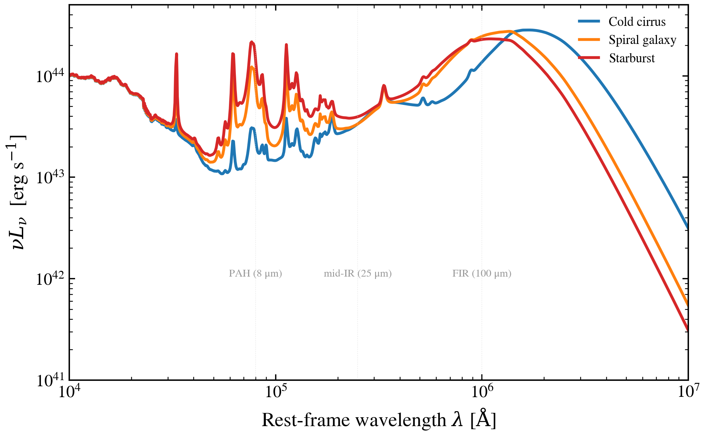

.. DO NOT EDIT.
.. THIS FILE WAS AUTOMATICALLY GENERATED BY SPHINX-GALLERY.
.. TO MAKE CHANGES, EDIT THE SOURCE PYTHON FILE:
.. "auto_examples/dust_emission/plot_pah_warm_cold_split.py"
.. LINE NUMBERS ARE GIVEN BELOW.

.. only:: html

    .. note::
        :class: sphx-glr-download-link-note

        :ref:`Go to the end <sphx_glr_download_auto_examples_dust_emission_plot_pah_warm_cold_split.py>`
        to download the full example code.

.. rst-class:: sphx-glr-example-title

.. _sphx_glr_auto_examples_dust_emission_plot_pah_warm_cold_split.py:

Dust IR SED: PAH / Warm grain / Cold grain decomposition
=========================================================

The Draine & Li (2007) dust model naturally separates three emission
regimes via its parameters. Varying ``q_PAH`` (PAH mass fraction) and
``U_min`` (minimum radiation-field intensity) traces three archetypal
SED shapes:

1. **Cold cirrus** (``q_PAH`` ≈ 0.5%, ``U_min`` ≈ 0.1 dex):
   Diffuse, cool dust with weak PAH features—characteristic of
   quiescent regions (peak ≈ 250 μm).

2. **Spiral-disk galaxy** (``q_PAH`` ≈ 2.5%, ``U_min`` ≈ 1.0 dex):
   Typical mid-IR + FIR balance with modest PAH features
   (peak ≈ 100 μm).

3. **Starburst** (``q_PAH`` ≈ 4.5%, ``U_min`` ≈ 2.0 dex):
   Strong PAH features at 3–20 μm and warm grains; harder
   radiation field from young star clusters (peak ≈ 60 μm).

This script sweeps the two knobs independently to show how the
dust SED morphology responds.

.. GENERATED FROM PYTHON SOURCE LINES 25-118

.. image-sg:: /auto_examples/dust_emission/images/sphx_glr_plot_pah_warm_cold_split_001.png
   :alt: plot pah warm cold split
   :srcset: /auto_examples/dust_emission/images/sphx_glr_plot_pah_warm_cold_split_001.png
   :class: sphx-glr-single-img

.. code-block:: Python

    import warnings

    import jax
    import jax.numpy as jnp
    import matplotlib as mpl
    import matplotlib.pyplot as plt
    import numpy as np

    import tengri
    from tengri.analysis.plotting import setup_style

    setup_style()
    warnings.filterwarnings("ignore", message=".*BakedInBackend.*")

    C_AA_PER_S = 2.998e18

    ssp = tengri.load_ssp()

    def _build(q_pah=None, u_min=None):
        """Build SEDModel with DL07 dust at specified q_PAH and U_min."""
        dust = {
            "type": "two_component",
            "*": tengri.FIXED,
            "tau_diff": 1.0,
            "tau_bc": 0.3,
            "emission": {
                "type": "draine_li2007",
                "*": tengri.FIXED,
            },
        }
        model = tengri.SEDModel.build(
            ssp,
            sfh={"type": "const", "*": tengri.FIXED, "log_sfr": 1.0},
            dust=dust,
            redshift=tengri.Fixed(0.05),
        )
        p = dict(model.spec.sample(jax.random.PRNGKey(0)))
        if q_pah is not None:
            p["dust_qpah"] = jnp.float64(q_pah)
        if u_min is not None:
            p["dust_umin"] = jnp.float64(u_min)
        return model, p

    # Three regimes: cold cirrus, normal galaxy, starburst.
    # Parameters chosen to illustrate the decomposition.
    regimes = {
        "Cold cirrus": {"q_pah": 0.5, "u_min": -1.0},
        "Spiral galaxy": {"q_pah": 2.5, "u_min": 1.0},
        "Starburst": {"q_pah": 4.5, "u_min": 2.0},
    }

    fig, ax = plt.subplots(figsize=(7.2, 4.6))

    colors = {"Cold cirrus": "#1f77b4", "Spiral galaxy": "#ff7f0e", "Starburst": "#d62728"}

    for regime, params in regimes.items():
        model, p = _build(q_pah=params["q_pah"], u_min=params["u_min"])
        out = model.predict_rest_sed(p)
        wave = np.asarray(out.wavelength)
        nu_l_nu = C_AA_PER_S / wave * np.asarray(out.sed)

        ax.loglog(
            wave,
            nu_l_nu,
            color=colors[regime],
            lw=2.0,
            label=regime,
        )

    # Mark diagnostic wavelengths: PAH, mid-IR, FIR
    ax.axvline(8e4, color="0.85", lw=0.5, alpha=0.6, linestyle=":")
    ax.text(8e4, 1e42, "PAH (8 μm)", fontsize=7.5, color="0.6", ha="center", va="bottom")

    ax.axvline(25e4, color="0.85", lw=0.5, alpha=0.6, linestyle=":")
    ax.text(25e4, 1e42, "mid-IR (25 μm)", fontsize=7.5, color="0.6", ha="center", va="bottom")

    ax.axvline(100e4, color="0.85", lw=0.5, alpha=0.6, linestyle=":")
    ax.text(100e4, 1e42, "FIR (100 μm)", fontsize=7.5, color="0.6", ha="center", va="bottom")

    ax.set(
        xlim=(1e4, 1e7),
        ylim=(1e41, 5e44),
        xlabel=r"Rest-frame wavelength $\lambda$ [$\mathrm{\AA}$]",
        ylabel=r"$\nu L_\nu$  [erg s$^{-1}$]",
    )

    ax.legend(frameon=False, fontsize=9, loc="upper right")

    fig.tight_layout()
    plt.savefig("plot_pah_warm_cold_split.png", dpi=150, bbox_inches="tight")

.. _sphx_glr_download_auto_examples_dust_emission_plot_pah_warm_cold_split.py:

.. only:: html

  .. container:: sphx-glr-footer sphx-glr-footer-example

    .. container:: sphx-glr-download sphx-glr-download-jupyter

      :download:`Download Jupyter notebook: plot_pah_warm_cold_split.ipynb <plot_pah_warm_cold_split.ipynb>`

    .. container:: sphx-glr-download sphx-glr-download-python

      :download:`Download Python source code: plot_pah_warm_cold_split.py <plot_pah_warm_cold_split.py>`

    .. container:: sphx-glr-download sphx-glr-download-zip

      :download:`Download zipped: plot_pah_warm_cold_split.zip <plot_pah_warm_cold_split.zip>`

.. only:: html

 .. rst-class:: sphx-glr-signature

    `Gallery generated by Sphinx-Gallery <https://sphinx-gallery.github.io>`_
