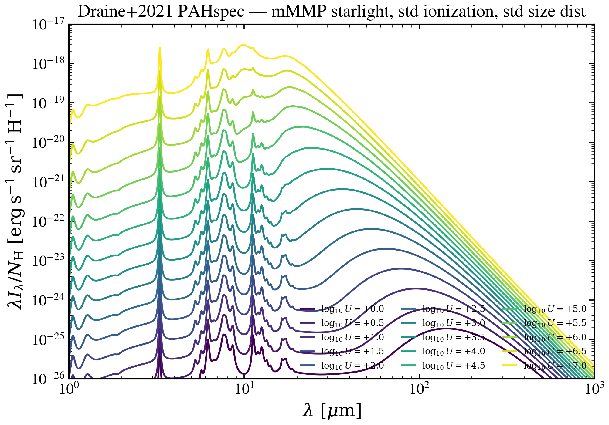

.. DO NOT EDIT.
.. THIS FILE WAS AUTOMATICALLY GENERATED BY SPHINX-GALLERY.
.. TO MAKE CHANGES, EDIT THE SOURCE PYTHON FILE:
.. "auto_examples/dust_emission/plot_pahspec_lgU_sweep.py"
.. LINE NUMBERS ARE GIVEN BELOW.

.. only:: html

    .. note::
        :class: sphx-glr-download-link-note

        :ref:`Go to the end <sphx_glr_download_auto_examples_dust_emission_plot_pahspec_lgU_sweep.py>`
        to download the full example code.

.. rst-class:: sphx-glr-example-title

.. _sphx_glr_auto_examples_dust_emission_plot_pahspec_lgU_sweep.py:

Draine+2021 PAHspec: log U sweep at fixed (starlight, ion, size)
================================================================

Sweep ionization parameter across the Draine+2021 PAHspec library at fixed
starlight spectrum and size distribution. Low U: FIR-cooling regime; high U:
mid-IR peak shift and PAH-feature strengthening.

.. sphx-glr-precomputed-img:

.. GENERATED FROM PYTHON SOURCE LINES 16-67

.. image-sg:: /auto_examples/dust_emission/images/sphx_glr_plot_pahspec_lgU_sweep_001.png
   :alt: Draine+2021 PAHspec — mMMP starlight, std ionization, std size dist
   :srcset: /auto_examples/dust_emission/images/sphx_glr_plot_pahspec_lgU_sweep_001.png
   :class: sphx-glr-single-img

.. code-block:: Python

    import matplotlib.pyplot as plt
    import numpy as np

    from tengri import data_path
    from tengri.analysis.plotting import setup_style
    from tengri.components.dust.draine2021_pah import (
        load_pahspec_or_raise,
        select_pahspec_axes,
    )

    setup_style()

    tpl = load_pahspec_or_raise(data_path("pahspec_draine2021.h5"))
    nu_pnu = select_pahspec_axes(
        tpl,
        starlight="mMMP",
        ionization="st",
        size_distribution="std",
        slab=False,
    )
    wave_um = np.asarray(tpl.wavelength_um)
    lgU_grid = np.asarray(tpl.lgU)

    li_um = np.asarray(nu_pnu) / (4.0 * np.pi)

    fig, ax = plt.subplots(figsize=(7.0, 5.0))
    cmap = plt.get_cmap("viridis")
    targets = list(np.arange(0.0, 7.5, 0.5))
    for k, tg in enumerate(targets):
        i = int(np.argmin(np.abs(lgU_grid - tg)))
        ax.plot(
            wave_um,
            li_um[i],
            color=cmap(k / max(1, len(targets) - 1)),
            lw=1.4,
            label=rf"$\log_{{10}} U={lgU_grid[i]:+.1f}$",
        )
    ax.set(
        xscale="log",
        yscale="log",
        xlabel=r"$\lambda\ [\mu\mathrm{m}]$",
        ylabel=r"$\lambda I_\lambda / N_{\rm H}\ [\mathrm{erg\,s^{-1}\,sr^{-1}\,H^{-1}}]$",
        xlim=(1.0, 1.0e3),
        ylim=(1.0e-26, 1.0e-17),
        title="Draine+2021 PAHspec — mMMP starlight, std ionization, std size dist",
    )
    ax.legend(loc="lower right", frameon=False, fontsize=7, ncol=3)
    fig.tight_layout()
    plt.savefig("plot_pahspec_lgU_sweep.png", dpi=150, bbox_inches="tight")
    plt.show()

.. _sphx_glr_download_auto_examples_dust_emission_plot_pahspec_lgU_sweep.py:

.. only:: html

  .. container:: sphx-glr-footer sphx-glr-footer-example

    .. container:: sphx-glr-download sphx-glr-download-jupyter

      :download:`Download Jupyter notebook: plot_pahspec_lgU_sweep.ipynb <plot_pahspec_lgU_sweep.ipynb>`

    .. container:: sphx-glr-download sphx-glr-download-python

      :download:`Download Python source code: plot_pahspec_lgU_sweep.py <plot_pahspec_lgU_sweep.py>`

    .. container:: sphx-glr-download sphx-glr-download-zip

      :download:`Download zipped: plot_pahspec_lgU_sweep.zip <plot_pahspec_lgU_sweep.zip>`

.. only:: html

 .. rst-class:: sphx-glr-signature

    `Gallery generated by Sphinx-Gallery <https://sphinx-gallery.github.io>`_
