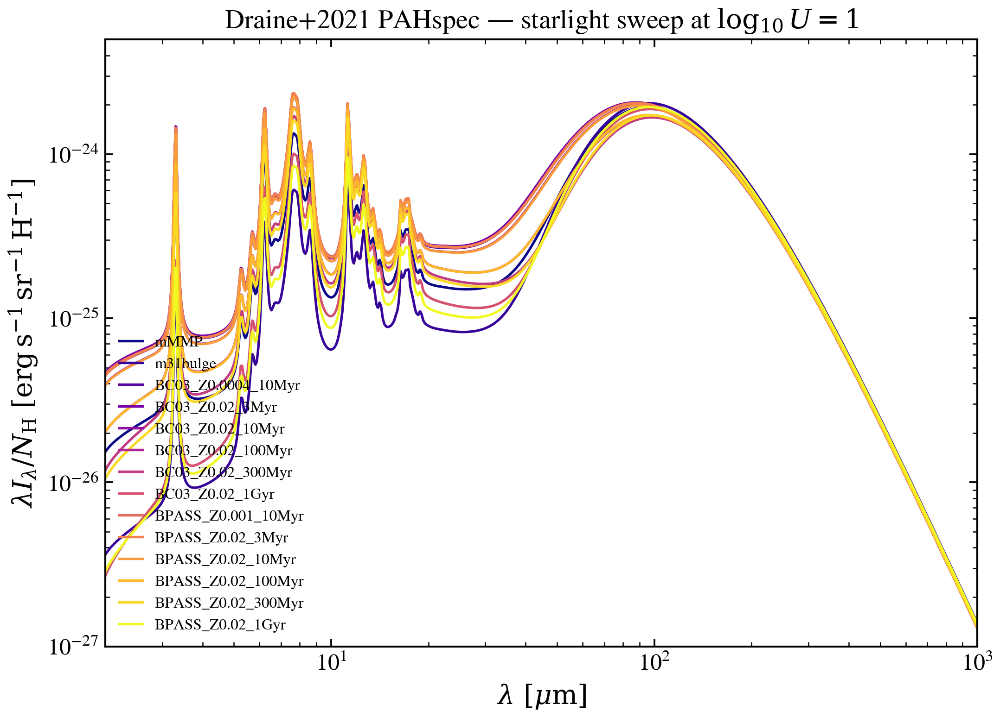

.. DO NOT EDIT.
.. THIS FILE WAS AUTOMATICALLY GENERATED BY SPHINX-GALLERY.
.. TO MAKE CHANGES, EDIT THE SOURCE PYTHON FILE:
.. "auto_examples/dust_emission/plot_pahspec_starlight_sweep.py"
.. LINE NUMBERS ARE GIVEN BELOW.

.. only:: html

    .. note::
        :class: sphx-glr-download-link-note

        :ref:`Go to the end <sphx_glr_download_auto_examples_dust_emission_plot_pahspec_starlight_sweep.py>`
        to download the full example code.

.. rst-class:: sphx-glr-example-title

.. _sphx_glr_auto_examples_dust_emission_plot_pahspec_starlight_sweep.py:

Draine+2021 PAHspec: starlight-spectrum sweep at fixed log U
=============================================================

Sweep across the 13 published PAHspec starlight spectra (mMMP, m31bulge,
BC03/BPASS SSPs) at fixed ionization parameter. Demonstrates strong
dependence of PAH features on starlight hardness.

.. sphx-glr-precomputed-img:

.. GENERATED FROM PYTHON SOURCE LINES 16-69

.. image-sg:: /auto_examples/dust_emission/images/sphx_glr_plot_pahspec_starlight_sweep_001.png
   :alt: Draine+2021 PAHspec — starlight sweep at $\log_{10} U = 1$
   :srcset: /auto_examples/dust_emission/images/sphx_glr_plot_pahspec_starlight_sweep_001.png
   :class: sphx-glr-single-img

.. code-block:: Python

    import matplotlib.pyplot as plt
    import numpy as np

    from tengri import data_path
    from tengri.analysis.plotting import setup_style
    from tengri.components.dust.draine2021_pah import (
        load_pahspec_or_raise,
        select_pahspec_axes,
    )

    setup_style()

    tpl = load_pahspec_or_raise(data_path("pahspec_draine2021.h5"))
    wave_um = np.asarray(tpl.wavelength_um)
    lgU_grid = np.asarray(tpl.lgU)
    i_lgU1 = int(np.argmin(np.abs(lgU_grid - 1.0)))

    starlights = tuple(tpl.starlight_names)

    fig, ax = plt.subplots(figsize=(7.5, 5.5))
    cmap = plt.get_cmap("plasma")
    for k, name in enumerate(starlights):
        if name not in tpl.starlight_names:
            continue
        nu_pnu = select_pahspec_axes(
            tpl,
            starlight=name,
            ionization="st",
            size_distribution="std",
            slab=False,
        )
        li = np.asarray(nu_pnu[i_lgU1]) / (4.0 * np.pi)
        ax.plot(
            wave_um,
            li,
            color=cmap(k / max(1, len(starlights) - 1)),
            lw=1.3,
            label=name,
        )
    ax.set(
        xscale="log",
        yscale="log",
        xlabel=r"$\lambda\ [\mu\mathrm{m}]$",
        ylabel=r"$\lambda I_\lambda / N_{\rm H}\ [\mathrm{erg\,s^{-1}\,sr^{-1}\,H^{-1}}]$",
        xlim=(2.0, 1.0e3),
        ylim=(1.0e-27, 5.0e-24),
        title=r"Draine+2021 PAHspec — starlight sweep at $\log_{10} U = 1$",
    )
    ax.legend(loc="lower left", frameon=False, fontsize=8, ncol=1)
    fig.tight_layout()
    plt.savefig("plot_pahspec_starlight_sweep.png", dpi=150, bbox_inches="tight")
    plt.show()

.. _sphx_glr_download_auto_examples_dust_emission_plot_pahspec_starlight_sweep.py:

.. only:: html

  .. container:: sphx-glr-footer sphx-glr-footer-example

    .. container:: sphx-glr-download sphx-glr-download-jupyter

      :download:`Download Jupyter notebook: plot_pahspec_starlight_sweep.ipynb <plot_pahspec_starlight_sweep.ipynb>`

    .. container:: sphx-glr-download sphx-glr-download-python

      :download:`Download Python source code: plot_pahspec_starlight_sweep.py <plot_pahspec_starlight_sweep.py>`

    .. container:: sphx-glr-download sphx-glr-download-zip

      :download:`Download zipped: plot_pahspec_starlight_sweep.zip <plot_pahspec_starlight_sweep.zip>`

.. only:: html

 .. rst-class:: sphx-glr-signature

    `Gallery generated by Sphinx-Gallery <https://sphinx-gallery.github.io>`_
