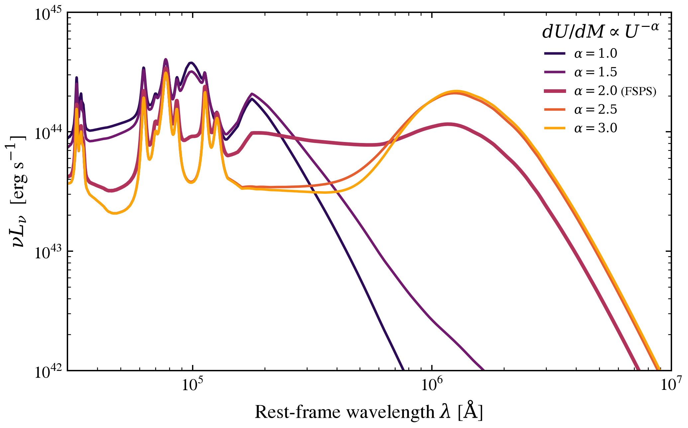

.. DO NOT EDIT.
.. THIS FILE WAS AUTOMATICALLY GENERATED BY SPHINX-GALLERY.
.. TO MAKE CHANGES, EDIT THE SOURCE PYTHON FILE:
.. "auto_examples/dust_emission/plot_themis_alpha_sweep.py"
.. LINE NUMBERS ARE GIVEN BELOW.

.. only:: html

    .. note::
        :class: sphx-glr-download-link-note

        :ref:`Go to the end <sphx_glr_download_auto_examples_dust_emission_plot_themis_alpha_sweep.py>`
        to download the full example code.

.. rst-class:: sphx-glr-example-title

.. _sphx_glr_auto_examples_dust_emission_plot_themis_alpha_sweep.py:

THEMIS: power-law slope alpha sweep
====================================

Sweep radiation-field distribution slope across the THEMIS grid at fixed
grain content and minimum intensity. Lower alpha shifts weight toward high U,
warming dust and shifting FIR peak blueward; higher alpha approaches single-U.

.. GENERATED FROM PYTHON SOURCE LINES 9-63

.. code-block:: Python

    import os

    os.environ["TF_CPP_MIN_LOG_LEVEL"] = "2"  # suppress XLA/PjRt C++ INFO+WARNING logs

    import warnings

    import h5py
    import matplotlib.pyplot as plt
    import numpy as np

    from tengri import data_path
    from tengri.analysis.plotting import setup_style

    setup_style()
    warnings.filterwarnings("ignore", message=".*BakedInBackend.*")
    warnings.filterwarnings("ignore", message=".*deprecated.*")

    with h5py.File(data_path("themis_templates.h5"), "r") as f:
        wave_aa = np.asarray(f["wavelength_aa"][:])
        qhac_grid = np.asarray(f["qhac_grid"][:])
        umin_grid = np.asarray(f["umin_grid"][:])
        alpha_grid = np.asarray(f["alpha_grid"][:])
        powerlaw_alpha = np.asarray(f["powerlaw_alpha"][:])

    wave_um = wave_aa * 1.0e-4
    i_qhac = int(np.argmin(np.abs(qhac_grid - 0.17)))
    i_umin = int(np.argmin(np.abs(umin_grid - 1.0)))
    c_aa_per_s = 2.99792458e18
    nu = c_aa_per_s / wave_aa

    fig, ax = plt.subplots(figsize=(8.0, 5.5))
    cmap = plt.get_cmap("plasma")
    idx_show = np.arange(0, len(alpha_grid), 2)
    for k, ia in enumerate(idx_show):
        L_nu = powerlaw_alpha[i_qhac, i_umin, ia]
        ax.plot(
            wave_um,
            nu * L_nu,
            color=cmap(k / max(1, len(idx_show) - 1)),
            lw=1.3,
            label=rf"$\alpha={alpha_grid[ia]:.1f}$",
        )
    ax.set(
        xscale="log",
        yscale="log",
        xlabel=r"$\lambda\ [\mu\mathrm{m}]$",
        ylabel=r"$\nu L_\nu\ [\mathrm{normalised}\ \int L_\nu d\nu = 1]$",
        xlim=(2.0, 1.0e3),
        ylim=(1.0e-26, 1.0e-22),
    )
    ax.legend(loc="lower center", frameon=False, fontsize=8, ncol=3)
    fig.tight_layout()
    plt.savefig("plot_themis_alpha_sweep.png", dpi=150, bbox_inches="tight")

.. _sphx_glr_download_auto_examples_dust_emission_plot_themis_alpha_sweep.py:

.. only:: html

  .. container:: sphx-glr-footer sphx-glr-footer-example

    .. container:: sphx-glr-download sphx-glr-download-jupyter

      :download:`Download Jupyter notebook: plot_themis_alpha_sweep.ipynb <plot_themis_alpha_sweep.ipynb>`

    .. container:: sphx-glr-download sphx-glr-download-python

      :download:`Download Python source code: plot_themis_alpha_sweep.py <plot_themis_alpha_sweep.py>`

    .. container:: sphx-glr-download sphx-glr-download-zip

      :download:`Download zipped: plot_themis_alpha_sweep.zip <plot_themis_alpha_sweep.zip>`

.. only:: html

 .. rst-class:: sphx-glr-signature

    `Gallery generated by Sphinx-Gallery <https://sphinx-gallery.github.io>`_
