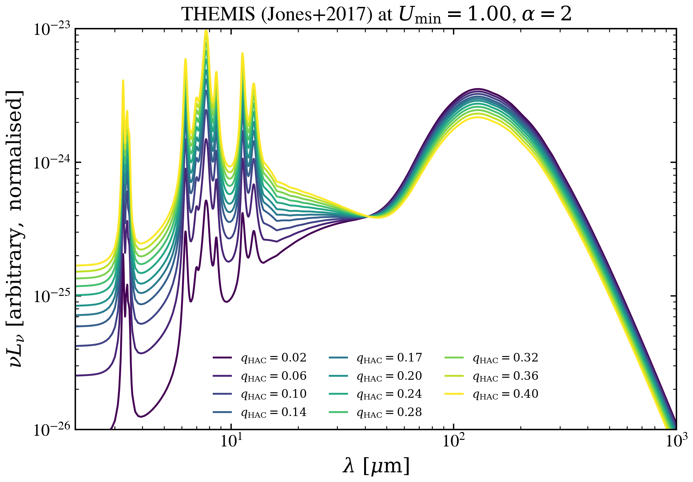

.. DO NOT EDIT.
.. THIS FILE WAS AUTOMATICALLY GENERATED BY SPHINX-GALLERY.
.. TO MAKE CHANGES, EDIT THE SOURCE PYTHON FILE:
.. "auto_examples/dust_emission/plot_themis_qhac_sweep.py"
.. LINE NUMBERS ARE GIVEN BELOW.

.. only:: html

    .. note::
        :class: sphx-glr-download-link-note

        :ref:`Go to the end <sphx_glr_download_auto_examples_dust_emission_plot_themis_qhac_sweep.py>`
        to download the full example code.

.. rst-class:: sphx-glr-example-title

.. _sphx_glr_auto_examples_dust_emission_plot_themis_qhac_sweep.py:

THEMIS: q_HAC sweep at fixed U_min
===================================

Sweep hydrocarbon grain content across the THEMIS grid at fixed minimum
radiation field strength. PAH-like mid-IR features strengthen with q_HAC
while FIR continuum remains essentially unchanged.

.. GENERATED FROM PYTHON SOURCE LINES 9-58

.. code-block:: Python

    import warnings

    import h5py
    import matplotlib.pyplot as plt
    import numpy as np

    from tengri import data_path
    from tengri.analysis.plotting import setup_style

    setup_style()
    warnings.filterwarnings("ignore", message=".*BakedInBackend.*")
    warnings.filterwarnings("ignore", message=".*deprecated.*")

    with h5py.File(data_path("themis_templates.h5"), "r") as f:
        wave_aa = np.asarray(f["wavelength_aa"][:])
        qhac_grid = np.asarray(f["qhac_grid"][:])
        umin_grid = np.asarray(f["umin_grid"][:])
        single_u = np.asarray(f["single_u"][:])

    wave_um = wave_aa * 1.0e-4
    i_umin = int(np.argmin(np.abs(umin_grid - 1.0)))

    c_aa_per_s = 2.99792458e18
    nu = c_aa_per_s / wave_aa

    fig, ax = plt.subplots(figsize=(7.0, 5.0))
    cmap = plt.get_cmap("viridis")
    for k, qhac in enumerate(qhac_grid):
        L_nu = single_u[k, i_umin]
        nu_Lnu = nu * L_nu
        ax.plot(
            wave_um,
            nu_Lnu,
            color=cmap(k / max(1, len(qhac_grid) - 1)),
            lw=1.3,
            label=rf"$q_{{\rm HAC}} = {qhac:.2f}$",
        )
    ax.set(
        xscale="log",
        yscale="log",
        xlabel=r"$\lambda\ [\mu\mathrm{m}]$",
        ylabel=r"$\nu L_\nu\ [\mathrm{arbitrary,\ normalised}]$",
        xlim=(2.0, 1.0e3),
        ylim=(1.0e-26, 1.0e-23),
    )
    ax.legend(loc="lower center", frameon=False, fontsize=8, ncol=3)
    fig.tight_layout()
    fig.savefig("plot_themis_qhac_sweep.png", dpi=150, bbox_inches="tight")

.. _sphx_glr_download_auto_examples_dust_emission_plot_themis_qhac_sweep.py:

.. only:: html

  .. container:: sphx-glr-footer sphx-glr-footer-example

    .. container:: sphx-glr-download sphx-glr-download-jupyter

      :download:`Download Jupyter notebook: plot_themis_qhac_sweep.ipynb <plot_themis_qhac_sweep.ipynb>`

    .. container:: sphx-glr-download sphx-glr-download-python

      :download:`Download Python source code: plot_themis_qhac_sweep.py <plot_themis_qhac_sweep.py>`

    .. container:: sphx-glr-download sphx-glr-download-zip

      :download:`Download zipped: plot_themis_qhac_sweep.zip <plot_themis_qhac_sweep.zip>`

.. only:: html

 .. rst-class:: sphx-glr-signature

    `Gallery generated by Sphinx-Gallery <https://sphinx-gallery.github.io>`_
