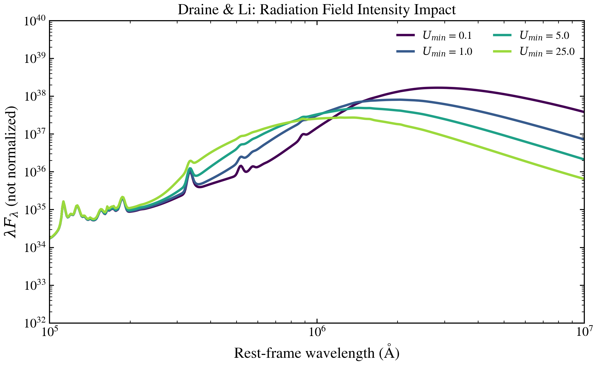

.. DO NOT EDIT.
.. THIS FILE WAS AUTOMATICALLY GENERATED BY SPHINX-GALLERY.
.. TO MAKE CHANGES, EDIT THE SOURCE PYTHON FILE:
.. "auto_examples/dust_emission/plot_umin_sweep.py"
.. LINE NUMBERS ARE GIVEN BELOW.

.. only:: html

    .. note::
        :class: sphx-glr-download-link-note

        :ref:`Go to the end <sphx_glr_download_auto_examples_dust_emission_plot_umin_sweep.py>`
        to download the full example code.

.. rst-class:: sphx-glr-example-title

.. _sphx_glr_auto_examples_dust_emission_plot_umin_sweep.py:

Draine & Li Minimum Radiation Field (U_min)
============================================

Minimum radiation field intensity U_min controls diffuse dust heating.
Higher U_min implies hotter dust and FIR peak shifted blueward toward
shorter wavelengths.

.. GENERATED FROM PYTHON SOURCE LINES 9-50

.. code-block:: Python

    import warnings

    import matplotlib.pyplot as plt

    from tengri import FIXED, SEDModel, load_ssp, recipes
    from tengri.analysis.plotting import SWEEP_CMAPS, setup_style, sweep_parameter

    setup_style()
    warnings.filterwarnings("ignore", message=".*BakedInBackend.*")
    warnings.filterwarnings("ignore", message=".*deprecated.*")

    recipe = recipes.dust_demo()
    recipe["dust"]["emission"] = {
        "type": "draine_li2007",
        "*": FIXED,
        "umin": 1.0,
        "gamma_dl": 0.01,
        "qpah": 2.5,
    }
    model = SEDModel.build(ssp_data=load_ssp(), **recipe)

    fig, ax = plt.subplots(figsize=(8, 5))
    sweep_parameter(
        model,
        "dust_umin",
        [0.1, 1.0, 5.0, 25.0],
        ax=ax,
        cmap=SWEEP_CMAPS["dust"],
        label_fmt=r"$U_{{min}}$ = {:.1f}",
        wave_range=(1e5, 1e7),
        normalize_at=None,
    )
    ax.set(
        xscale="log",
        yscale="log",
        ylim=(1e32, 1e40),
        ylabel=r"$\lambda F_\lambda$ (not normalized)",
    )
    fig.tight_layout()
    fig.savefig("plot_umin_sweep.png", dpi=150, bbox_inches="tight")

.. _sphx_glr_download_auto_examples_dust_emission_plot_umin_sweep.py:

.. only:: html

  .. container:: sphx-glr-footer sphx-glr-footer-example

    .. container:: sphx-glr-download sphx-glr-download-jupyter

      :download:`Download Jupyter notebook: plot_umin_sweep.ipynb <plot_umin_sweep.ipynb>`

    .. container:: sphx-glr-download sphx-glr-download-python

      :download:`Download Python source code: plot_umin_sweep.py <plot_umin_sweep.py>`

    .. container:: sphx-glr-download sphx-glr-download-zip

      :download:`Download zipped: plot_umin_sweep.zip <plot_umin_sweep.zip>`

.. only:: html

 .. rst-class:: sphx-glr-signature

    `Gallery generated by Sphinx-Gallery <https://sphinx-gallery.github.io>`_
