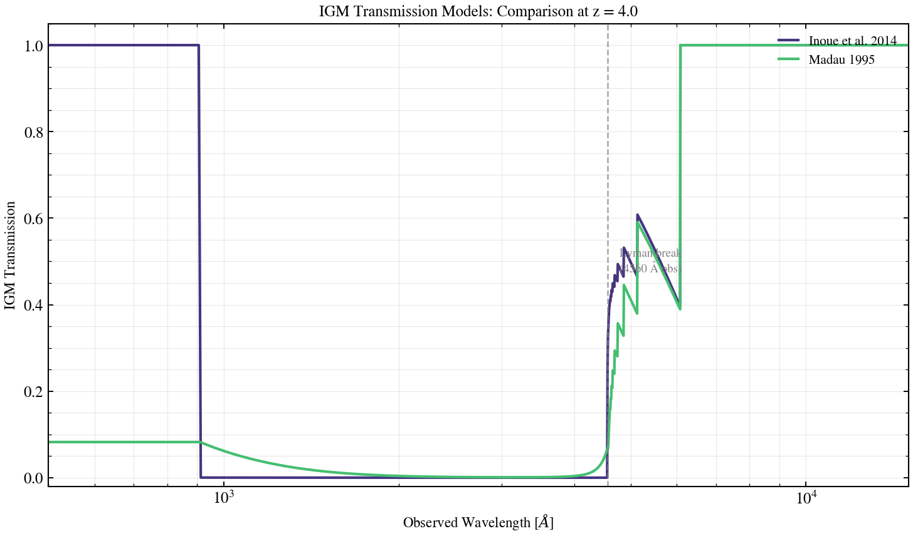

.. DO NOT EDIT.
.. THIS FILE WAS AUTOMATICALLY GENERATED BY SPHINX-GALLERY.
.. TO MAKE CHANGES, EDIT THE SOURCE PYTHON FILE:
.. "auto_examples/igm/plot_igm_model_comparison.py"
.. LINE NUMBERS ARE GIVEN BELOW.

.. only:: html

    .. note::
        :class: sphx-glr-download-link-note

        :ref:`Go to the end <sphx_glr_download_auto_examples_igm_plot_igm_model_comparison.py>`
        to download the full example code.

.. rst-class:: sphx-glr-example-title

.. _sphx_glr_auto_examples_igm_plot_igm_model_comparison.py:

IGM Transmission Model Comparison
==================================

Compare available IGM transmission models at a fixed redshift (z=4.0).
The Inoue et al. (2014) model captures Lyman-series absorption and
Lyman-continuum opacity; the Madau (1995) model provides a simpler analytical
approximation. This script shows how they differ in the UV to optical regime.

.. sphx-glr-precomputed-img:

.. GENERATED FROM PYTHON SOURCE LINES 17-86

.. code-block:: Python

    import jax
    import jax.numpy as jnp
    import matplotlib.pyplot as plt
    import numpy as np

    jax.config.update("jax_enable_x64", True)

    from tengri.analysis.plotting import setup_style
    from tengri.components.igm import (
        igm_transmission,
        igm_transmission_madau,
    )

    setup_style()

    # Observed-frame wavelength grid covering Lyman break to optical
    wave_obs = jnp.linspace(500.0, 15000.0, 2000)

    # Fixed redshift for comparison
    z_fixed = 4.0

    fig, ax = plt.subplots(figsize=(10, 6))

    # Inoue et al. 2014 model (default)
    trans_inoue = np.array(igm_transmission(wave_obs, z_fixed))
    ax.plot(
        np.array(wave_obs),
        trans_inoue,
        lw=2.0,
        color=plt.cm.viridis(0.15),
        label="Inoue et al. 2014",
    )

    # Madau 1995 model
    trans_madau = np.array(igm_transmission_madau(wave_obs, z_fixed))
    ax.plot(
        np.array(wave_obs),
        trans_madau,
        lw=2.0,
        color=plt.cm.viridis(0.70),
        label="Madau 1995",
    )

    # Mark Lyman break at 912 Å rest-frame
    lyman_break_obs = 912.0 * (1 + z_fixed)
    ax.axvline(lyman_break_obs, color="0.5", lw=1.2, ls="--", alpha=0.7)
    ax.text(
        lyman_break_obs * 1.05,
        0.5,
        f"Lyman break\n({lyman_break_obs:.0f} Å obs)",
        fontsize=9,
        color="0.5",
        va="center",
    )

    ax.set_xlabel(r"Observed Wavelength [$\AA$]", fontsize=11)
    ax.set_ylabel("IGM Transmission", fontsize=11)
    ax.set_title(f"IGM Transmission Models: Comparison at z = {z_fixed}", fontsize=12)
    ax.set_xscale("log")
    ax.set_xlim(500, 15000)
    ax.set_ylim(-0.02, 1.05)
    ax.legend(fontsize=10, frameon=False, loc="upper right")
    ax.grid(True, alpha=0.3, which="both")

    fig.tight_layout()
    plt.savefig("plot_igm_model_comparison.png", dpi=150, bbox_inches="tight")
    plt.show()

.. _sphx_glr_download_auto_examples_igm_plot_igm_model_comparison.py:

.. only:: html

  .. container:: sphx-glr-footer sphx-glr-footer-example

    .. container:: sphx-glr-download sphx-glr-download-jupyter

      :download:`Download Jupyter notebook: plot_igm_model_comparison.ipynb <plot_igm_model_comparison.ipynb>`

    .. container:: sphx-glr-download sphx-glr-download-python

      :download:`Download Python source code: plot_igm_model_comparison.py <plot_igm_model_comparison.py>`

    .. container:: sphx-glr-download sphx-glr-download-zip

      :download:`Download zipped: plot_igm_model_comparison.zip <plot_igm_model_comparison.zip>`

.. only:: html

 .. rst-class:: sphx-glr-signature

    `Gallery generated by Sphinx-Gallery <https://sphinx-gallery.github.io>`_
