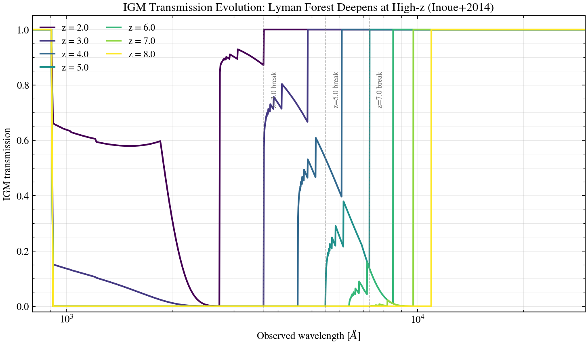

.. DO NOT EDIT.
.. THIS FILE WAS AUTOMATICALLY GENERATED BY SPHINX-GALLERY.
.. TO MAKE CHANGES, EDIT THE SOURCE PYTHON FILE:
.. "auto_examples/igm/plot_igm_z_evolution.py"
.. LINE NUMBERS ARE GIVEN BELOW.

.. only:: html

    .. note::
        :class: sphx-glr-download-link-note

        :ref:`Go to the end <sphx_glr_download_auto_examples_igm_plot_igm_z_evolution.py>`
        to download the full example code.

.. rst-class:: sphx-glr-example-title

.. _sphx_glr_auto_examples_igm_plot_igm_z_evolution.py:

IGM Absorption Evolution with Redshift
========================================

The intergalactic medium (IGM) opacity increases dramatically with redshift due to
the expanding neutral hydrogen fraction. This script sweeps redshift z ∈ {2, 3, 4, 5, 6, 7, 8}
on Inoue+2014 IGM transmission curves, showing how the Lyman alpha forest deepens
and the Lyman break (912 Å rest-frame) sharpens at higher z, affecting photometric
redshift estimation via dropout techniques.

.. sphx-glr-precomputed-img:

.. GENERATED FROM PYTHON SOURCE LINES 18-89

.. code-block:: Python

    from pathlib import Path

    import jax
    import jax.numpy as jnp
    import matplotlib

    matplotlib.use("Agg")
    import matplotlib.pyplot as plt
    import numpy as np

    jax.config.update("jax_enable_x64", True)

    from tengri.analysis.plotting import SWEEP_CMAPS, setup_style
    from tengri.igm import igm_transmission

    setup_style()

    # Observed-frame wavelength grid covering UV to optical
    wave_obs = jnp.linspace(800.0, 30000.0, 3000)

    redshifts = [2.0, 3.0, 4.0, 5.0, 6.0, 7.0, 8.0]
    cmap = plt.get_cmap(SWEEP_CMAPS["redshift"])
    colors = [cmap(i / max(len(redshifts) - 1, 1)) for i in range(len(redshifts))]

    fig, ax = plt.subplots(figsize=(10, 6))

    # Plot transmission curves
    for z, color in zip(redshifts, colors):
        trans = igm_transmission(wave_obs, z)
        ax.plot(
            np.array(wave_obs),
            np.array(trans),
            color=color,
            lw=2.0,
            label=f"z = {z}",
        )

    # Mark Lyman break at 912 Å rest-frame for key redshifts
    # The break moves to longer observed wavelengths as z increases
    for z in [3.0, 5.0, 7.0]:
        lyman_break_obs = 912.0 * (1 + z)
        ax.axvline(lyman_break_obs, color="0.5", lw=0.8, ls="--", alpha=0.5)
        ax.text(
            lyman_break_obs * 1.05,
            0.85,
            f"z={z} break",
            fontsize=9,
            color="0.4",
            rotation=90,
            va="top",
        )

    ax.set_xlabel(r"Observed wavelength [$\AA$]", fontsize=12)
    ax.set_ylabel("IGM transmission", fontsize=12)
    ax.set_xlim(800, 30000)
    ax.set_xscale("log")
    ax.set_ylim(-0.02, 1.05)
    ax.legend(fontsize=11, frameon=False, ncol=2, loc="upper left")
    ax.set_title(
        "IGM Transmission Evolution: Lyman Forest Deepens at High-z (Inoue+2014)",
        fontsize=14,
    )
    ax.grid(True, alpha=0.3, which="both")

    fig.tight_layout()
    # Save to script directory
    script_dir = Path(__file__).resolve().parent if "__file__" in dir() else Path(".")
    plt.savefig(str(script_dir / "plot_igm_z_evolution.png"), dpi=150, bbox_inches="tight")
    plt.close()

.. _sphx_glr_download_auto_examples_igm_plot_igm_z_evolution.py:

.. only:: html

  .. container:: sphx-glr-footer sphx-glr-footer-example

    .. container:: sphx-glr-download sphx-glr-download-jupyter

      :download:`Download Jupyter notebook: plot_igm_z_evolution.ipynb <plot_igm_z_evolution.ipynb>`

    .. container:: sphx-glr-download sphx-glr-download-python

      :download:`Download Python source code: plot_igm_z_evolution.py <plot_igm_z_evolution.py>`

    .. container:: sphx-glr-download sphx-glr-download-zip

      :download:`Download zipped: plot_igm_z_evolution.zip <plot_igm_z_evolution.zip>`

.. only:: html

 .. rst-class:: sphx-glr-signature

    `Gallery generated by Sphinx-Gallery <https://sphinx-gallery.github.io>`_
