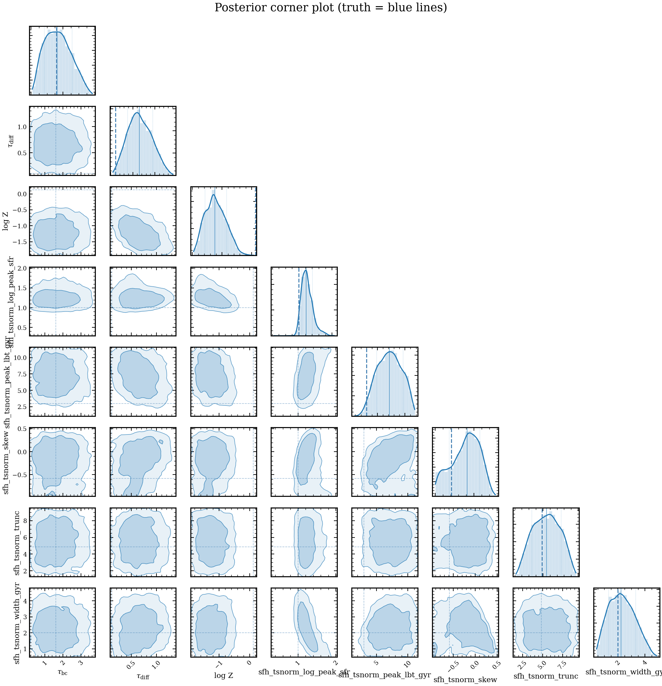

.. DO NOT EDIT.
.. THIS FILE WAS AUTOMATICALLY GENERATED BY SPHINX-GALLERY.
.. TO MAKE CHANGES, EDIT THE SOURCE PYTHON FILE:
.. "auto_examples/inference/plot_corner.py"
.. LINE NUMBERS ARE GIVEN BELOW.

.. only:: html

    .. note::
        :class: sphx-glr-download-link-note

        :ref:`Go to the end <sphx_glr_download_auto_examples_inference_plot_corner.py>`
        to download the full example code.

.. rst-class:: sphx-glr-example-title

.. _sphx_glr_auto_examples_inference_plot_corner.py:

Posterior corner plot from variational inference
================================================

Demonstrates parameter degeneracies and individual 1-D marginalized
posteriors after fitting mock 5-band SDSS photometry. The corner plot
shows the full 2-D covariance structure between parameters; blue lines
mark the injected truth. Note: for demonstration scale; production runs
use 10× more VI iterations and samples.

Reference: Conroy 2013, ARA&A, 51, 393 (SED fitting overview).

.. GENERATED FROM PYTHON SOURCE LINES 13-97

.. code-block:: Python

    import os

    os.environ["TF_CPP_MIN_LOG_LEVEL"] = "2"  # suppress XLA/PjRt C++ INFO+WARNING logs

    import warnings

    import corner
    import jax
    import matplotlib.pyplot as plt
    import numpy as np

    import tengri
    from tengri.analysis.plotting import setup_style

    setup_style()
    warnings.filterwarnings("ignore", message=".*BakedInBackend.*")

    ssp = tengri.load_ssp()
    obs = tengri.Observation(
        photometry=tengri.Photometry.from_names(["sdss_u", "sdss_g", "sdss_r", "sdss_i", "sdss_z"])
    )

    model = tengri.SEDModel.build(
        ssp,
        observation=obs,
        sfh={
            "type": "tsnorm",
            "*": tengri.FREE,
            "skew": tengri.Fixed(0.3),
            "trunc": tengri.Fixed(10.0),
        },
        dust={
            "type": "two_component",
            "*": tengri.FIXED,
            "tau_diff": tengri.Uniform(0.0, 1.5),
            "slope": -0.7,
        },
        redshift=tengri.Fixed(0.1),
    )

    key = jax.random.PRNGKey(99)
    truth = dict(model.spec.sample(key))
    truth.update(
        sfh_tsnorm_peak_lbt_gyr=3.0,
        sfh_tsnorm_width_gyr=2.0,
        sfh_tsnorm_log_total_mass=10.0,
        dust_tau_diff=0.3,
    )
    mock = model.mock(truth, snr=25.0, key=key)

    forward = tengri.ForwardModel.build(sed=model, observation=obs)
    posterior = forward.fit(
        mock.flux_obs,
        mock.noise,
        method="native_vi_nonlinear",
        n_iterations=500,
        n_samples=3,
        verbose=False,
    )

    samples_dict = posterior.samples
    # Keep only parameters with non-trivial posterior variance — fixed params
    # and tightly-constrained ones end up as effectively zero-range columns
    # and corner.corner refuses to plot them.
    EPS = 1e-8
    param_names = [
        p
        for p in samples_dict
        if np.asarray(samples_dict[p]).std() > EPS * abs(np.asarray(samples_dict[p]).mean() + 1.0)
    ]
    samples_array = np.array([np.asarray(samples_dict[p]) for p in param_names]).T
    truths = [float(truth[p]) for p in param_names]

    fig = corner.corner(
        samples_array,
        labels=param_names,
        truths=truths,
        color="C0",
        hist_kwargs={"density": True},
        show_titles=False,
    )

    plt.savefig("plot_corner.png", dpi=150, bbox_inches="tight")

.. _sphx_glr_download_auto_examples_inference_plot_corner.py:

.. only:: html

  .. container:: sphx-glr-footer sphx-glr-footer-example

    .. container:: sphx-glr-download sphx-glr-download-jupyter

      :download:`Download Jupyter notebook: plot_corner.ipynb <plot_corner.ipynb>`

    .. container:: sphx-glr-download sphx-glr-download-python

      :download:`Download Python source code: plot_corner.py <plot_corner.py>`

    .. container:: sphx-glr-download sphx-glr-download-zip

      :download:`Download zipped: plot_corner.zip <plot_corner.zip>`

.. only:: html

 .. rst-class:: sphx-glr-signature

    `Gallery generated by Sphinx-Gallery <https://sphinx-gallery.github.io>`_
