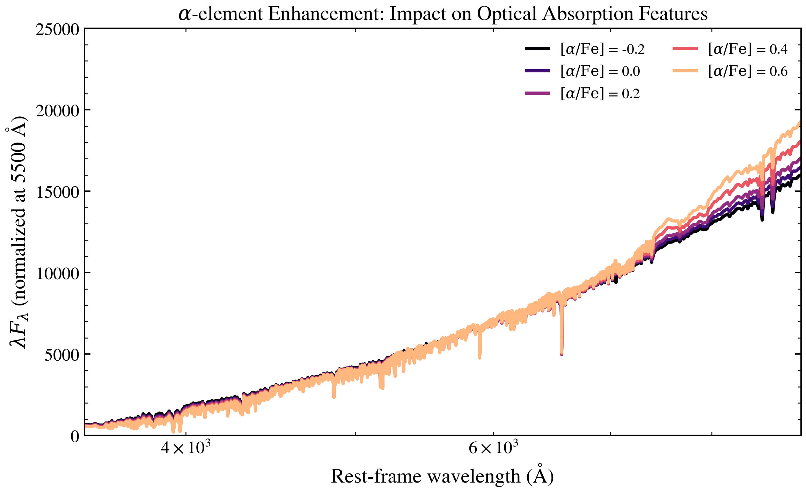

.. DO NOT EDIT.
.. THIS FILE WAS AUTOMATICALLY GENERATED BY SPHINX-GALLERY.
.. TO MAKE CHANGES, EDIT THE SOURCE PYTHON FILE:
.. "auto_examples/metallicity/plot_alpha_fe_sweep.py"
.. LINE NUMBERS ARE GIVEN BELOW.

.. only:: html

    .. note::
        :class: sphx-glr-download-link-note

        :ref:`Go to the end <sphx_glr_download_auto_examples_metallicity_plot_alpha_fe_sweep.py>`
        to download the full example code.

.. rst-class:: sphx-glr-example-title

.. _sphx_glr_auto_examples_metallicity_plot_alpha_fe_sweep.py:

α/Fe Enhancement (met_alpha_fe)
================================

[α/Fe] records the chemical enrichment history: high [α/Fe] signals rapid
enrichment by core-collapse SNe before Type Ia SNe can dilute the alpha
elements. In the SED, enhanced alpha suppresses iron absorption features
in the optical.

Old-passive recipe + sweep ``met_alpha_fe`` from -0.2 to +0.6.

.. sphx-glr-precomputed-img:

.. GENERATED FROM PYTHON SOURCE LINES 19-51

.. image-sg:: /auto_examples/metallicity/images/sphx_glr_plot_alpha_fe_sweep_001.png
   :alt: $\alpha$-element Enhancement: Impact on Optical Absorption Features
   :srcset: /auto_examples/metallicity/images/sphx_glr_plot_alpha_fe_sweep_001.png
   :class: sphx-glr-single-img

.. rst-class:: sphx-glr-script-out

 .. code-block:: none

    /Users/suchethacooray/Projects/tengri/.claude/worktrees/gallery-batch-2/src/tengri/forward/sed_model.py:643: BakedInNebularWarning: BakedInBackend: nebular emission is baked into the SSP file at a FIXED logU and FIXED escape fraction determined when the SSP grid was generated (commonly logU = −3, but depends on the SSP file). The ionization parameter and escape fraction are NOT free parameters — varying neb_logU or neb_fesc in your Parameters will have no effect. Check your SSP file's nebular assumptions. Switch to CloudyGridBackend or CueBackend to vary nebular properties. To suppress: pass ionizing_source_warning='suppress'.
      self._nebular_backend = BakedInBackend()

|

.. code-block:: Python

    import matplotlib.pyplot as plt

    from tengri import SEDModel, load_ssp, recipes
    from tengri.analysis.plotting import setup_style, sweep_parameter

    setup_style()

    # Old-passive galaxy — [α/Fe] effects are clearest where iron features dominate.
    recipe = recipes.dust_demo()
    recipe["sfh"].update(peak_lbt_gyr=8.0, log_peak_sfr=0.5, width_gyr=1.5, skew=0.0, trunc=10.0)
    recipe["dust"].update(tau_bc=0.0, tau_diff=0.1)
    model = SEDModel.from_groups(ssp_data=load_ssp(), **recipe)

    fig, ax = plt.subplots(figsize=(8, 5))
    sweep_parameter(
        model,
        "met_alpha_fe",
        [-0.2, 0.0, 0.2, 0.4, 0.6],
        ax=ax,
        cmap="magma",
        label_fmt=r"$[\alpha/\mathrm{{Fe}}]$ = {:.1f}",
        wave_range=(3500, 9000),
    )
    ax.set(
        title=r"$\alpha$-element Enhancement: Impact on Optical Absorption Features",
        ylabel=r"$\lambda F_\lambda$ (normalized at 5500 Å)",
        ylim=(0, 2.5e4),
    )
    fig.tight_layout()
    plt.savefig("plot_alpha_fe_sweep.png", dpi=150, bbox_inches="tight")
    plt.show()

.. rst-class:: sphx-glr-timing

   **Total running time of the script:** (0 minutes 3.572 seconds)

.. _sphx_glr_download_auto_examples_metallicity_plot_alpha_fe_sweep.py:

.. only:: html

  .. container:: sphx-glr-footer sphx-glr-footer-example

    .. container:: sphx-glr-download sphx-glr-download-jupyter

      :download:`Download Jupyter notebook: plot_alpha_fe_sweep.ipynb <plot_alpha_fe_sweep.ipynb>`

    .. container:: sphx-glr-download sphx-glr-download-python

      :download:`Download Python source code: plot_alpha_fe_sweep.py <plot_alpha_fe_sweep.py>`

    .. container:: sphx-glr-download sphx-glr-download-zip

      :download:`Download zipped: plot_alpha_fe_sweep.zip <plot_alpha_fe_sweep.zip>`

.. only:: html

 .. rst-class:: sphx-glr-signature

    `Gallery generated by Sphinx-Gallery <https://sphinx-gallery.github.io>`_
