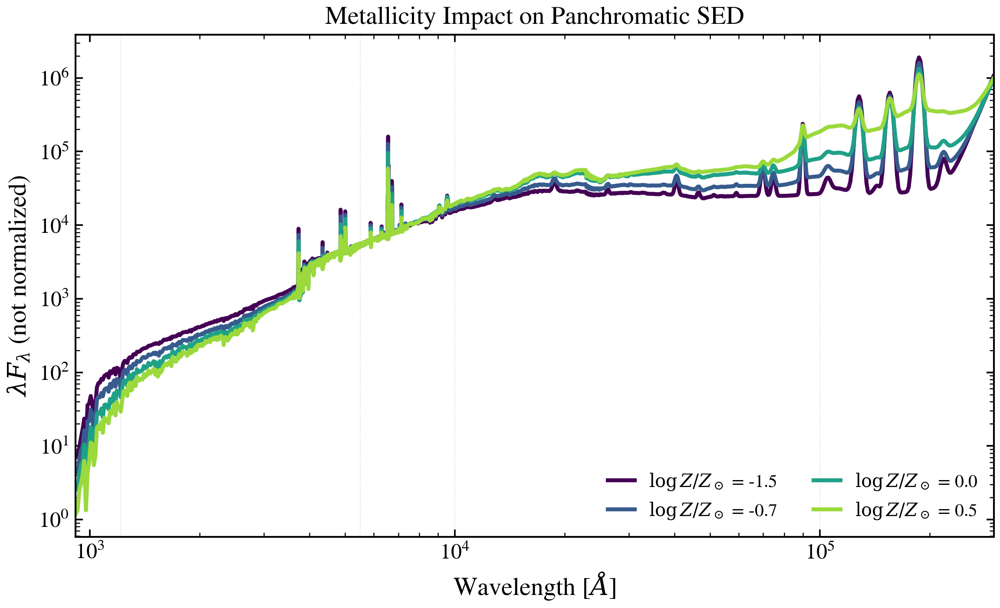

.. DO NOT EDIT.
.. THIS FILE WAS AUTOMATICALLY GENERATED BY SPHINX-GALLERY.
.. TO MAKE CHANGES, EDIT THE SOURCE PYTHON FILE:
.. "auto_examples/metallicity/plot_logzsol_panchromatic.py"
.. LINE NUMBERS ARE GIVEN BELOW.

.. only:: html

    .. note::
        :class: sphx-glr-download-link-note

        :ref:`Go to the end <sphx_glr_download_auto_examples_metallicity_plot_logzsol_panchromatic.py>`
        to download the full example code.

.. rst-class:: sphx-glr-example-title

.. _sphx_glr_auto_examples_metallicity_plot_logzsol_panchromatic.py:

Metallicity Sweep: Panchromatic SED
====================================

Sweep ``met_logzsol`` ∈ {−1.5, −0.7, 0, +0.5} on a composite SED from
912 Å (Lyman limit) to 30 μm (mid-IR), with modified-blackbody dust
emission turned on so the metallicity-vs-energy-balance interaction is
visible.

.. sphx-glr-precomputed-img:

.. GENERATED FROM PYTHON SOURCE LINES 17-57

.. image-sg:: /auto_examples/metallicity/images/sphx_glr_plot_logzsol_panchromatic_001.png
   :alt: Metallicity Impact on Panchromatic SED
   :srcset: /auto_examples/metallicity/images/sphx_glr_plot_logzsol_panchromatic_001.png
   :class: sphx-glr-single-img

.. rst-class:: sphx-glr-script-out

 .. code-block:: none

    /Users/suchethacooray/Projects/tengri/.claude/worktrees/gallery-batch-2/src/tengri/forward/sed_model.py:643: BakedInNebularWarning: BakedInBackend: nebular emission is baked into the SSP file at a FIXED logU and FIXED escape fraction determined when the SSP grid was generated (commonly logU = −3, but depends on the SSP file). The ionization parameter and escape fraction are NOT free parameters — varying neb_logU or neb_fesc in your Parameters will have no effect. Check your SSP file's nebular assumptions. Switch to CloudyGridBackend or CueBackend to vary nebular properties. To suppress: pass ionizing_source_warning='suppress'.
      self._nebular_backend = BakedInBackend()

|

.. code-block:: Python

    import matplotlib.pyplot as plt

    from tengri import FIXED, Fixed, SEDModel, load_ssp, recipes
    from tengri.analysis.plotting import setup_style, sweep_parameter

    setup_style()

    # Star-forming galaxy with modified-blackbody dust emission at z=0.2.
    recipe = recipes.dust_demo()
    recipe["sfh"].update(peak_lbt_gyr=1.0, log_peak_sfr=1.0, width_gyr=0.8, trunc=3.0)
    recipe["dust"].update(tau_bc=1.0, tau_diff=0.5)
    recipe["dust"]["emission"] = {"type": "modified_blackbody", "*": FIXED, "T": 30.0, "beta_ir": 1.8}
    recipe["redshift"] = Fixed(0.2)
    model = SEDModel.from_groups(ssp_data=load_ssp(), **recipe)

    fig, ax = plt.subplots(figsize=(8, 5))
    sweep_parameter(
        model,
        "met_logzsol",
        [-1.5, -0.7, 0.0, 0.5],
        ax=ax,
        cmap="viridis",
        label_fmt=r"$\log Z/Z_\odot$ = {:.1f}",
        wave_range=(912, 3e5),  # 912 Å (Lyman limit) → 30 μm (mid-IR)
    )
    ax.set(
        xscale="log",
        yscale="log",
        title=r"Metallicity Impact on Panchromatic SED",
        xlabel=r"Wavelength [$\AA$]",
        ylabel=r"$\lambda F_\lambda$ (not normalized)",
    )

    for wl in (1215, 5500, 1e4, 1e5):
        ax.axvline(wl, color="grey", ls=":", lw=0.5, alpha=0.3)

    fig.tight_layout()
    plt.savefig("plot_logzsol_panchromatic.png", dpi=150, bbox_inches="tight")
    plt.show()

.. _sphx_glr_download_auto_examples_metallicity_plot_logzsol_panchromatic.py:

.. only:: html

  .. container:: sphx-glr-footer sphx-glr-footer-example

    .. container:: sphx-glr-download sphx-glr-download-jupyter

      :download:`Download Jupyter notebook: plot_logzsol_panchromatic.ipynb <plot_logzsol_panchromatic.ipynb>`

    .. container:: sphx-glr-download sphx-glr-download-python

      :download:`Download Python source code: plot_logzsol_panchromatic.py <plot_logzsol_panchromatic.py>`

    .. container:: sphx-glr-download sphx-glr-download-zip

      :download:`Download zipped: plot_logzsol_panchromatic.zip <plot_logzsol_panchromatic.zip>`

.. only:: html

 .. rst-class:: sphx-glr-signature

    `Gallery generated by Sphinx-Gallery <https://sphinx-gallery.github.io>`_
