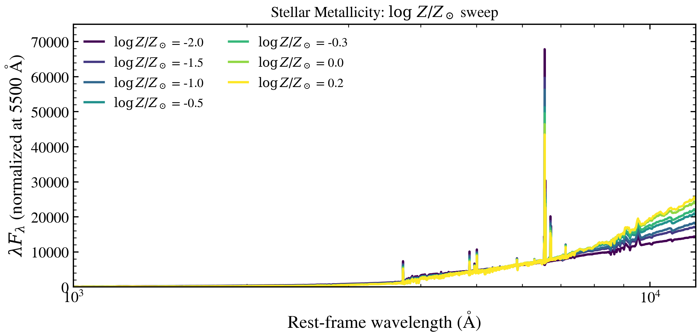

.. DO NOT EDIT.
.. THIS FILE WAS AUTOMATICALLY GENERATED BY SPHINX-GALLERY.
.. TO MAKE CHANGES, EDIT THE SOURCE PYTHON FILE:
.. "auto_examples/metallicity/plot_logzsol_sweep.py"
.. LINE NUMBERS ARE GIVEN BELOW.

.. only:: html

    .. note::
        :class: sphx-glr-download-link-note

        :ref:`Go to the end <sphx_glr_download_auto_examples_metallicity_plot_logzsol_sweep.py>`
        to download the full example code.

.. rst-class:: sphx-glr-example-title

.. _sphx_glr_auto_examples_metallicity_plot_logzsol_sweep.py:

Stellar metallicity drives UV-optical SED colour
=================================================

Metal-poor stars are hotter and bluer (less line blanketing), while metal-rich
stars are redder due to increased opacity. We sweep stellar metallicity across
the prior range with every other parameter fixed on a typical intermediate-age
galaxy with modest dust attenuation.

Reference: Conroy 2013, ARA&A, 51, 393 (SSP synthesis and metallicity effects).

.. GENERATED FROM PYTHON SOURCE LINES 12-75

.. code-block:: Python

    import os

    os.environ["TF_CPP_MIN_LOG_LEVEL"] = "2"  # suppress XLA/PjRt C++ INFO+WARNING logs

    import warnings

    import jax
    import jax.numpy as jnp
    import matplotlib as mpl
    import matplotlib.pyplot as plt
    import numpy as np

    import tengri
    from tengri.analysis.plotting import setup_style

    setup_style()
    warnings.filterwarnings("ignore", message=".*BakedInBackend.*")

    ssp = tengri.load_ssp()
    model = tengri.SEDModel.build(
        ssp,
        sfh={
            "type": "dpl",
            "*": tengri.FIXED,
            "alpha": 2.0,
            "beta": 2.5,
            "tau_gyr": 1.5,
            "log_total_mass": 10.0,
        },
        dust={
            "type": "two_component",
            "*": tengri.FIXED,
            "tau_bc": 0.3,
            "tau_diff": 0.2,
        },
        redshift=tengri.Fixed(0.1),
    )
    baseline = dict(model.spec.sample(jax.random.PRNGKey(0)))

    met_logzsol_values = np.linspace(-2.0, 0.2, 7)
    norm = mpl.colors.Normalize(vmin=met_logzsol_values.min(), vmax=met_logzsol_values.max())
    cmap = plt.get_cmap("viridis")

    fig, ax = plt.subplots(figsize=(6.5, 4.2))
    for met_logzsol in met_logzsol_values:
        params = {**baseline, "met_logzsol": jnp.float64(met_logzsol)}
        out = model.predict_rest_sed(params)
        wave = np.asarray(out.wavelength)
        nu = 2.998e18 / wave  # Å/s -> Hz
        nu_l_nu = nu * np.asarray(out.sed)
        ax.loglog(wave, nu_l_nu, color=cmap(norm(met_logzsol)), lw=1.4)

    ax.set_xlim(800, 3e4)
    ax.set_ylim(1e40, 5e43)
    ax.set_xlabel(r"Rest-frame wavelength $\lambda$ [$\mathrm{\AA}$]")
    ax.set_ylabel(r"$\nu L_\nu$  [erg s$^{-1}$]")

    cbar = fig.colorbar(plt.cm.ScalarMappable(norm=norm, cmap=cmap), ax=ax, pad=0.01)
    cbar.set_label(r"Stellar metallicity $\log Z_\star/Z_\odot$")

    fig.tight_layout()
    plt.savefig("plot_logzsol_sweep.png", dpi=150, bbox_inches="tight")

.. _sphx_glr_download_auto_examples_metallicity_plot_logzsol_sweep.py:

.. only:: html

  .. container:: sphx-glr-footer sphx-glr-footer-example

    .. container:: sphx-glr-download sphx-glr-download-jupyter

      :download:`Download Jupyter notebook: plot_logzsol_sweep.ipynb <plot_logzsol_sweep.ipynb>`

    .. container:: sphx-glr-download sphx-glr-download-python

      :download:`Download Python source code: plot_logzsol_sweep.py <plot_logzsol_sweep.py>`

    .. container:: sphx-glr-download sphx-glr-download-zip

      :download:`Download zipped: plot_logzsol_sweep.zip <plot_logzsol_sweep.zip>`

.. only:: html

 .. rst-class:: sphx-glr-signature

    `Gallery generated by Sphinx-Gallery <https://sphinx-gallery.github.io>`_
