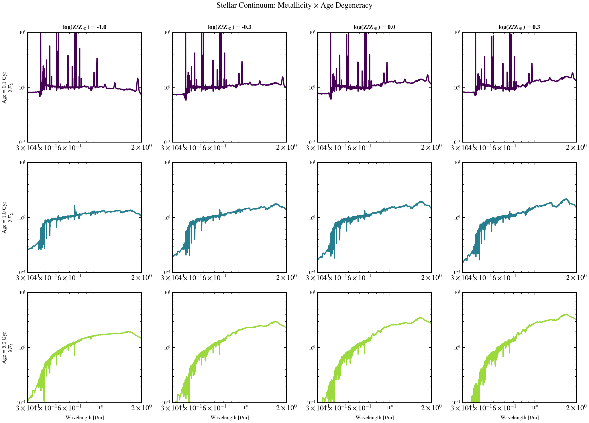

.. DO NOT EDIT.
.. THIS FILE WAS AUTOMATICALLY GENERATED BY SPHINX-GALLERY.
.. TO MAKE CHANGES, EDIT THE SOURCE PYTHON FILE:
.. "auto_examples/metallicity/plot_metallicity_age_grid.py"
.. LINE NUMBERS ARE GIVEN BELOW.

.. only:: html

    .. note::
        :class: sphx-glr-download-link-note

        :ref:`Go to the end <sphx_glr_download_auto_examples_metallicity_plot_metallicity_age_grid.py>`
        to download the full example code.

.. rst-class:: sphx-glr-example-title

.. _sphx_glr_auto_examples_metallicity_plot_metallicity_age_grid.py:

Stellar Continuum: Metallicity × Age Grid
==========================================

2D grid showing how stellar continuum shape responds to metallicity at
different ages. Demonstrates the age-metallicity degeneracy: a metal-rich
young star can mimic a metal-poor old star in the optical continuum. Uses a
3×4 panel grid: log(Z/Z_sun) ∈ {-1.0, -0.3, 0.0, 0.3} × age ∈ {0.1, 1.0, 5.0} Gyr.

.. sphx-glr-precomputed-img:

.. GENERATED FROM PYTHON SOURCE LINES 17-131

.. code-block:: Python

    from pathlib import Path

    import jax
    import matplotlib.pyplot as plt
    import numpy as np

    jax.config.update("jax_enable_x64", True)

    from tengri import Fixed, Parameters, SEDModel, load_ssp_data
    from tengri.analysis.plotting import setup_style

    setup_style()

    def _find_ssp():
        """Find SSP data file in standard locations."""
        name = "ssp_prsc_miles_chabrier_wNE_logGasU-3.0_logGasZ0.0.h5"
        for p in [
            Path("data") / name,
            Path("../data") / name,
            Path("../../data") / name,
            Path("../../../data") / name,
        ]:
            if p.exists():
                return str(p)
        return None

    SSP_PATH = _find_ssp()
    if SSP_PATH is None:
        raise FileNotFoundError("SSP data not found — skipping example")

    ssp = load_ssp_data(SSP_PATH)

    # --- Grid parameters ---
    logz_values = [-1.0, -0.3, 0.0, 0.3]  # log(Z/Z_sun)
    age_gyr_values = [0.1, 1.0, 5.0]  # Gyr

    # --- Color map ---
    colors_age = plt.cm.viridis(np.linspace(0.0, 0.85, len(age_gyr_values)))

    fig, axes = plt.subplots(len(age_gyr_values), len(logz_values), figsize=(14, 10))
    fig.suptitle(
        "Stellar Continuum: Metallicity × Age Degeneracy",
        fontsize=13,
        y=0.995,
    )

    for i, age_gyr in enumerate(age_gyr_values):
        for j, logz in enumerate(logz_values):
            ax = axes[i, j]

            # --- Build pure-stellar model (no dust, simple SFH) ---
            # Peak the SFH at the given age to make that age dominate the light
            spec = Parameters(
                sfh_tsnorm_log_peak_sfr=Fixed(1.0),
                sfh_tsnorm_peak_lbt_gyr=Fixed(age_gyr),
                sfh_tsnorm_width_gyr=Fixed(0.3),
                sfh_tsnorm_skew=Fixed(0.0),
                sfh_tsnorm_trunc=Fixed(max(3.0, age_gyr + 2.0)),
                met_logzsol=Fixed(logz),  # Vary metallicity
                dust_tau_bc=Fixed(0.0),  # No dust for clean continuum view
                dust_tau_diff=Fixed(0.0),
                dust_slope=Fixed(-0.7),
                redshift=Fixed(0.0),  # No redshift; rest-frame
            )
            model = SEDModel(spec, ssp)

            # Sample parameters and generate SED
            import jax.random

            key = jax.random.PRNGKey(0)
            params = spec.sample(key)
            pred = model.predict_rest_sed(params)

            wavelength = np.array(pred.wavelength)
            sed = np.array(pred.sed)
            wave_um = wavelength / 1e4

            # Normalize at 5500 A
            i_norm = int(np.argmin(np.abs(wavelength - 5500.0)))
            norm_val = sed[i_norm]
            if norm_val > 0:
                sed_norm = sed / norm_val
            else:
                sed_norm = sed

            # Plot: optical + NIR range
            mask = (wave_um > 0.3) & (wave_um < 2.0) & (sed_norm > 0)
            ax.loglog(wave_um[mask], sed_norm[mask], color=colors_age[i], lw=2.0)

            # Labels and formatting
            ax.set_xlim(0.3, 2.0)
            ax.set_ylim(0.1, 10)
            ax.tick_params(labelsize=8)

            # Row labels (age)
            if j == 0:
                ax.set_ylabel(f"Age = {age_gyr:.1f} Gyr\n" + r"$\lambda F_\lambda$", fontsize=9)

            # Column labels (metallicity)
            if i == 0:
                ax.set_title(f"log(Z/Z$_\\odot$) = {logz:.1f}", fontsize=10, fontweight="bold")

            # X-axis only on bottom row
            if i == len(age_gyr_values) - 1:
                ax.set_xlabel(r"Wavelength [$\mu$m]", fontsize=9)
            else:
                ax.set_xticklabels([])

    fig.tight_layout()
    plt.savefig("plot_metallicity_age_grid.png", dpi=150, bbox_inches="tight")
    plt.show()

.. _sphx_glr_download_auto_examples_metallicity_plot_metallicity_age_grid.py:

.. only:: html

  .. container:: sphx-glr-footer sphx-glr-footer-example

    .. container:: sphx-glr-download sphx-glr-download-jupyter

      :download:`Download Jupyter notebook: plot_metallicity_age_grid.ipynb <plot_metallicity_age_grid.ipynb>`

    .. container:: sphx-glr-download sphx-glr-download-python

      :download:`Download Python source code: plot_metallicity_age_grid.py <plot_metallicity_age_grid.py>`

    .. container:: sphx-glr-download sphx-glr-download-zip

      :download:`Download zipped: plot_metallicity_age_grid.zip <plot_metallicity_age_grid.zip>`

.. only:: html

 .. rst-class:: sphx-glr-signature

    `Gallery generated by Sphinx-Gallery <https://sphinx-gallery.github.io>`_
